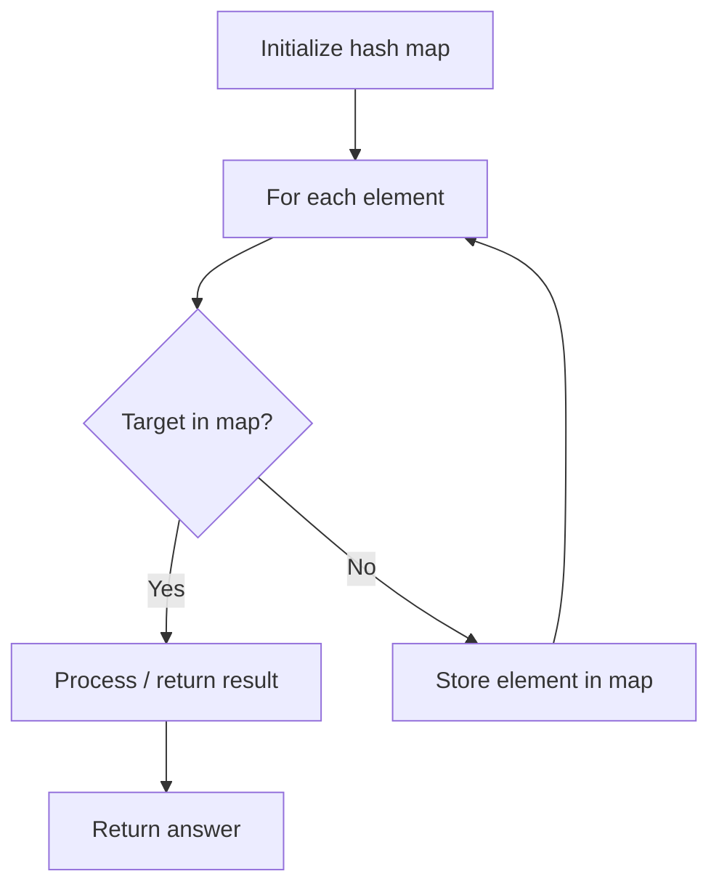

# Problem 748: Shortest Completing Word

**Difficulty:** Easy  
**Tags:** Array, Hash Table, String  
**Pattern:** Hash Map Lookup  
**Link:** [leetcode.com/problems/shortest-completing-word](https://leetcode.com/problems/shortest-completing-word/)

## Description

Given a string `licensePlate` and an array of strings `words`, find the **shortest completing** word in `words`.

A **completing** word is a word that **contains all the letters** in `licensePlate`. **Ignore numbers and spaces** in `licensePlate`, and treat letters as **case insensitive**. If a letter appears more than once in `licensePlate`, then it must appear in the word the same number of times or more.

For example, if `licensePlate`` = "aBc 12c"`, then it contains letters `'a'`, `'b'` (ignoring case), and `'c'` twice. Possible **completing** words are `"abccdef"`, `"caaacab"`, and `"cbca"`.

Return *the shortest **completing** word in *`words`*.* It is guaranteed an answer exists. If there are multiple shortest **completing** words, return the **first** one that occurs in `words`.

 

Example 1:

```

**Input:** licensePlate = "1s3 PSt", words = ["step","steps","stripe","stepple"]
**Output:** "steps"
**Explanation:** licensePlate contains letters 's', 'p', 's' (ignoring case), and 't'.
"step" contains 't' and 'p', but only contains 1 's'.
"steps" contains 't', 'p', and both 's' characters.
"stripe" is missing an 's'.
"stepple" is missing an 's'.
Since "steps" is the only word containing all the letters, that is the answer.

```

Example 2:

```

**Input:** licensePlate = "1s3 456", words = ["looks","pest","stew","show"]
**Output:** "pest"
**Explanation:** licensePlate only contains the letter 's'. All the words contain 's', but among these "pest", "stew", and "show" are shortest. The answer is "pest" because it is the word that appears earliest of the 3.

```

 

**Constraints:**

	- `1 <= licensePlate.length <= 7`
	- `licensePlate` contains digits, letters (uppercase or lowercase), or space `' '`.
	- `1 <= words.length <= 1000`
	- `1 <= words[i].length <= 15`
	- `words[i]` consists of lower case English letters.

## Approach: Hash Map Lookup

Use a hash map (dictionary) to store elements for O(1) lookup. Iterate through the input, checking membership or counting frequencies in the map.

## Pseudocode

```
1. Initialize hash map
2. Iterate through elements:
   a. Check if target/complement exists in map
   b. If found: process result
   c. Otherwise: store element in map
3. Return result
```

## Algorithm Flow



## Complexity Analysis

- **Time:** O(n)
- **Space:** O(n)

## Solution (Python3)

```python
class Solution:
    def shortestCompletingWord(self, licensePlate: str, words: List[str]) -> str:
        # Hash map approach - O(n) time, O(n) space
        seen = {}
        for i, val in enumerate(licensePlate):
            complement = words - val
            if complement in seen:
                return [seen[complement], i]
            seen[val] = i
        return ""
```

## Solution (C++)

```cpp
#include <string>
#include <unordered_map>
#include <vector>
using namespace std;

class Solution {
public:
    string shortestCompletingWord(string& licensePlate, vector<string>& words) {
        // Hash map approach - O(n) time, O(n) space
        unordered_map<int, int> seen;
        for (int i = 0; i < licensePlate.size(); i++) {
            int complement = words - licensePlate[i];
            if (seen.count(complement)) {
                return {seen[complement], i};
            }
            seen[licensePlate[i]] = i;
        }
        return "";
    }
};
```
