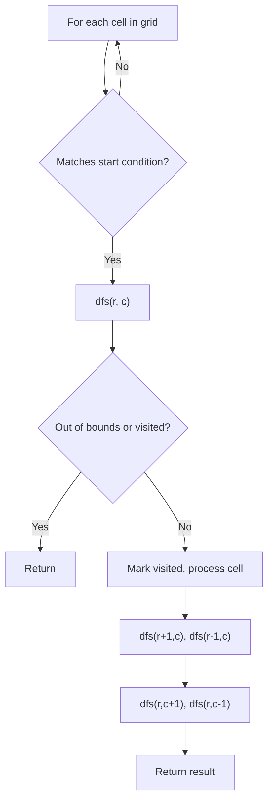
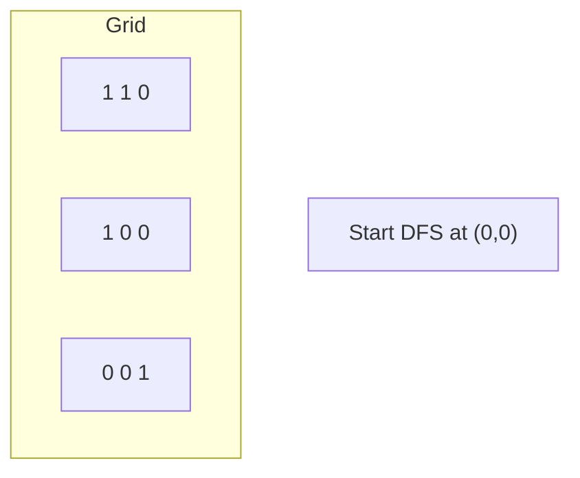
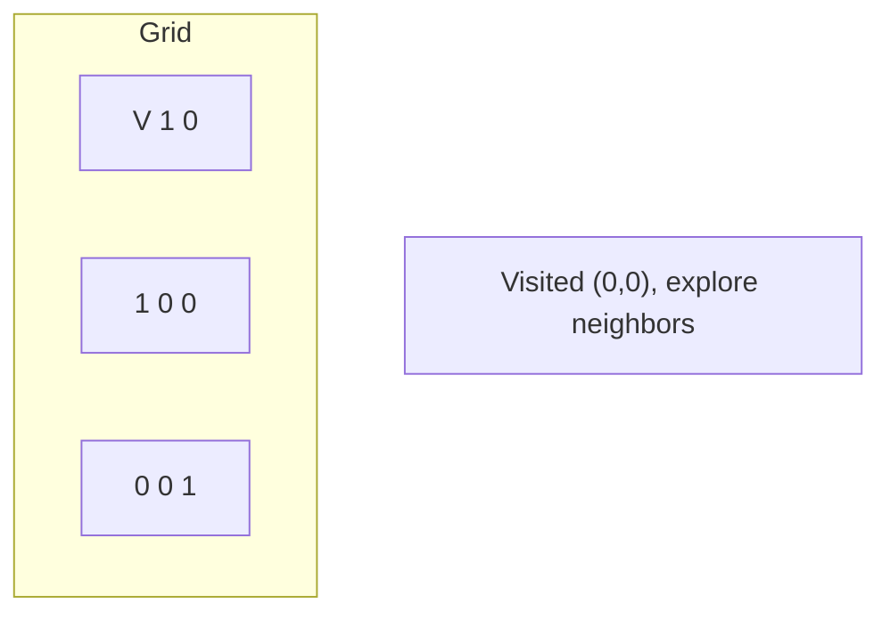
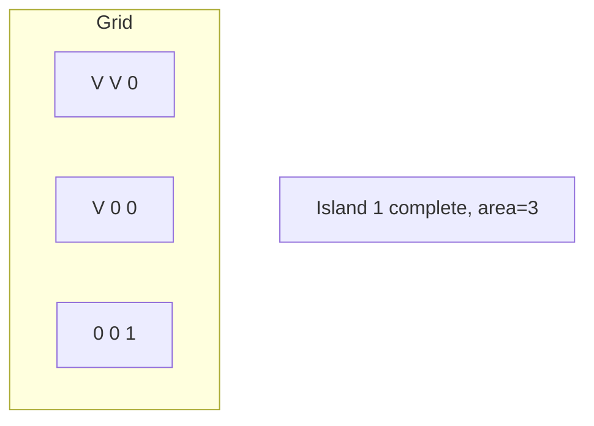
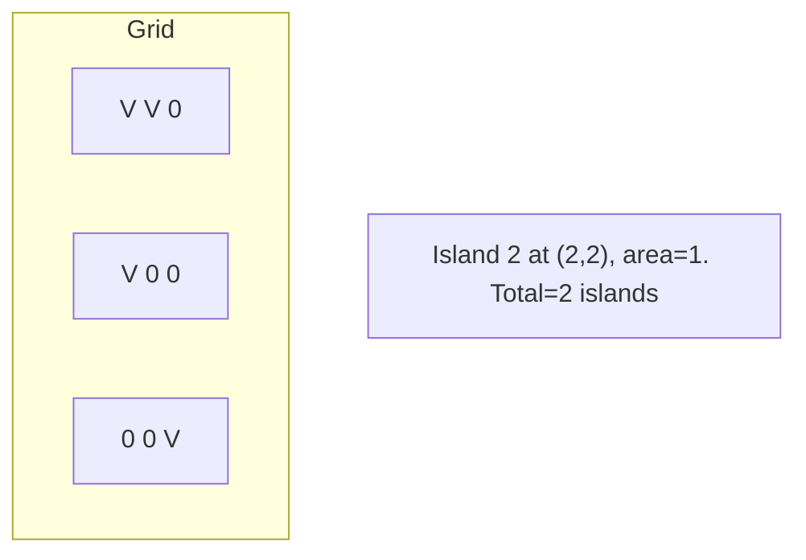

# Problem 749: Contain Virus

**Difficulty:** Hard  
**Tags:** Array, Depth-First Search, Breadth-First Search, Matrix, Simulation  
**Pattern:** DFS on Matrix / Grid  
**Link:** [leetcode.com/problems/contain-virus](https://leetcode.com/problems/contain-virus/)

## Description

A virus is spreading rapidly, and your task is to quarantine the infected area by installing walls.

The world is modeled as an `m x n` binary grid `isInfected`, where `isInfected[i][j] == 0` represents uninfected cells, and `isInfected[i][j] == 1` represents cells contaminated with the virus. A wall (and only one wall) can be installed between any two **4-directionally** adjacent cells, on the shared boundary.

Every night, the virus spreads to all neighboring cells in all four directions unless blocked by a wall. Resources are limited. Each day, you can install walls around only one region (i.e., the affected area (continuous block of infected cells) that threatens the most uninfected cells the following night). There **will never be a tie**.

Return *the number of walls used to quarantine all the infected regions*. If the world will become fully infected, return the number of walls used.

 

Example 1:

```

**Input:** isInfected = [[0,1,0,0,0,0,0,1],[0,1,0,0,0,0,0,1],[0,0,0,0,0,0,0,1],[0,0,0,0,0,0,0,0]]
**Output:** 10
**Explanation:** There are 2 contaminated regions.
On the first day, add 5 walls to quarantine the viral region on the left. The board after the virus spreads is:

On the second day, add 5 walls to quarantine the viral region on the right. The virus is fully contained.

```

Example 2:

```

**Input:** isInfected = [[1,1,1],[1,0,1],[1,1,1]]
**Output:** 4
**Explanation:** Even though there is only one cell saved, there are 4 walls built.
Notice that walls are only built on the shared boundary of two different cells.

```

Example 3:

```

**Input:** isInfected = [[1,1,1,0,0,0,0,0,0],[1,0,1,0,1,1,1,1,1],[1,1,1,0,0,0,0,0,0]]
**Output:** 13
**Explanation:** The region on the left only builds two new walls.

```

 

**Constraints:**

	- `m == isInfected.length`
	- `n == isInfected[i].length`
	- `1 <= m, n <= 50`
	- `isInfected[i][j]` is either `0` or `1`.
	- There is always a contiguous viral region throughout the described process that will **infect strictly more uncontaminated squares** in the next round.

## Approach: DFS on Matrix / Grid

Treat the grid as a graph where each cell connects to its 4 (or 8) neighbors. DFS from target cells, marking visited to avoid revisiting.

## Pseudocode

```
1. For each cell (r, c) in grid:
   a. If cell meets start condition:
      - Call dfs(r, c)
2. dfs(r, c):
   a. If out of bounds or visited or invalid: return
   b. Mark cell visited
   c. Recurse on 4 neighbors: up, down, left, right
3. Return result
```

## Algorithm Flow



## Visual State Transitions

**DFS on Grid (Island/Flood Fill):**

**Frame 1: Find first land cell**


**Frame 2: DFS explores connected cells**


**Frame 3: Mark entire island**


**Frame 4: Find second island**



## Complexity Analysis

- **Time:** O(m * n)
- **Space:** O(m * n)

## Solution (Python3)

```python
class Solution:
    def containVirus(self, isInfected: List[List[int]]) -> int:
        # DFS on grid - O(m*n) time
        if not isInfected:
            return 0
        rows, cols = len(isInfected), len(isInfected[0])
        count = 0
        
        def dfs(r, c):
            if r < 0 or r >= rows or c < 0 or c >= cols:
                return
            if isInfected[r][c] == '0' or isInfected[r][c] == 0:
                return
            isInfected[r][c] = '0'
            dfs(r+1, c); dfs(r-1, c)
            dfs(r, c+1); dfs(r, c-1)
        
        for r in range(rows):
            for c in range(cols):
                if isInfected[r][c] == '1' or isInfected[r][c] == 1:
                    dfs(r, c)
                    count += 1
        return count
```

## Solution (C++)

```cpp
#include <functional>
#include <string>
#include <vector>
using namespace std;

class Solution {
public:
    int containVirus(vector<vector<int>>& isInfected) {
        // DFS on grid - O(m*n) time
        if (isInfected.empty()) return 0;
        int rows = isInfected.size(), cols = isInfected[0].size();
        int count = 0;
        function<void(int, int)> dfs = [&](int r, int c) {
            if (r < 0 || r >= rows || c < 0 || c >= cols) return;
            if (isInfected[r][c] == '0') return;
            isInfected[r][c] = '0';
            dfs(r+1, c); dfs(r-1, c);
            dfs(r, c+1); dfs(r, c-1);
        };
        for (int r = 0; r < rows; r++) {
            for (int c = 0; c < cols; c++) {
                if (isInfected[r][c] == '1') {
                    dfs(r, c);
                    count++;
                }
            }
        }
        return count;
    }
};
```
