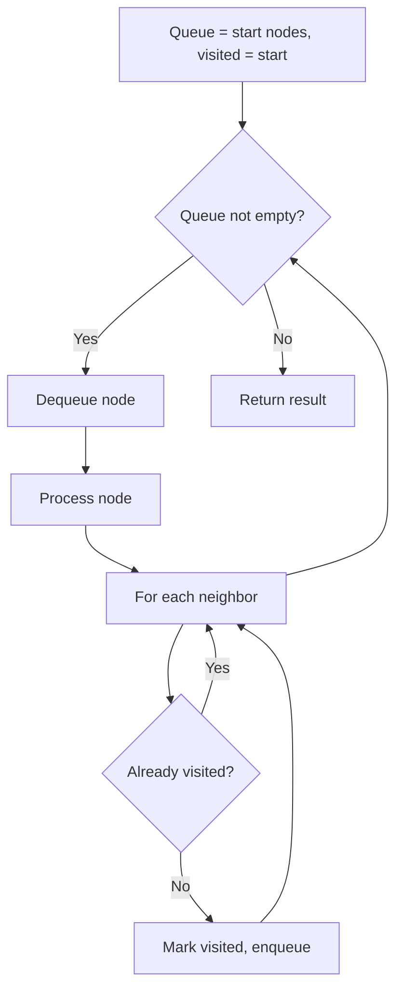
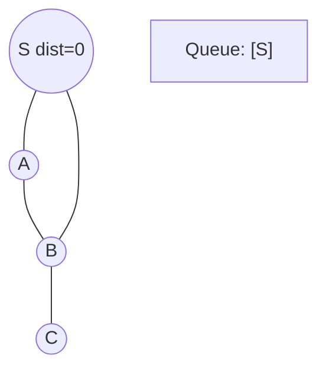
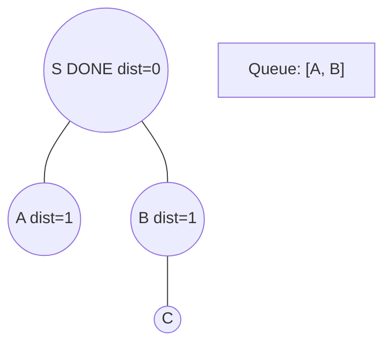
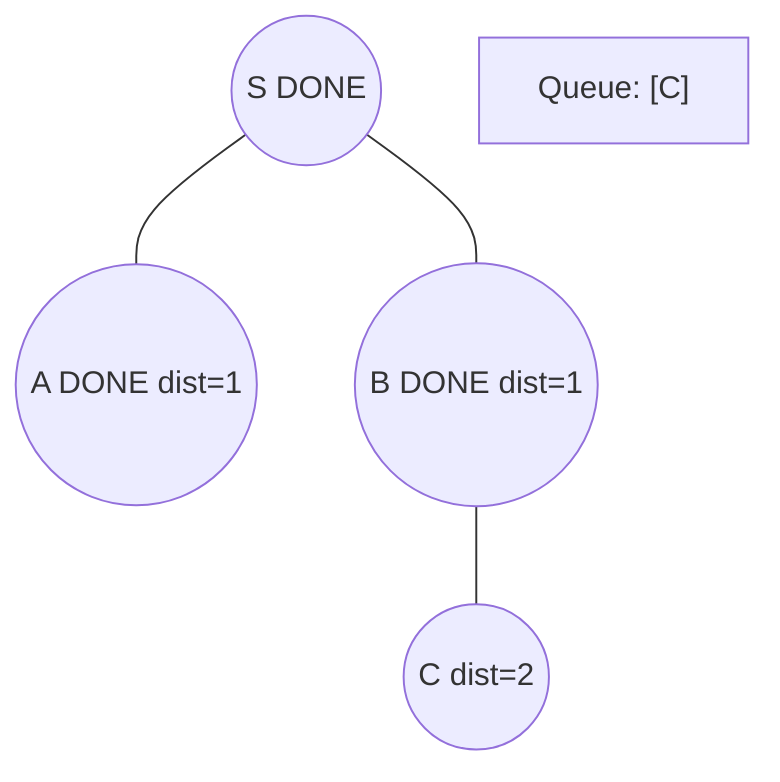
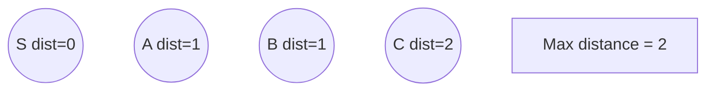

# Problem 752: Open the Lock

**Difficulty:** Medium  
**Tags:** Array, Hash Table, String, Breadth-First Search  
**Pattern:** BFS Graph Traversal  
**Link:** [leetcode.com/problems/open-the-lock](https://leetcode.com/problems/open-the-lock/)

## Description

You have a lock in front of you with 4 circular wheels. Each wheel has 10 slots: `'0', '1', '2', '3', '4', '5', '6', '7', '8', '9'`. The wheels can rotate freely and wrap around: for example we can turn `'9'` to be `'0'`, or `'0'` to be `'9'`. Each move consists of turning one wheel one slot.

The lock initially starts at `'0000'`, a string representing the state of the 4 wheels.

You are given a list of `deadends` dead ends, meaning if the lock displays any of these codes, the wheels of the lock will stop turning and you will be unable to open it.

Given a `target` representing the value of the wheels that will unlock the lock, return the minimum total number of turns required to open the lock, or -1 if it is impossible.

 

Example 1:

```

**Input:** deadends = ["0201","0101","0102","1212","2002"], target = "0202"
**Output:** 6
**Explanation:** 
A sequence of valid moves would be "0000" -> "1000" -> "1100" -> "1200" -> "1201" -> "1202" -> "0202".
Note that a sequence like "0000" -> "0001" -> "0002" -> "0102" -> "0202" would be invalid,
because the wheels of the lock become stuck after the display becomes the dead end "0102".

```

Example 2:

```

**Input:** deadends = ["8888"], target = "0009"
**Output:** 1
**Explanation:** We can turn the last wheel in reverse to move from "0000" -> "0009".

```

Example 3:

```

**Input:** deadends = ["8887","8889","8878","8898","8788","8988","7888","9888"], target = "8888"
**Output:** -1
**Explanation:** We cannot reach the target without getting stuck.

```

 

**Constraints:**

	- `1 <= deadends.length <= 500`
	- `deadends[i].length == 4`
	- `target.length == 4`
	- target **will not be** in the list `deadends`.
	- `target` and `deadends[i]` consist of digits only.

## Approach: BFS Graph Traversal

Explore the graph breadth-first using a queue. Process nodes level by level; BFS finds shortest paths in unweighted graphs.

## Pseudocode

```
1. Initialize queue with start node(s), visited set
2. While queue not empty:
   a. Dequeue node
   b. Process node
   c. For each unvisited neighbor:
      - Mark visited, enqueue
3. Return result
```

## Algorithm Flow



## Visual State Transitions

**BFS Level-by-Level Traversal:**

**Frame 1: Start BFS from source**


**Frame 2: Process level 0, enqueue neighbors**


**Frame 3: Process level 1**


**Frame 4: All nodes reached**



## Complexity Analysis

- **Time:** O(V + E)
- **Space:** O(V)

## Solution (Python3)

```python
class Solution:
    def openLock(self, deadends: List[str], target: str) -> int:
        # BFS on graph - O(V+E) time
        from collections import deque
        if not deadends:
            return 0
        visited = set()
        queue = deque([0])
        visited.add(0)
        dist = 0
        while queue:
            for _ in range(len(queue)):
                node = queue.popleft()
                # Process node
            dist += 1
        return dist
```

## Solution (C++)

```cpp
#include <queue>
#include <string>
#include <unordered_set>
#include <vector>
using namespace std;

class Solution {
public:
    int openLock(vector<string>& deadends, string& target) {
        // BFS on graph - O(V+E) time
        if (deadends.empty()) return 0;
        queue<int> q;
        unordered_set<int> visited;
        q.push(0);
        visited.insert(0);
        int dist = 0;
        while (!q.empty()) {
            int sz = q.size();
            for (int i = 0; i < sz; i++) {
                int node = q.front(); q.pop();
                // Process node
            }
            dist++;
        }
        return dist;
    }
};
```
