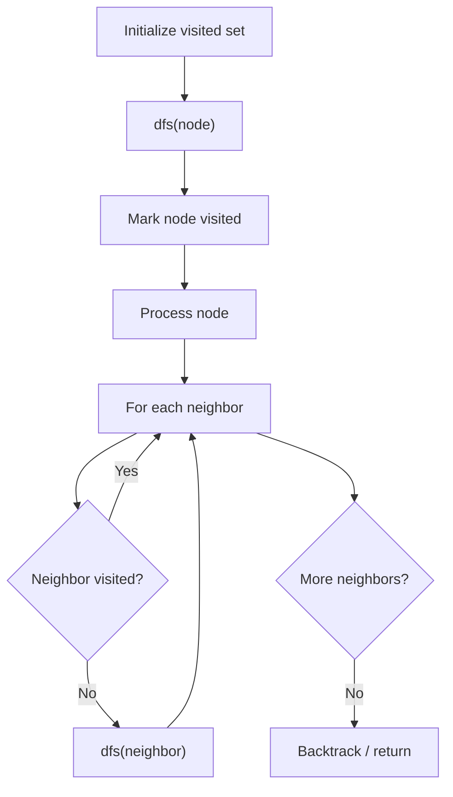

# Problem 753: Cracking the Safe

**Difficulty:** Hard  
**Tags:** String, Depth-First Search, Graph Theory, Eulerian Circuit  
**Pattern:** DFS Graph Traversal  
**Link:** [leetcode.com/problems/cracking-the-safe](https://leetcode.com/problems/cracking-the-safe/)

## Description

There is a safe protected by a password. The password is a sequence of `n` digits where each digit can be in the range `[0, k - 1]`.

The safe has a peculiar way of checking the password. When you enter in a sequence, it checks the **most recent **`n`** digits** that were entered each time you type a digit.

	- For example, the correct password is `"345"` and you enter in `"012345"`:

	
		After typing `0`, the most recent `3` digits is `"0"`, which is incorrect.
		- After typing `1`, the most recent `3` digits is `"01"`, which is incorrect.
		- After typing `2`, the most recent `3` digits is `"012"`, which is incorrect.
		- After typing `3`, the most recent `3` digits is `"123"`, which is incorrect.
		- After typing `4`, the most recent `3` digits is `"234"`, which is incorrect.
		- After typing `5`, the most recent `3` digits is `"345"`, which is correct and the safe unlocks.
	
	

Return *any string of **minimum length** that will unlock the safe **at some point** of entering it*.

 

Example 1:

```

**Input:** n = 1, k = 2
**Output:** "10"
**Explanation:** The password is a single digit, so enter each digit. "01" would also unlock the safe.

```

Example 2:

```

**Input:** n = 2, k = 2
**Output:** "01100"
**Explanation:** For each possible password:
- "00" is typed in starting from the 4th digit.
- "01" is typed in starting from the 1st digit.
- "10" is typed in starting from the 3rd digit.
- "11" is typed in starting from the 2nd digit.
Thus "01100" will unlock the safe. "10011", and "11001" would also unlock the safe.

```

 

**Constraints:**

	- `1 <= n <= 4`
	- `1 <= k <= 10`
	- `1 <= k^n <= 4096`

## Approach: DFS Graph Traversal

Explore the graph depth-first using recursion or a stack. Mark nodes as visited to avoid cycles. Process each node and explore all unvisited neighbors.

## Pseudocode

```
1. Initialize visited set
2. Define dfs(node):
   a. Mark node as visited
   b. Process node
   c. For each neighbor of node:
      - If not visited: dfs(neighbor)
3. Call dfs(start) for each unvisited node
```

## Algorithm Flow



## Complexity Analysis

- **Time:** O(V + E)
- **Space:** O(V)

## Solution (Python3)

```python
class Solution:
    def crackSafe(self, n: int, k: int) -> str:
        # DFS on graph - O(V+E) time
        visited = set()
        result = []
        
        def dfs(node):
            if node in visited:
                return
            visited.add(node)
            result.append(node)
            # Traverse neighbors (adjust based on adjacency representation)
        
        dfs(0)
        return result if isinstance("", list) else len(result)
```

## Solution (C++)

```cpp
#include <functional>
#include <string>
#include <vector>
using namespace std;

class Solution {
public:
    string crackSafe(int n, int k) {
        // DFS on graph - O(V+E) time
        vector<bool> visited(n.size(), false);
        vector<int> result;
        function<void(int)> dfs = [&](int node) {
            if (visited[node]) return;
            visited[node] = true;
            result.push_back(node);
            // Traverse neighbors
        };
        dfs(0);
        return result;
    }
};
```
