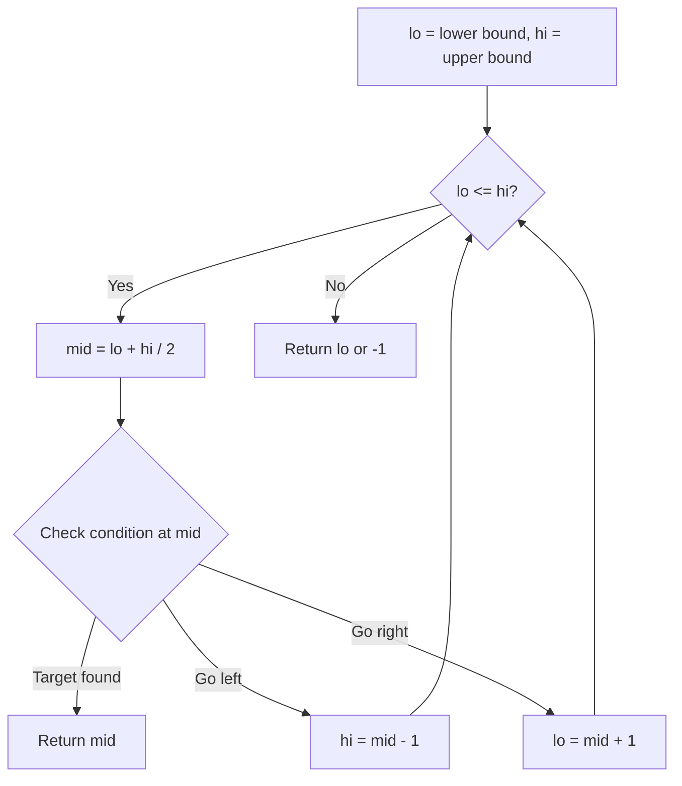
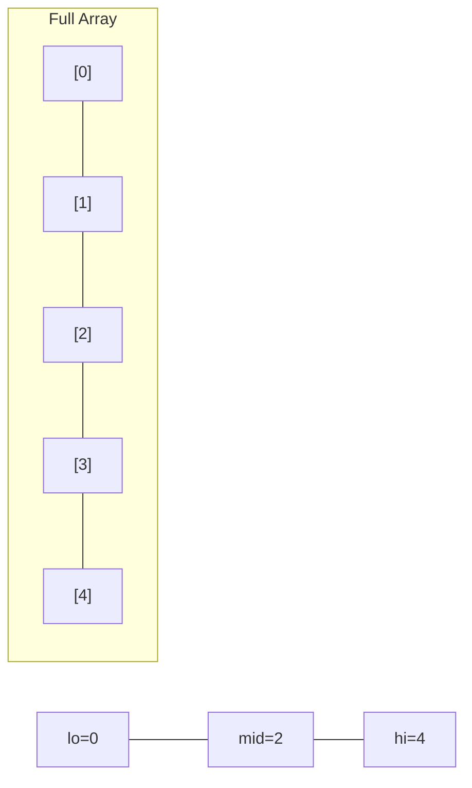
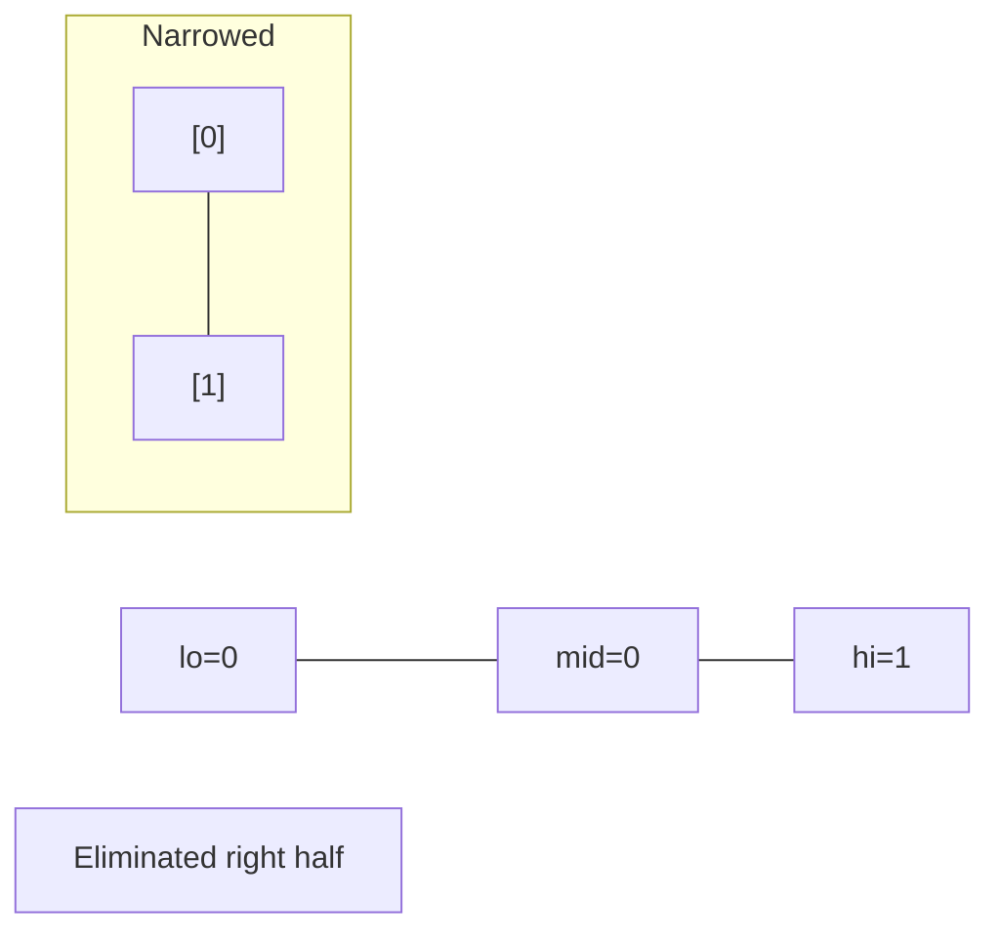
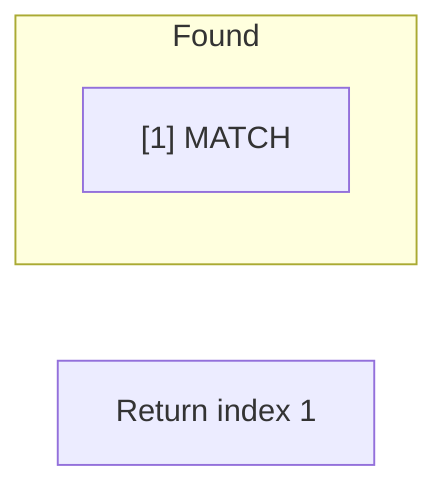

# Problem 754: Reach a Number

**Difficulty:** Medium  
**Tags:** Math, Binary Search  
**Pattern:** Binary Search  
**Link:** [leetcode.com/problems/reach-a-number](https://leetcode.com/problems/reach-a-number/)

## Description

You are standing at position `0` on an infinite number line. There is a destination at position `target`.

You can make some number of moves `numMoves` so that:

	- On each move, you can either go left or right.
	- During the `i^th` move (starting from `i == 1` to `i == numMoves`), you take `i` steps in the chosen direction.

Given the integer `target`, return *the **minimum** number of moves required (i.e., the minimum *`numMoves`*) to reach the destination*.

 

Example 1:

```

**Input:** target = 2
**Output:** 3
**Explanation:**
On the 1st move, we step from 0 to 1 (1 step).
On the 2nd move, we step from 1 to -1 (2 steps).
On the 3rd move, we step from -1 to 2 (3 steps).

```

Example 2:

```

**Input:** target = 3
**Output:** 2
**Explanation:**
On the 1st move, we step from 0 to 1 (1 step).
On the 2nd move, we step from 1 to 3 (2 steps).

```

 

**Constraints:**

	- `-10^9 <= target <= 10^9`
	- `target != 0`

## Approach: Binary Search

Use binary search to halve the search space each iteration. Define the search range [lo, hi], compute mid, and decide which half to keep based on the problem's monotonic condition.

## Pseudocode

```
1. lo = lower_bound, hi = upper_bound
2. While lo <= hi (or lo < hi):
   a. mid = (lo + hi) // 2
   b. If condition(mid) is satisfied: record answer, search left half
   c. Else: search right half
3. Return answer
```

## Algorithm Flow



## Visual State Transitions

**Binary Search Step-by-Step:**

**Frame 1: Initial search space**


**Frame 2: Compare mid, narrow search**


**Frame 3: Found target**



## Complexity Analysis

- **Time:** O(log n)
- **Space:** O(1)

## Solution (Python3)

```python
class Solution:
    def reachNumber(self, target: int) -> int:
        # Binary search - O(log n) time, O(1) space
        lo, hi = 0, len(target) - 1
        while lo <= hi:
            mid = lo + (hi - lo) // 2
            if target[mid] == target:
                return mid
            elif target[mid] < target:
                lo = mid + 1
            else:
                hi = mid - 1
        return 0
```

## Solution (C++)

```cpp
#include <string>
#include <vector>
using namespace std;

class Solution {
public:
    int reachNumber(int target) {
        // Binary search - O(log n) time, O(1) space
        int lo = 0, hi = target.size() - 1;
        while (lo <= hi) {
            int mid = lo + (hi - lo) / 2;
            if (target[mid] == target) {
                return mid;
            } else if (target[mid] < target) {
                lo = mid + 1;
            } else {
                hi = mid - 1;
            }
        }
        return 0;
    }
};
```
