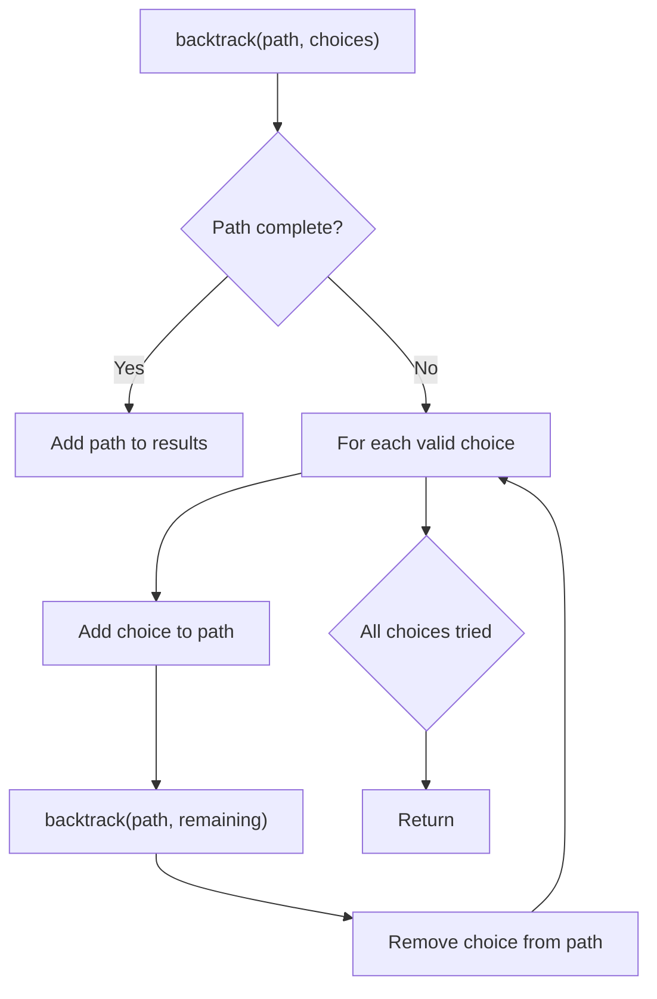
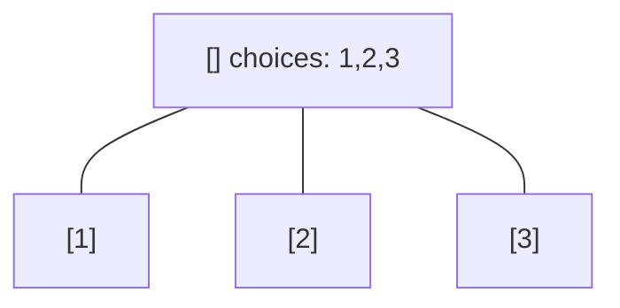
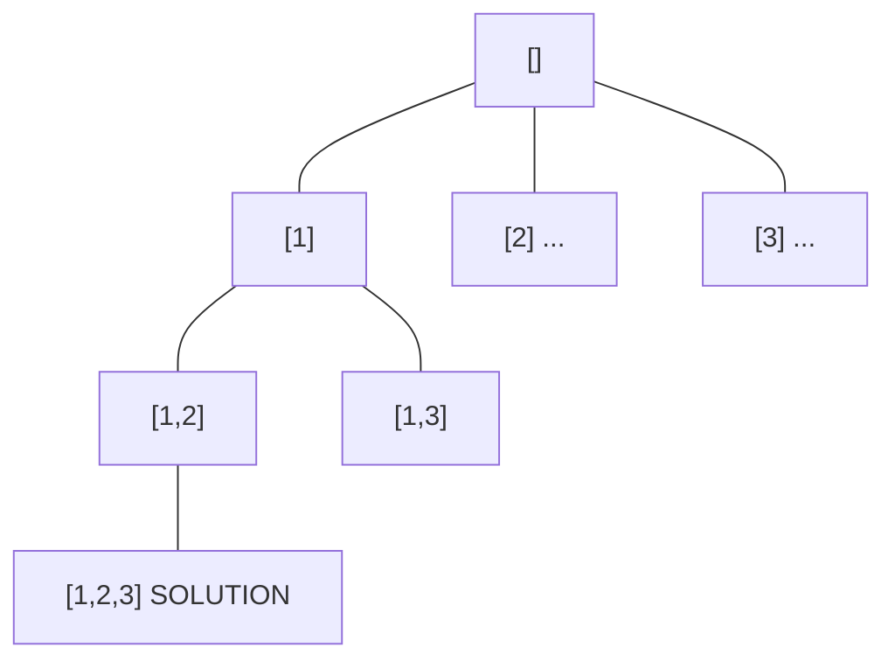
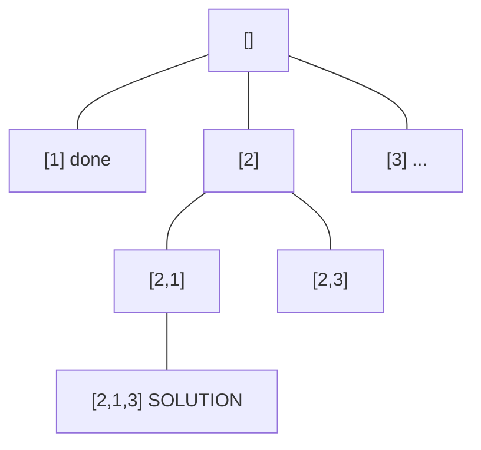
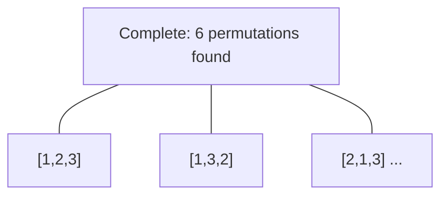

# Problem 756: Pyramid Transition Matrix

**Difficulty:** Medium  
**Tags:** Hash Table, String, Backtracking, Bit Manipulation  
**Pattern:** Backtracking  
**Link:** [leetcode.com/problems/pyramid-transition-matrix](https://leetcode.com/problems/pyramid-transition-matrix/)

## Description

You are stacking blocks to form a pyramid. Each block has a color, which is represented by a single letter. Each row of blocks contains **one less block** than the row beneath it and is centered on top.

To make the pyramid aesthetically pleasing, there are only specific **triangular patterns** that are allowed. A triangular pattern consists of a **single block** stacked on top of **two blocks**. The patterns are given as a list of three-letter strings `allowed`, where the first two characters of a pattern represent the left and right bottom blocks respectively, and the third character is the top block.

	- For example, `"ABC"` represents a triangular pattern with a `'C'` block stacked on top of an `'A'` (left) and `'B'` (right) block. Note that this is different from `"BAC"` where `'B'` is on the left bottom and `'A'` is on the right bottom.

You start with a bottom row of blocks `bottom`, given as a single string, that you **must** use as the base of the pyramid.

Given `bottom` and `allowed`, return `true`* if you can build the pyramid all the way to the top such that **every triangular pattern** in the pyramid is in *`allowed`*, or *`false`* otherwise*.

 

Example 1:

```

**Input:** bottom = "BCD", allowed = ["BCC","CDE","CEA","FFF"]
**Output:** true
**Explanation:** The allowed triangular patterns are shown on the right.
Starting from the bottom (level 3), we can build "CE" on level 2 and then build "A" on level 1.
There are three triangular patterns in the pyramid, which are "BCC", "CDE", and "CEA". All are allowed.

```

Example 2:

```

**Input:** bottom = "AAAA", allowed = ["AAB","AAC","BCD","BBE","DEF"]
**Output:** false
**Explanation:** The allowed triangular patterns are shown on the right.
Starting from the bottom (level 4), there are multiple ways to build level 3, but trying all the possibilites, you will get always stuck before building level 1.

```

 

**Constraints:**

	- `2 <= bottom.length <= 6`
	- `0 <= allowed.length <= 216`
	- `allowed[i].length == 3`
	- The letters in all input strings are from the set `{'A', 'B', 'C', 'D', 'E', 'F'}`.
	- All the values of `allowed` are **unique**.

## Approach: Backtracking

Explore all possible solutions by building candidates incrementally. At each step, make a choice and recurse. If the choice leads to a dead end, undo the choice (backtrack) and try the next option.

## Pseudocode

```
1. Define backtrack(path, choices):
   a. If path is a complete solution: add to results
   b. For each choice in choices:
      - If choice is valid:
        * Add choice to path
        * backtrack(path, remaining_choices)
        * Remove choice from path (backtrack)
2. Call backtrack([], all_choices)
```

## Algorithm Flow



## Visual State Transitions

**Backtracking Decision Tree:**

**Frame 1: Root - start with empty path**


**Frame 2: Explore branch [1]**


**Frame 3: Backtrack, explore [2]**


**Frame 4: All solutions found**



## Complexity Analysis

- **Time:** O(k^n) or O(n!)
- **Space:** O(n)

## Solution (Python3)

```python
class Solution:
    def pyramidTransition(self, bottom: str, allowed: List[str]) -> bool:
        # Backtracking - O(2^n) or O(n!) time
        result = []
        
        def backtrack(path, start):
            result.append(path[:])
            for i in range(start, len(bottom)):
                path.append(bottom[i])
                backtrack(path, i + 1)
                path.pop()
        
        backtrack([], 0)
        return result
```

## Solution (C++)

```cpp
#include <functional>
#include <string>
#include <vector>
using namespace std;

class Solution {
public:
    bool pyramidTransition(string& bottom, vector<string>& allowed) {
        // Backtracking - O(2^n) or O(n!) time
        vector<vector<int>> result;
        vector<int> path;
        function<void(int)> backtrack = [&](int start) {
            result.push_back(path);
            for (int i = start; i < (int)bottom.size(); i++) {
                path.push_back(bottom[i]);
                backtrack(i + 1);
                path.pop_back();
            }
        };
        backtrack(0);
        return result;
    }
};
```
