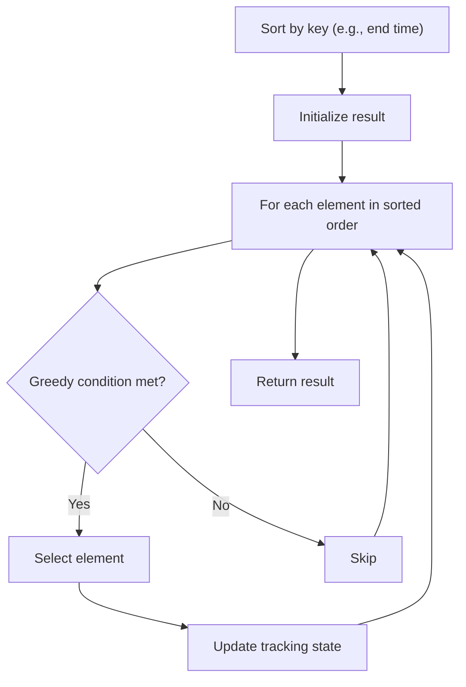

# Problem 757: Set Intersection Size At Least Two

**Difficulty:** Hard  
**Tags:** Array, Greedy, Sorting  
**Pattern:** Greedy with Sorting  
**Link:** [leetcode.com/problems/set-intersection-size-at-least-two](https://leetcode.com/problems/set-intersection-size-at-least-two/)

## Description

You are given a 2D integer array `intervals` where `intervals[i] = [starti, endi]` represents all the integers from `starti` to `endi` inclusively.

A **containing set** is an array `nums` where each interval from `intervals` has **at least two** integers in `nums`.

	- For example, if `intervals = [[1,3], [3,7], [8,9]]`, then `[1,2,4,7,8,9]` and `[2,3,4,8,9]` are **containing sets**.

Return *the minimum possible size of a containing set*.

 

Example 1:

```

**Input:** intervals = [[1,3],[3,7],[8,9]]
**Output:** 5
**Explanation:** let nums = [2, 3, 4, 8, 9].
It can be shown that there cannot be any containing array of size 4.

```

Example 2:

```

**Input:** intervals = [[1,3],[1,4],[2,5],[3,5]]
**Output:** 3
**Explanation:** let nums = [2, 3, 4].
It can be shown that there cannot be any containing array of size 2.

```

Example 3:

```

**Input:** intervals = [[1,2],[2,3],[2,4],[4,5]]
**Output:** 5
**Explanation:** let nums = [1, 2, 3, 4, 5].
It can be shown that there cannot be any containing array of size 4.

```

 

**Constraints:**

	- `1 <= intervals.length <= 3000`
	- `intervals[i].length == 2`
	- `0 <= starti < endi <= 10^8`

## Approach: Greedy with Sorting

Sort the input by a key criterion, then greedily process elements in sorted order. The sorting ensures the greedy choice is always optimal.

## Pseudocode

```
1. Sort elements by key (start time, weight, etc.)
2. Initialize result, tracking variables
3. For each element in sorted order:
   a. Apply greedy selection rule
   b. Update result
4. Return result
```

## Algorithm Flow



## Complexity Analysis

- **Time:** O(n log n)
- **Space:** O(n)

## Solution (Python3)

```python
class Solution:
    def intersectionSizeTwo(self, intervals: List[List[int]]) -> int:
        # Sort + greedy - O(n log n) time
        intervals.sort()
        result = 0
        curr_end = 0
        for item in intervals:
            if isinstance(item, (list, tuple)):
                if item[0] >= curr_end:
                    result += 1
                    curr_end = item[1]
            else:
                result += 1
        return result
```

## Solution (C++)

```cpp
#include <algorithm>
#include <string>
#include <vector>
using namespace std;

class Solution {
public:
    int intersectionSizeTwo(vector<vector<int>>& intervals) {
        // Sort + greedy - O(n log n) time
        sort(intervals.begin(), intervals.end());
        int result = 0, curr_end = 0;
        for (auto& item : intervals) {
            result++;
        }
        return result;
    }
};
```
