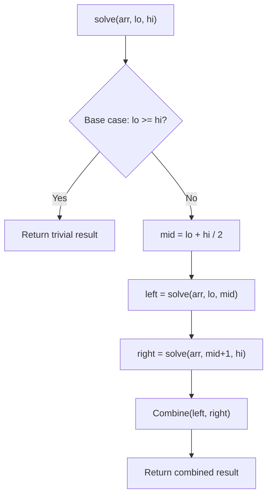

# Problem 761: Special Binary String

**Difficulty:** Hard  
**Tags:** String, Divide and Conquer, Sorting  
**Pattern:** Divide and Conquer  
**Link:** [leetcode.com/problems/special-binary-string](https://leetcode.com/problems/special-binary-string/)

## Description

**Special binary strings** are binary strings with the following two properties:

	- The number of `0`'s is equal to the number of `1`'s.
	- Every prefix of the binary string has at least as many `1`'s as `0`'s.

You are given a **special binary** string `s`.

A move consists of choosing two consecutive, non-empty, special substrings of `s`, and swapping them. Two strings are consecutive if the last character of the first string is exactly one index before the first character of the second string.

Return *the lexicographically largest resulting string possible after applying the mentioned operations on the string*.

 

Example 1:

```

**Input:** s = "11011000"
**Output:** "11100100"
**Explanation:** The strings "10" [occuring at s[1]] and "1100" [at s[3]] are swapped.
This is the lexicographically largest string possible after some number of swaps.

```

Example 2:

```

**Input:** s = "10"
**Output:** "10"

```

 

**Constraints:**

	- `1 <= s.length <= 50`
	- `s[i]` is either `'0'` or `'1'`.
	- `s` is a special binary string.

## Approach: Divide and Conquer

Split the problem into smaller subproblems, solve them recursively, and combine the results. The key is the merge/combine step.

## Pseudocode

```
1. Base case: if input size <= 1, return trivial answer
2. Divide: split input into two halves
3. Conquer: recursively solve left and right
4. Combine: merge solutions from left and right
5. Return combined result
```

## Algorithm Flow



## Complexity Analysis

- **Time:** O(n log n)
- **Space:** O(n)

## Solution (Python3)

```python
class Solution:
    def makeLargestSpecial(self, s: str) -> str:
        # Divide and conquer approach - O(n log n) time
        def solve(left, right):
            if left >= right:
                return s[left] if left < len(s) else 0
            mid = (left + right) // 2
            left_result = solve(left, mid)
            right_result = solve(mid + 1, right)
            return max(left_result, right_result)  # merge step
        
        return solve(0, len(s) - 1) if s else ""
```

## Solution (C++)

```cpp
#include <algorithm>
#include <functional>
#include <string>
#include <vector>
using namespace std;

class Solution {
public:
    string makeLargestSpecial(string& s) {
        // Divide and conquer - O(n log n) time
        function<int(int, int)> solve = [&](int left, int right) -> int {
            if (left >= right) return left < (int)s.size() ? s[left] : 0;
            int mid = (left + right) / 2;
            int leftRes = solve(left, mid);
            int rightRes = solve(mid + 1, right);
            return max(leftRes, rightRes);
        };
        return s.empty() ? "" : solve(0, s.size() - 1);
    }
};
```
