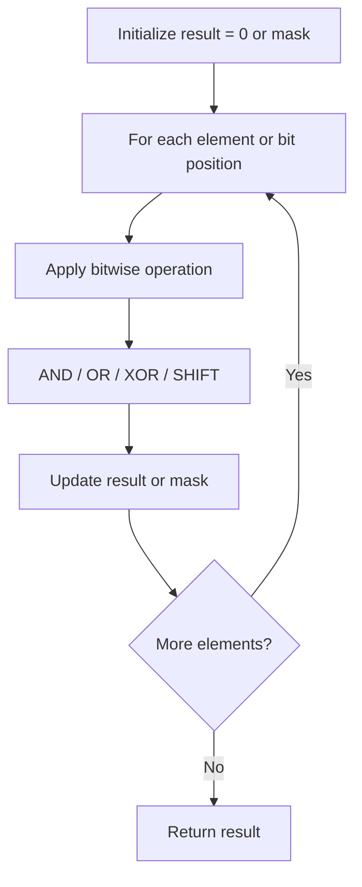

# Problem 762: Prime Number of Set Bits in Binary Representation

**Difficulty:** Easy  
**Tags:** Math, Bit Manipulation  
**Pattern:** Bit Manipulation  
**Link:** [leetcode.com/problems/prime-number-of-set-bits-in-binary-representation](https://leetcode.com/problems/prime-number-of-set-bits-in-binary-representation/)

## Description

Given two integers `left` and `right`, return *the **count** of numbers in the **inclusive** range *`[left, right]`* having a **prime number of set bits** in their binary representation*.

Recall that the **number of set bits** an integer has is the number of `1`'s present when written in binary.

	- For example, `21` written in binary is `10101`, which has `3` set bits.

 

Example 1:

```

**Input:** left = 6, right = 10
**Output:** 4
**Explanation:**
6  -> 110 (2 set bits, 2 is prime)
7  -> 111 (3 set bits, 3 is prime)
8  -> 1000 (1 set bit, 1 is not prime)
9  -> 1001 (2 set bits, 2 is prime)
10 -> 1010 (2 set bits, 2 is prime)
4 numbers have a prime number of set bits.

```

Example 2:

```

**Input:** left = 10, right = 15
**Output:** 5
**Explanation:**
10 -> 1010 (2 set bits, 2 is prime)
11 -> 1011 (3 set bits, 3 is prime)
12 -> 1100 (2 set bits, 2 is prime)
13 -> 1101 (3 set bits, 3 is prime)
14 -> 1110 (3 set bits, 3 is prime)
15 -> 1111 (4 set bits, 4 is not prime)
5 numbers have a prime number of set bits.

```

 

**Constraints:**

	- `1 <= left <= right <= 10^6`
	- `0 <= right - left <= 10^4`

## Approach: Bit Manipulation

Operate on individual bits using bitwise operators (AND, OR, XOR, shift). Common tricks: x & (x-1) removes lowest set bit, x ^ x = 0, XOR all elements to find unique.

## Pseudocode

```
1. Apply bitwise operations:
   - XOR all elements to cancel paired bits
   - Use bitmask to track state
   - Shift and mask to extract/set individual bits
2. Return result
```

## Algorithm Flow



## Complexity Analysis

- **Time:** O(n) or O(log n)
- **Space:** O(1)

## Solution (Python3)

```python
class Solution:
    def countPrimeSetBits(self, left: int, right: int) -> int:
        # Bit manipulation - O(n) time, O(1) space
        result = 0
        for val in left:
            result ^= val
        return result
```

## Solution (C++)

```cpp
#include <string>
#include <vector>
using namespace std;

class Solution {
public:
    int countPrimeSetBits(int left, int right) {
        // Bit manipulation - O(n) time, O(1) space
        int result = 0;
        for (int val : left) {
            result ^= val;
        }
        return result;
    }
};
```
