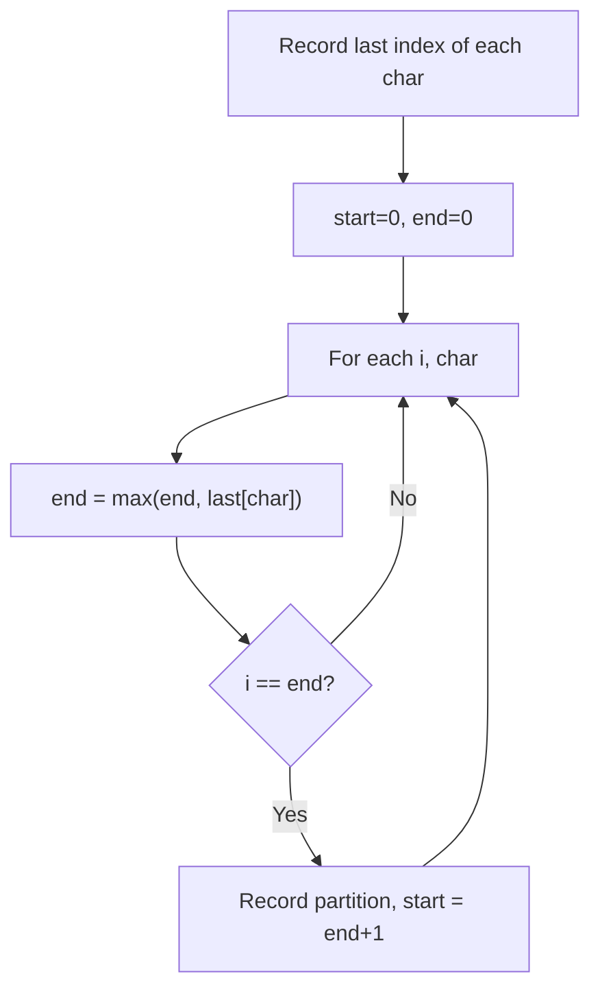

# Problem 763: Partition Labels

**Difficulty:** Medium  
**Tags:** Hash Table, Two Pointers, String, Greedy  
**Pattern:** Greedy / Two Pointers  
**Link:** [leetcode.com/problems/partition-labels](https://leetcode.com/problems/partition-labels/)

## Description

You are given a string `s`. We want to partition the string into as many parts as possible so that each letter appears in at most one part. For example, the string `"ababcc"` can be partitioned into `["abab", "cc"]`, but partitions such as `["aba", "bcc"]` or `["ab", "ab", "cc"]` are invalid.

Note that the partition is done so that after concatenating all the parts in order, the resultant string should be `s`.

Return *a list of integers representing the size of these parts*.

 

Example 1:

```

**Input:** s = "ababcbacadefegdehijhklij"
**Output:** [9,7,8]
**Explanation:**
The partition is "ababcbaca", "defegde", "hijhklij".
This is a partition so that each letter appears in at most one part.
A partition like "ababcbacadefegde", "hijhklij" is incorrect, because it splits s into less parts.

```

Example 2:

```

**Input:** s = "eccbbbbdec"
**Output:** [10]

```

 

**Constraints:**

	- `1 <= s.length <= 500`
	- `s` consists of lowercase English letters.

## Approach: Greedy / Two Pointers

Track last occurrence of each char. Extend partition end to include all occurrences. Cut when i == end.

## Pseudocode

```
1. Sort or organize data for greedy ordering
2. Initialize result
3. For each element in greedy order:
   a. If element satisfies constraint:
      - Take the greedy choice
      - Update result and state
4. Return result
```

## Algorithm Flow



## Complexity Analysis

- **Time:** O(n)
- **Space:** O(1)

## Solution (Python3)

```python
class Solution:
    def partitionLabels(self, s: str) -> list[int]:
        last = {c: i for i, c in enumerate(s)}
        result = []
        start = end = 0
        for i, c in enumerate(s):
            end = max(end, last[c])
            if i == end:
                result.append(end - start + 1)
                start = end + 1
        return result
```

## Solution (C++)

```cpp
#include <algorithm>
#include <string>
#include <vector>
using namespace std;

class Solution {
public:
    vector<int> partitionLabels(string& s) {
        // Greedy approach - O(n) time
        int result = 0, curr_max = 0;
        for (int i = 0; i < (int)s.size(); i++) {
            curr_max = max(curr_max, s[i]);
            result = max(result, curr_max);
        }
        return result;
    }
};
```
