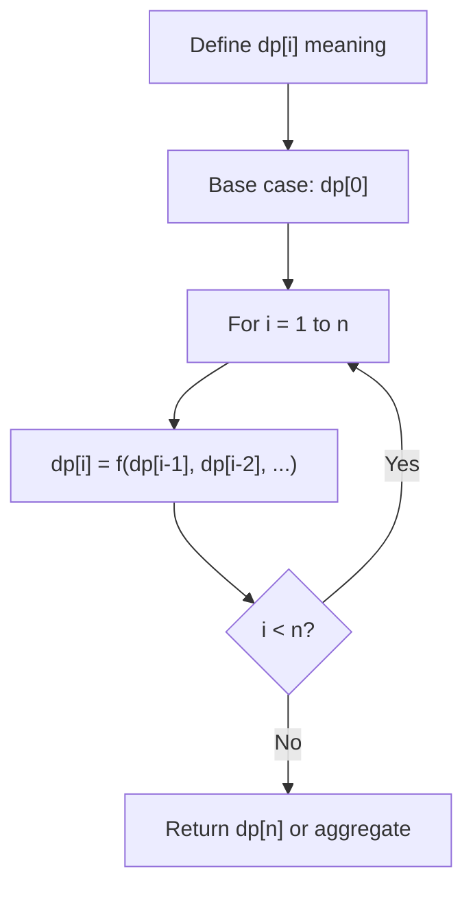
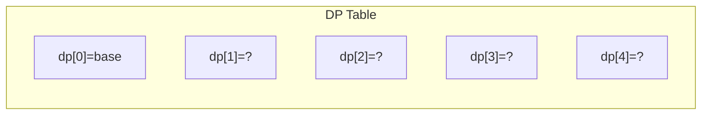
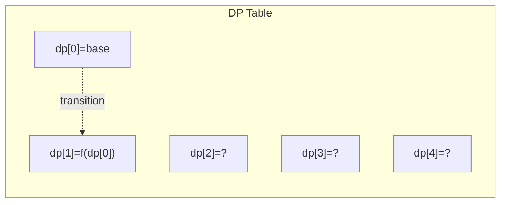
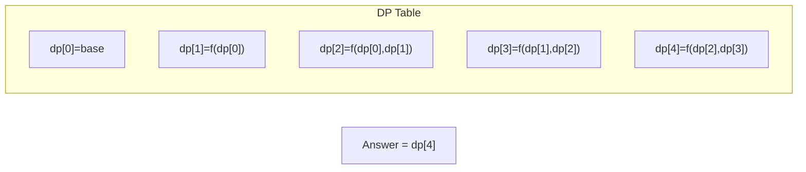

# Problem 764: Largest Plus Sign

**Difficulty:** Medium  
**Tags:** Array, Dynamic Programming  
**Pattern:** Dynamic Programming (1D)  
**Link:** [leetcode.com/problems/largest-plus-sign](https://leetcode.com/problems/largest-plus-sign/)

## Description

You are given an integer `n`. You have an `n x n` binary grid `grid` with all values initially `1`'s except for some indices given in the array `mines`. The `i^th` element of the array `mines` is defined as `mines[i] = [xi, yi]` where `grid[xi][yi] == 0`.

Return *the order of the largest **axis-aligned** plus sign of *1*'s contained in *`grid`. If there is none, return `0`.

An **axis-aligned plus sign** of `1`'s of order `k` has some center `grid[r][c] == 1` along with four arms of length `k - 1` going up, down, left, and right, and made of `1`'s. Note that there could be `0`'s or `1`'s beyond the arms of the plus sign, only the relevant area of the plus sign is checked for `1`'s.

 

Example 1:

```

**Input:** n = 5, mines = [[4,2]]
**Output:** 2
**Explanation:** In the above grid, the largest plus sign can only be of order 2. One of them is shown.

```

Example 2:

```

**Input:** n = 1, mines = [[0,0]]
**Output:** 0
**Explanation:** There is no plus sign, so return 0.

```

 

**Constraints:**

	- `1 <= n <= 500`
	- `1 <= mines.length <= 5000`
	- `0 <= xi, yi < n`
	- All the pairs `(xi, yi)` are **unique**.

## Approach: Dynamic Programming (1D)

Break the problem into overlapping subproblems. Define dp[i] as the optimal value for the subproblem ending at or considering index i. Build the solution bottom-up, using previously computed dp values.

## Pseudocode

```
1. Define dp[i] = optimal value for subproblem i
2. Base case: dp[0] = initial value
3. For i from 1 to n:
   a. dp[i] = recurrence(dp[i-1], dp[i-2], ...)
4. Return dp[n] or max/min of dp
```

## Algorithm Flow



## Visual State Transitions

**1D Dynamic Programming Table Build:**

**Frame 1: Initialize base cases**


**Frame 2: Fill dp[1] from dp[0]**


**Frame 3: Fill remaining cells**



## Complexity Analysis

- **Time:** O(n)
- **Space:** O(n)

## Solution (Python3)

```python
class Solution:
    def orderOfLargestPlusSign(self, n: int, mines: List[List[int]]) -> int:
        # Dynamic programming (1D) - O(n) time, O(n) space
        if not n:
            return 0
        n = len(n) if isinstance(n, list) else n
        dp = [0] * (n + 1)
        dp[0] = 1  # base case
        for i in range(1, n + 1):
            dp[i] = dp[i-1]  # transition (customize per problem)
            if i >= 2:
                dp[i] += dp[i-2]
        return dp[n]
```

## Solution (C++)

```cpp
#include <string>
#include <vector>
using namespace std;

class Solution {
public:
    int orderOfLargestPlusSign(int n, vector<vector<int>>& mines) {
        // Dynamic programming (1D) - O(n) time, O(n) space
        int n = n;
        if (n <= 0) return 0;
        vector<int> dp(n + 1, 0);
        dp[0] = 1;
        for (int i = 1; i <= n; i++) {
            dp[i] = dp[i-1];
            if (i >= 2) dp[i] += dp[i-2];
        }
        return dp[n];
    }
};
```
