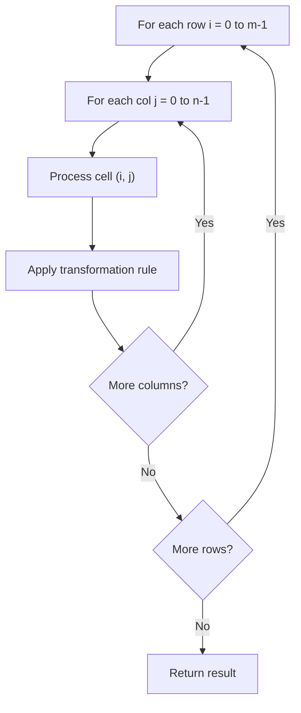

# Problem 766: Toeplitz Matrix

**Difficulty:** Easy  
**Tags:** Array, Matrix  
**Pattern:** Matrix / 2D Array  
**Link:** [leetcode.com/problems/toeplitz-matrix](https://leetcode.com/problems/toeplitz-matrix/)

## Description

Given an `m x n` `matrix`, return *`true` if the matrix is Toeplitz. Otherwise, return `false`.*

A matrix is **Toeplitz** if every diagonal from top-left to bottom-right has the same elements.

 

Example 1:

```

**Input:** matrix = [[1,2,3,4],[5,1,2,3],[9,5,1,2]]
**Output:** true
**Explanation:**
In the above grid, the diagonals are:
"[9]", "[5, 5]", "[1, 1, 1]", "[2, 2, 2]", "[3, 3]", "[4]".
In each diagonal all elements are the same, so the answer is True.

```

Example 2:

```

**Input:** matrix = [[1,2],[2,2]]
**Output:** false
**Explanation:**
The diagonal "[1, 2]" has different elements.

```

 

**Constraints:**

	- `m == matrix.length`
	- `n == matrix[i].length`
	- `1 <= m, n <= 20`
	- `0 <= matrix[i][j] <= 99`

 

**Follow up:**

	- What if the `matrix` is stored on disk, and the memory is limited such that you can only load at most one row of the matrix into the memory at once?
	- What if the `matrix` is so large that you can only load up a partial row into the memory at once?

## Approach: Matrix / 2D Array

Process the matrix row by row or column by column. Common patterns: rotation, spiral traversal, in-place modification, transposition.

## Pseudocode

```
1. For each row i:
   For each column j:
     Process cell (i, j) based on neighbors or rules
2. Handle boundary conditions
3. Return modified matrix or computed result
```

## Algorithm Flow



## Complexity Analysis

- **Time:** O(m * n)
- **Space:** O(1) extra

## Solution (Python3)

```python
class Solution:
    def isToeplitzMatrix(self, matrix: List[List[int]]) -> bool:
        # Matrix manipulation - O(m*n) time
        if not matrix:
            return False
        m, n = len(matrix), len(matrix[0])
        # Process matrix in-place or build result
        for i in range(m):
            for j in range(n):
                pass  # Process matrix[i][j]
        return False
```

## Solution (C++)

```cpp
#include <string>
#include <vector>
using namespace std;

class Solution {
public:
    bool isToeplitzMatrix(vector<vector<int>>& matrix) {
        // Matrix manipulation - O(m*n) time
        if (matrix.empty()) return false;
        int m = matrix.size(), n = matrix[0].size();
        for (int i = 0; i < m; i++) {
            for (int j = 0; j < n; j++) {
                // Process matrix[i][j]
            }
        }
        return false;
    }
};
```
