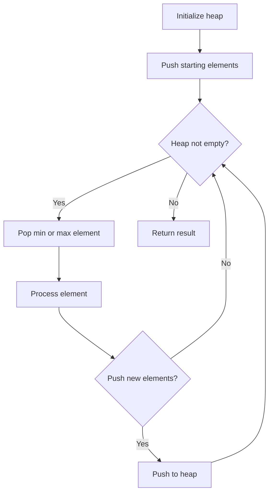
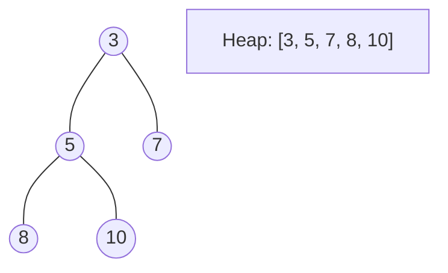
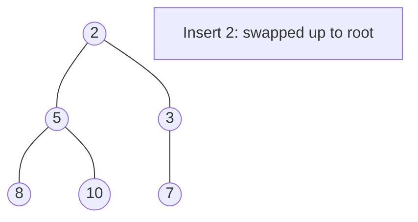
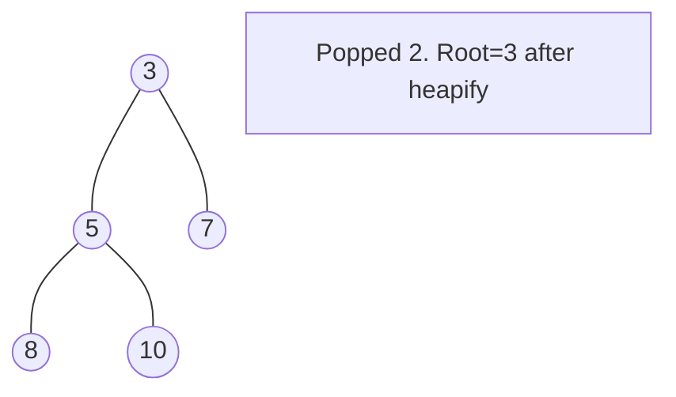

# Problem 767: Reorganize String

**Difficulty:** Medium  
**Tags:** Hash Table, String, Greedy, Sorting, Heap (Priority Queue), Counting  
**Pattern:** Heap / Priority Queue  
**Link:** [leetcode.com/problems/reorganize-string](https://leetcode.com/problems/reorganize-string/)

## Description

Given a string `s`, rearrange the characters of `s` so that any two adjacent characters are not the same.

Return *any possible rearrangement of* `s` *or return* `""` *if not possible*.

 

Example 1:

```
**Input:** s = "aab"
**Output:** "aba"

```
Example 2:

```
**Input:** s = "aaab"
**Output:** ""

```

 

**Constraints:**

	- `1 <= s.length <= 500`
	- `s` consists of lowercase English letters.

## Approach: Heap / Priority Queue

Use a min-heap or max-heap to efficiently access the smallest/largest element. Push elements and pop the top to process in priority order.

## Pseudocode

```
1. Initialize heap (min or max)
2. Push initial elements onto heap
3. While heap not empty and condition:
   a. Pop top element (min or max)
   b. Process element
   c. Push new elements if needed
4. Return result
```

## Algorithm Flow



## Visual State Transitions

**Heap Operations (Min-Heap):**

**Frame 1: Initial heap**


**Frame 2: Insert 2 - bubble up**


**Frame 3: Pop minimum (2) - heapify down**



## Complexity Analysis

- **Time:** O(n log n)
- **Space:** O(n)

## Solution (Python3)

```python
class Solution:
    def reorganizeString(self, s: str) -> str:
        # Heap/Priority Queue - O(n log k) time
        import heapq
        if not s:
            return ""
        # Min heap (negate for max heap)
        heap = []
        for val in s:
            heapq.heappush(heap, val)
            if len(heap) > (s if isinstance(s, int) else len(s)):
                heapq.heappop(heap)
        return heap[0] if heap else ""
```

## Solution (C++)

```cpp
#include <queue>
#include <string>
#include <vector>
using namespace std;

class Solution {
public:
    string reorganizeString(string& s) {
        // Heap/Priority Queue - O(n log k) time
        priority_queue<int, vector<int>, greater<int>> pq;
        for (int val : s) {
            pq.push(val);
            if ((int)pq.size() > s)
                pq.pop();
        }
        return pq.empty() ? "" : pq.top();
    }
};
```
