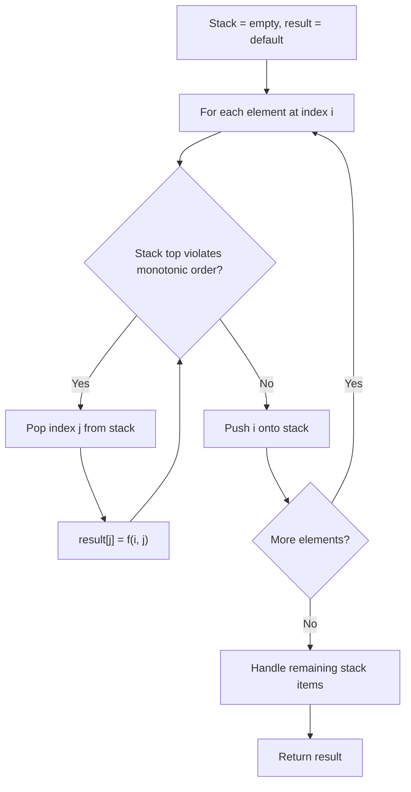
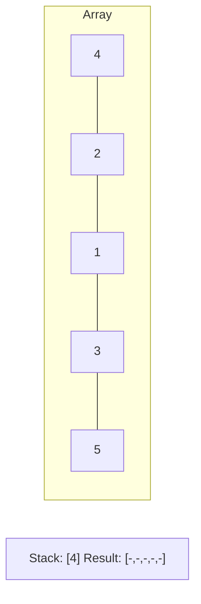
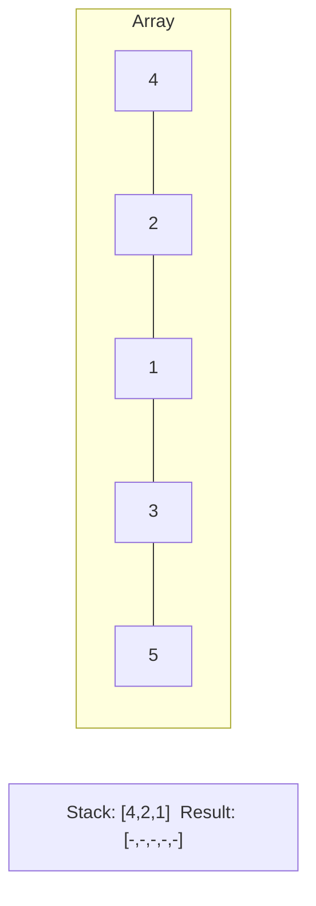
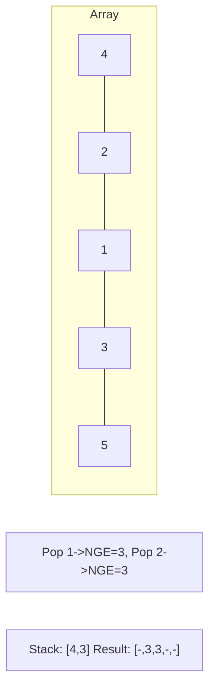
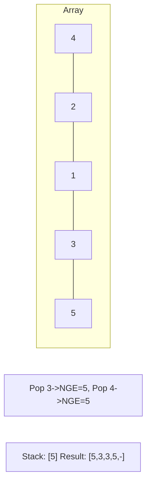

# Problem 768: Max Chunks To Make Sorted II

**Difficulty:** Hard  
**Tags:** Array, Stack, Greedy, Sorting, Monotonic Stack  
**Pattern:** Monotonic Stack  
**Link:** [leetcode.com/problems/max-chunks-to-make-sorted-ii](https://leetcode.com/problems/max-chunks-to-make-sorted-ii/)

## Description

You are given an integer array `arr`.

We split `arr` into some number of **chunks** (i.e., partitions), and individually sort each chunk. After concatenating them, the result should equal the sorted array.

Return *the largest number of chunks we can make to sort the array*.

 

Example 1:

```

**Input:** arr = [5,4,3,2,1]
**Output:** 1
**Explanation:**
Splitting into two or more chunks will not return the required result.
For example, splitting into [5, 4], [3, 2, 1] will result in [4, 5, 1, 2, 3], which isn't sorted.

```

Example 2:

```

**Input:** arr = [2,1,3,4,4]
**Output:** 4
**Explanation:**
We can split into two chunks, such as [2, 1], [3, 4, 4].
However, splitting into [2, 1], [3], [4], [4] is the highest number of chunks possible.

```

 

**Constraints:**

	- `1 <= arr.length <= 2000`
	- `0 <= arr[i] <= 10^8`

## Approach: Monotonic Stack

Maintain a stack where elements are always in monotonic order (increasing or decreasing). When a new element violates the monotonic property, pop elements and compute results (e.g., next greater/smaller element, spans, areas).

## Pseudocode

```
1. Initialize empty stack, result array
2. For each element (index i):
   a. While stack not empty and arr[i] breaks monotonic order:
      - Pop index j from stack
      - result[j] = compute(i, j)
   b. Push i onto stack
3. Handle remaining elements in stack
4. Return result
```

## Algorithm Flow



## Visual State Transitions

**Monotonic Stack (Next Greater Element):**

**Frame 1: Process first elements**


**Frame 2: Push smaller elements**


**Frame 3: Element 3 pops 1 and 2**


**Frame 4: Element 5 pops all**



## Complexity Analysis

- **Time:** O(n)
- **Space:** O(n)

## Solution (Python3)

```python
class Solution:
    def maxChunksToSorted(self, arr: List[int]) -> int:
        # Monotonic stack - O(n) time, O(n) space
        n = len(arr)
        result = [0] * n
        stack = []  # indices
        for i in range(n):
            while stack and arr[i] > arr[stack[-1]]:
                idx = stack.pop()
                result[idx] = i - idx
            stack.append(i)
        return result
```

## Solution (C++)

```cpp
#include <stack>
#include <string>
#include <vector>
using namespace std;

class Solution {
public:
    int maxChunksToSorted(vector<int>& arr) {
        // Monotonic stack - O(n) time, O(n) space
        int n = arr.size();
        vector<int> result(n, 0);
        stack<int> st;
        for (int i = 0; i < n; i++) {
            while (!st.empty() && arr[i] > arr[st.top()]) {
                int idx = st.top(); st.pop();
                result[idx] = i - idx;
            }
            st.push(i);
        }
        return result;
    }
};
```
