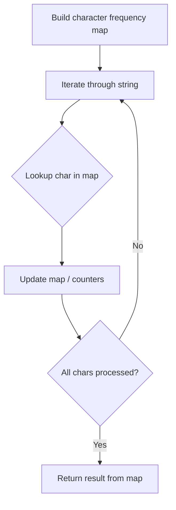

# Problem 771: Jewels and Stones

**Difficulty:** Easy  
**Tags:** Hash Table, String  
**Pattern:** Hash Map String Processing  
**Link:** [leetcode.com/problems/jewels-and-stones](https://leetcode.com/problems/jewels-and-stones/)

## Description

You're given strings `jewels` representing the types of stones that are jewels, and `stones` representing the stones you have. Each character in `stones` is a type of stone you have. You want to know how many of the stones you have are also jewels.

Letters are case sensitive, so `"a"` is considered a different type of stone from `"A"`.

 

Example 1:

```
**Input:** jewels = "aA", stones = "aAAbbbb"
**Output:** 3

```
Example 2:

```
**Input:** jewels = "z", stones = "ZZ"
**Output:** 0

```

 

**Constraints:**

	- `1 <= jewels.length, stones.length <= 50`
	- `jewels` and `stones` consist of only English letters.
	- All the characters of `jewels` are **unique**.

## Approach: Hash Map String Processing

Use a hash map to count character frequencies or map characters/strings for O(1) lookups. Process the string in one or two passes.

## Pseudocode

```
1. Build frequency map / char-to-index map
2. Iterate through string:
   a. Look up character in map
   b. Update counts or mappings
3. Return result based on map state
```

## Algorithm Flow



## Complexity Analysis

- **Time:** O(n)
- **Space:** O(n)

## Solution (Python3)

```python
class Solution:
    def numJewelsInStones(self, jewels: str, stones: str) -> int:
        # Hash map for string/character frequency - O(n) time
        freq = {}
        for ch in jewels:
            freq[ch] = freq.get(ch, 0) + 1
        # Process frequency map
        for ch, cnt in freq.items():
            if cnt == 1:
                return jewels.index(ch)
        return 0
```

## Solution (C++)

```cpp
#include <string>
#include <unordered_map>
#include <vector>
using namespace std;

class Solution {
public:
    int numJewelsInStones(string& jewels, string& stones) {
        // Hash map for string/character frequency - O(n) time
        unordered_map<char, int> freq;
        for (char ch : jewels) {
            freq[ch]++;
        }
        // Process frequency map
        for (int i = 0; i < jewels.size(); i++) {
            if (freq[jewels[i]] == 1) return i;
        }
        return 0;
    }
};
```
