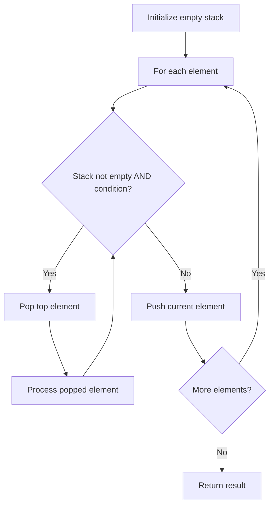

# Problem 772: Basic Calculator III

**Difficulty:** Hard  
**Tags:** Math, String, Stack, Recursion  
**Pattern:** Stack  
**Link:** [leetcode.com/problems/basic-calculator-iii](https://leetcode.com/problems/basic-calculator-iii/)

## Description

*(Premium problem -- description requires LeetCode subscription)*

## Approach: Stack

Use a stack (LIFO) to process elements. Push elements when they might be needed later; pop when a matching or resolving condition is found. Common uses: parentheses matching, expression evaluation, next greater element.

## Pseudocode

```
1. Initialize empty stack
2. For each element:
   a. While stack is not empty and condition met:
      - Pop and process top element
   b. Push current element onto stack
3. Process remaining elements in stack if needed
4. Return result
```

## Algorithm Flow



## Complexity Analysis

- **Time:** O(n)
- **Space:** O(n)

## Solution (Python3)

```python
class Solution:
    pass
```

## Solution (C++)

```cpp
class Solution {
public:
    // Design problem stub
};
```
