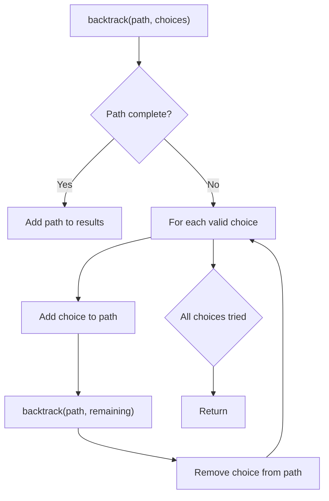
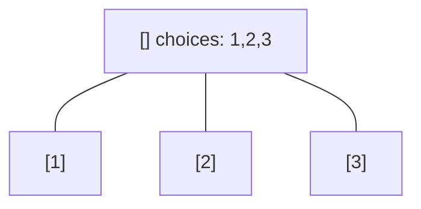
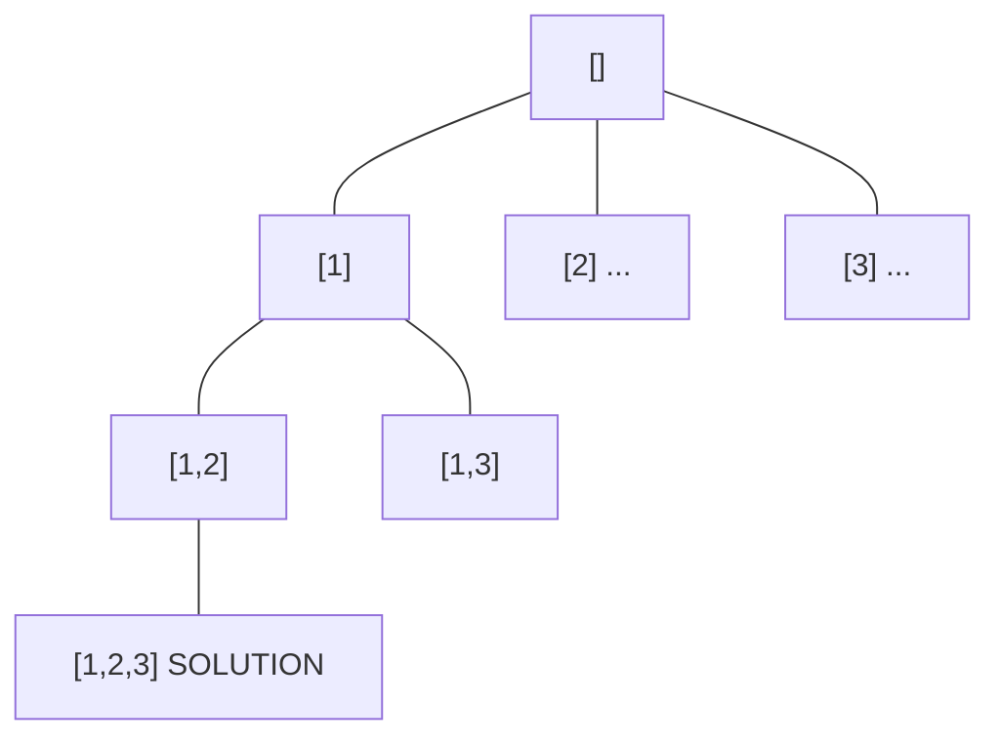
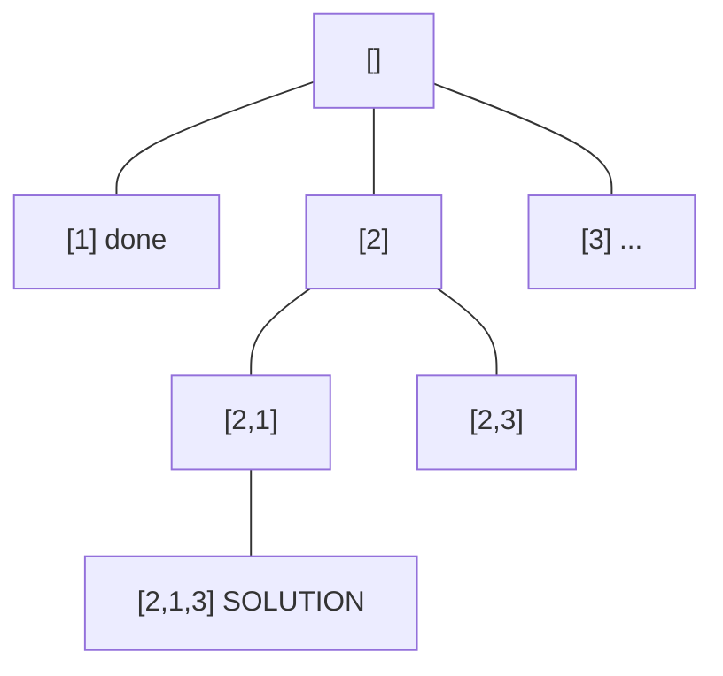
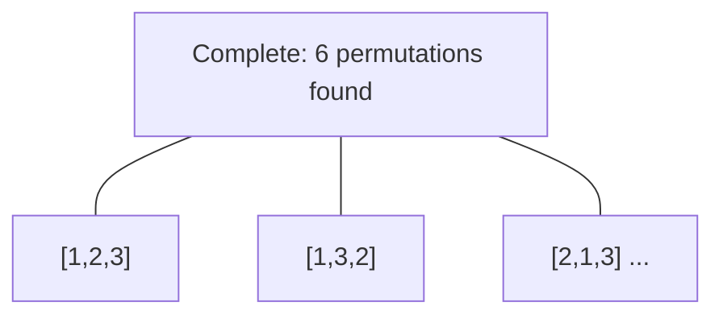

# Problem 773: Sliding Puzzle

**Difficulty:** Hard  
**Tags:** Array, Dynamic Programming, Backtracking, Breadth-First Search, Memoization, Matrix  
**Pattern:** Backtracking  
**Link:** [leetcode.com/problems/sliding-puzzle](https://leetcode.com/problems/sliding-puzzle/)

## Description

On an `2 x 3` board, there are five tiles labeled from `1` to `5`, and an empty square represented by `0`. A **move** consists of choosing `0` and a 4-directionally adjacent number and swapping it.

The state of the board is solved if and only if the board is `[[1,2,3],[4,5,0]]`.

Given the puzzle board `board`, return *the least number of moves required so that the state of the board is solved*. If it is impossible for the state of the board to be solved, return `-1`.

 

Example 1:

```

**Input:** board = [[1,2,3],[4,0,5]]
**Output:** 1
**Explanation:** Swap the 0 and the 5 in one move.

```

Example 2:

```

**Input:** board = [[1,2,3],[5,4,0]]
**Output:** -1
**Explanation:** No number of moves will make the board solved.

```

Example 3:

```

**Input:** board = [[4,1,2],[5,0,3]]
**Output:** 5
**Explanation:** 5 is the smallest number of moves that solves the board.
An example path:
After move 0: [[4,1,2],[5,0,3]]
After move 1: [[4,1,2],[0,5,3]]
After move 2: [[0,1,2],[4,5,3]]
After move 3: [[1,0,2],[4,5,3]]
After move 4: [[1,2,0],[4,5,3]]
After move 5: [[1,2,3],[4,5,0]]

```

 

**Constraints:**

	- `board.length == 2`
	- `board[i].length == 3`
	- `0 <= board[i][j] <= 5`
	- Each value `board[i][j]` is **unique**.

## Approach: Backtracking

Explore all possible solutions by building candidates incrementally. At each step, make a choice and recurse. If the choice leads to a dead end, undo the choice (backtrack) and try the next option.

## Pseudocode

```
1. Define backtrack(path, choices):
   a. If path is a complete solution: add to results
   b. For each choice in choices:
      - If choice is valid:
        * Add choice to path
        * backtrack(path, remaining_choices)
        * Remove choice from path (backtrack)
2. Call backtrack([], all_choices)
```

## Algorithm Flow



## Visual State Transitions

**Backtracking Decision Tree:**

**Frame 1: Root - start with empty path**


**Frame 2: Explore branch [1]**


**Frame 3: Backtrack, explore [2]**


**Frame 4: All solutions found**



## Complexity Analysis

- **Time:** O(k^n) or O(n!)
- **Space:** O(n)

## Solution (Python3)

```python
class Solution:
    def slidingPuzzle(self, board: List[List[int]]) -> int:
        # Backtracking - O(2^n) or O(n!) time
        result = []
        
        def backtrack(path, start):
            result.append(path[:])
            for i in range(start, len(board)):
                path.append(board[i])
                backtrack(path, i + 1)
                path.pop()
        
        backtrack([], 0)
        return result
```

## Solution (C++)

```cpp
#include <functional>
#include <string>
#include <vector>
using namespace std;

class Solution {
public:
    int slidingPuzzle(vector<vector<int>>& board) {
        // Backtracking - O(2^n) or O(n!) time
        vector<vector<int>> result;
        vector<int> path;
        function<void(int)> backtrack = [&](int start) {
            result.push_back(path);
            for (int i = start; i < (int)board.size(); i++) {
                path.push_back(board[i]);
                backtrack(i + 1);
                path.pop_back();
            }
        };
        backtrack(0);
        return result;
    }
};
```
