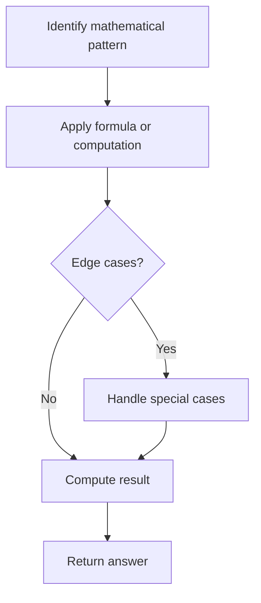

# Problem 775: Global and Local Inversions

**Difficulty:** Medium  
**Tags:** Array, Math  
**Pattern:** Math  
**Link:** [leetcode.com/problems/global-and-local-inversions](https://leetcode.com/problems/global-and-local-inversions/)

## Description

You are given an integer array `nums` of length `n` which represents a permutation of all the integers in the range `[0, n - 1]`.

The number of **global inversions** is the number of the different pairs `(i, j)` where:

	- `0 <= i < j < n`
	- `nums[i] > nums[j]`

The number of **local inversions** is the number of indices `i` where:

	- `0 <= i < n - 1`
	- `nums[i] > nums[i + 1]`

Return `true` *if the number of **global inversions** is equal to the number of **local inversions***.

 

Example 1:

```

**Input:** nums = [1,0,2]
**Output:** true
**Explanation:** There is 1 global inversion and 1 local inversion.

```

Example 2:

```

**Input:** nums = [1,2,0]
**Output:** false
**Explanation:** There are 2 global inversions and 1 local inversion.

```

 

**Constraints:**

	- `n == nums.length`
	- `1 <= n <= 10^5`
	- `0 <= nums[i] < n`
	- All the integers of `nums` are **unique**.
	- `nums` is a permutation of all the numbers in the range `[0, n - 1]`.

## Approach: Math

Apply mathematical properties, formulas, or number-theoretic concepts. Look for patterns, modular arithmetic, or closed-form solutions.

## Pseudocode

```
1. Identify the mathematical pattern or formula
2. Apply computation:
   - Modular arithmetic for large numbers
   - GCD/LCM for divisibility
   - Sieve for primes
3. Handle edge cases
4. Return result
```

## Algorithm Flow



## Complexity Analysis

- **Time:** O(n) or O(sqrt(n))
- **Space:** O(1)

## Solution (Python3)

```python
class Solution:
    def isIdealPermutation(self, nums: List[int]) -> bool:
        # Mathematical approach
        result = 0
        x = nums
        while x != 0:
            result = result * 10 + x % 10
            x //= 10 if isinstance(x, int) else 1
        return result
```

## Solution (C++)

```cpp
#include <string>
#include <vector>
using namespace std;

class Solution {
public:
    bool isIdealPermutation(vector<int>& nums) {
        // Mathematical approach
        long long result = 0;
        int x = nums;
        while (x != 0) {
            result = result * 10 + x % 10;
            x /= 10;
        }
        return (int)result;
    }
};
```
