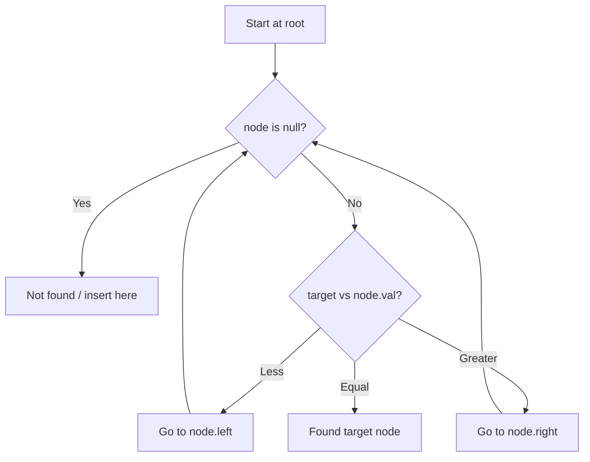

# Problem 776: Split BST

**Difficulty:** Medium  
**Tags:** Tree, Binary Search Tree, Recursion, Binary Tree  
**Pattern:** Binary Search Tree  
**Link:** [leetcode.com/problems/split-bst](https://leetcode.com/problems/split-bst/)

## Description

*(Premium problem -- description requires LeetCode subscription)*

## Approach: Binary Search Tree

Leverage BST property: left < root < right. Navigate left for smaller values, right for larger values. Inorder traversal yields sorted order.

## Pseudocode

```
1. Start at root
2. Compare target with current node:
   a. If target < node.val: go left
   b. If target > node.val: go right
   c. If equal: found
3. Return result
```

## Algorithm Flow



## Complexity Analysis

- **Time:** O(h)
- **Space:** O(h)

## Solution (Python3)

```python
class Solution:
    pass
```

## Solution (C++)

```cpp
class Solution {
public:
    // Design problem stub
};
```
