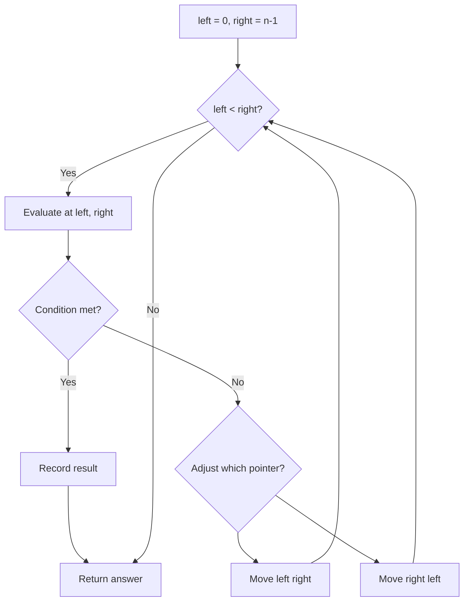
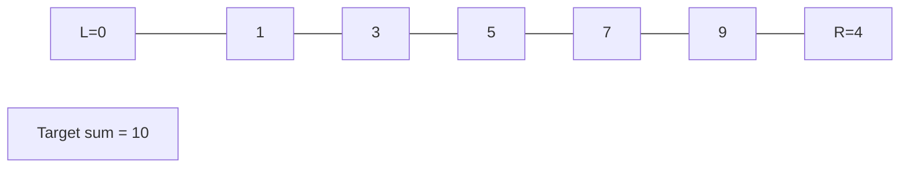
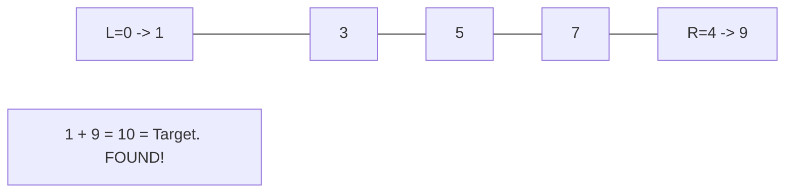

# Problem 777: Swap Adjacent in LR String

**Difficulty:** Medium  
**Tags:** Two Pointers, String  
**Pattern:** Two Pointers  
**Link:** [leetcode.com/problems/swap-adjacent-in-lr-string](https://leetcode.com/problems/swap-adjacent-in-lr-string/)

## Description

In a string composed of `'L'`, `'R'`, and `'X'` characters, like `"RXXLRXRXL"`, a move consists of either replacing one occurrence of `"XL"` with `"LX"`, or replacing one occurrence of `"RX"` with `"XR"`. Given the starting string `start` and the ending string `result`, return `True` if and only if there exists a sequence of moves to transform `start` to `result`.

 

Example 1:

```

**Input:** start = "RXXLRXRXL", result = "XRLXXRRLX"
**Output:** true
**Explanation:** We can transform start to result following these steps:
RXXLRXRXL ->
XRXLRXRXL ->
XRLXRXRXL ->
XRLXXRRXL ->
XRLXXRRLX

```

Example 2:

```

**Input:** start = "X", result = "L"
**Output:** false

```

 

**Constraints:**

	- `1 <= start.length <= 10^4`
	- `start.length == result.length`
	- Both `start` and `result` will only consist of characters in `'L'`, `'R'`, and `'X'`.

## Approach: Two Pointers

Use two pointers moving through the data structure. Depending on the problem, pointers may move toward each other (converging), in the same direction (fast/slow), or independently.

## Pseudocode

```
1. Initialize left = 0, right = n-1 (or two independent pointers)
2. While pointers haven't crossed:
   a. Evaluate condition at pointer positions
   b. Move left pointer right or right pointer left
3. Return result
```

## Algorithm Flow



## Visual State Transitions

**Two Pointer Convergence:**

**Frame 1: Initialize pointers**


**Frame 2: Sum = 1+9 = 10, found!**



## Complexity Analysis

- **Time:** O(n)
- **Space:** O(1)

## Solution (Python3)

```python
class Solution:
    def canTransform(self, start: str, result: str) -> bool:
        # Two pointer approach - O(n) time, O(1) space
        left, right = 0, len(start) - 1
        while left < right:
            curr = start[left] + start[right]
            if curr == result:
                return [left, right]
            elif curr < result:
                left += 1
            else:
                right -= 1
        return False
```

## Solution (C++)

```cpp
#include <string>
#include <vector>
using namespace std;

class Solution {
public:
    bool canTransform(string& start, string& result) {
        // Two pointer approach - O(n) time, O(1) space
        int left = 0, right = start.size() - 1;
        while (left < right) {
            int curr = start[left] + start[right];
            if (curr == result) {
                return {left, right};
            } else if (curr < result) {
                left++;
            } else {
                right--;
            }
        }
        return false;
    }
};
```
