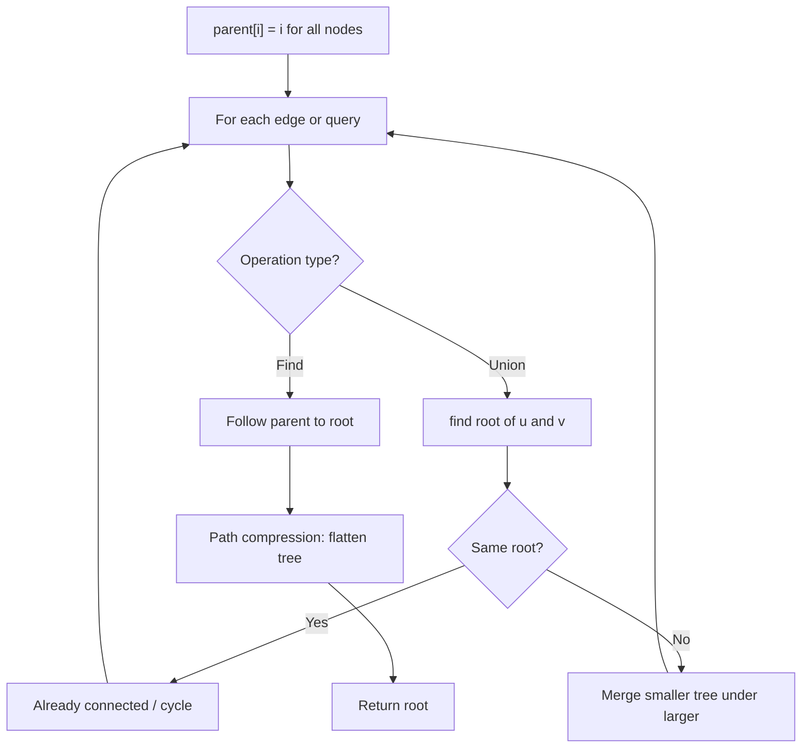
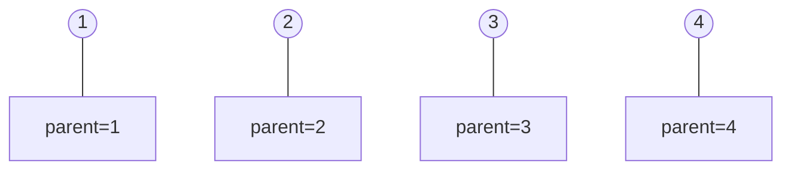
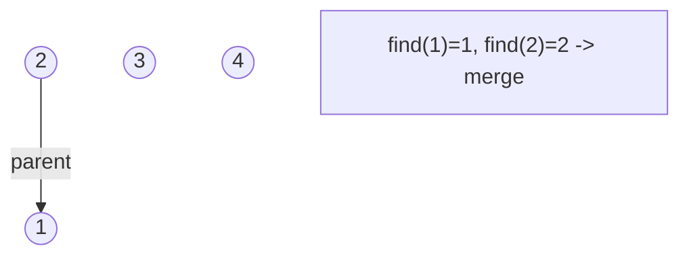
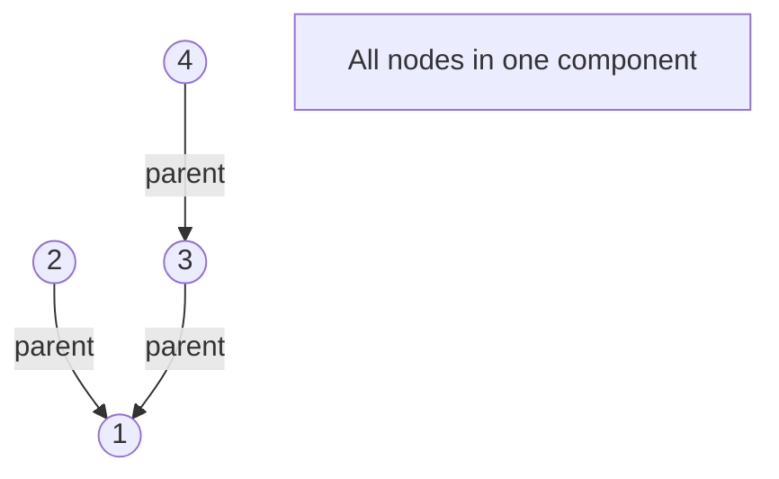
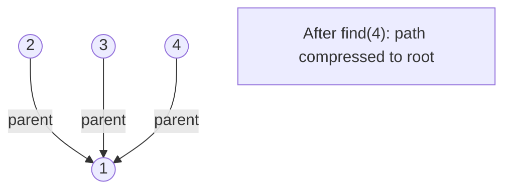

# Problem 778: Swim in Rising Water

**Difficulty:** Hard  
**Tags:** Array, Binary Search, Depth-First Search, Breadth-First Search, Union-Find, Heap (Priority Queue), Matrix  
**Pattern:** Union-Find / Disjoint Set  
**Link:** [leetcode.com/problems/swim-in-rising-water](https://leetcode.com/problems/swim-in-rising-water/)

## Description

You are given an `n x n` integer matrix `grid` where each value `grid[i][j]` represents the elevation at that point `(i, j)`.

It starts raining, and water gradually rises over time. At time `t`, the water level is `t`, meaning **any** cell with elevation less than equal to `t` is submerged or reachable.

You can swim from a square to another 4-directionally adjacent square if and only if the elevation of both squares individually are at most `t`. You can swim infinite distances in zero time. Of course, you must stay within the boundaries of the grid during your swim.

Return *the minimum time until you can reach the bottom right square *`(n - 1, n - 1)`* if you start at the top left square *`(0, 0)`.

 

Example 1:

```

**Input:** grid = [[0,2],[1,3]]
**Output:** 3
Explanation:
At time 0, you are in grid location (0, 0).
You cannot go anywhere else because 4-directionally adjacent neighbors have a higher elevation than t = 0.
You cannot reach point (1, 1) until time 3.
When the depth of water is 3, we can swim anywhere inside the grid.

```

Example 2:

```

**Input:** grid = [[0,1,2,3,4],[24,23,22,21,5],[12,13,14,15,16],[11,17,18,19,20],[10,9,8,7,6]]
**Output:** 16
**Explanation:** The final route is shown.
We need to wait until time 16 so that (0, 0) and (4, 4) are connected.

```

 

**Constraints:**

	- `n == grid.length`
	- `n == grid[i].length`
	- `1 <= n <= 50`
	- `0 <= grid[i][j] < n^2`
	- Each value `grid[i][j]` is **unique**.

## Approach: Union-Find / Disjoint Set

Use Union-Find with path compression and union by rank to efficiently manage connected components. Find(x) returns the root of x's component; Union(x,y) merges two components.

## Pseudocode

```
1. parent[i] = i for all nodes (each is its own set)
2. find(x): follow parent pointers to root (with path compression)
3. union(x, y): merge sets of x and y by rank
4. Process edges/operations:
   a. For each edge (u, v): union(u, v)
5. Answer queries using find()
```

## Algorithm Flow



## Visual State Transitions

**Union-Find Step-by-Step:**

**Frame 1: Initial - each node is own parent**


**Frame 2: Union(1,2) - merge components**


**Frame 3: Union(3,4) then Union(2,3)**


**Frame 4: Path compression on find(4)**



## Complexity Analysis

- **Time:** O(n * alpha(n))
- **Space:** O(n)

## Solution (Python3)

```python
class Solution:
    def swimInWater(self, grid: List[List[int]]) -> int:
        # Union Find (Disjoint Set Union) - O(n * alpha(n))
        parent = list(range(len(grid) + 1 if isinstance(grid, list) else grid + 1))
        rank = [0] * len(parent)
        
        def find(x):
            if parent[x] != x:
                parent[x] = find(parent[x])
            return parent[x]
        
        def union(x, y):
            px, py = find(x), find(y)
            if px == py:
                return False
            if rank[px] < rank[py]:
                px, py = py, px
            parent[py] = px
            if rank[px] == rank[py]:
                rank[px] += 1
            return True
        
        components = len(parent)
        # Process edges/connections
        return components
```

## Solution (C++)

```cpp
#include <functional>
#include <numeric>
#include <string>
#include <vector>
using namespace std;

class Solution {
public:
    int swimInWater(vector<vector<int>>& grid) {
        // Union Find (DSU) - O(n * alpha(n))
        int n = grid.size();
        vector<int> parent(n + 1), rnk(n + 1, 0);
        iota(parent.begin(), parent.end(), 0);
        function<int(int)> find = [&](int x) -> int {
            return parent[x] == x ? x : parent[x] = find(parent[x]);
        };
        auto unite = [&](int x, int y) -> bool {
            int px = find(x), py = find(y);
            if (px == py) return false;
            if (rnk[px] < rnk[py]) swap(px, py);
            parent[py] = px;
            if (rnk[px] == rnk[py]) rnk[px]++;
            return true;
        };
        int components = n;
        return components;
    }
};
```
