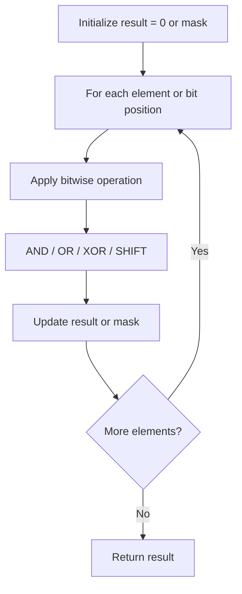

# Problem 779: K-th Symbol in Grammar

**Difficulty:** Medium  
**Tags:** Math, Bit Manipulation, Recursion  
**Pattern:** Bit Manipulation  
**Link:** [leetcode.com/problems/k-th-symbol-in-grammar](https://leetcode.com/problems/k-th-symbol-in-grammar/)

## Description

We build a table of `n` rows (**1-indexed**). We start by writing `0` in the `1^st` row. Now in every subsequent row, we look at the previous row and replace each occurrence of `0` with `01`, and each occurrence of `1` with `10`.

	- For example, for `n = 3`, the `1^st` row is `0`, the `2^nd` row is `01`, and the `3^rd` row is `0110`.

Given two integer `n` and `k`, return the `k^th` (**1-indexed**) symbol in the `n^th` row of a table of `n` rows.

 

Example 1:

```

**Input:** n = 1, k = 1
**Output:** 0
**Explanation:** row 1: 0

```

Example 2:

```

**Input:** n = 2, k = 1
**Output:** 0
**Explanation:** 
row 1: 0
row 2: 01

```

Example 3:

```

**Input:** n = 2, k = 2
**Output:** 1
**Explanation:** 
row 1: 0
row 2: 01

```

 

**Constraints:**

	- `1 <= n <= 30`
	- `1 <= k <= 2^n - 1`

## Approach: Bit Manipulation

Operate on individual bits using bitwise operators (AND, OR, XOR, shift). Common tricks: x & (x-1) removes lowest set bit, x ^ x = 0, XOR all elements to find unique.

## Pseudocode

```
1. Apply bitwise operations:
   - XOR all elements to cancel paired bits
   - Use bitmask to track state
   - Shift and mask to extract/set individual bits
2. Return result
```

## Algorithm Flow



## Complexity Analysis

- **Time:** O(n) or O(log n)
- **Space:** O(1)

## Solution (Python3)

```python
class Solution:
    def kthGrammar(self, n: int, k: int) -> int:
        # Bit manipulation - O(n) time, O(1) space
        result = 0
        for val in n:
            result ^= val
        return result
```

## Solution (C++)

```cpp
#include <string>
#include <vector>
using namespace std;

class Solution {
public:
    int kthGrammar(int n, int k) {
        // Bit manipulation - O(n) time, O(1) space
        int result = 0;
        for (int val : n) {
            result ^= val;
        }
        return result;
    }
};
```
