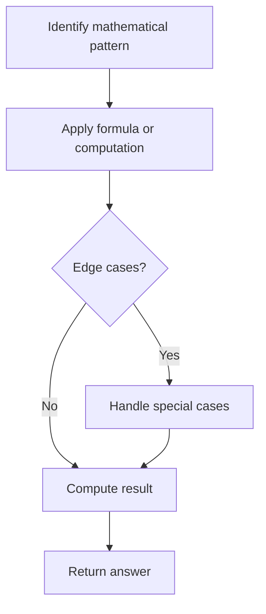

# Problem 780: Reaching Points

**Difficulty:** Hard  
**Tags:** Math  
**Pattern:** Math  
**Link:** [leetcode.com/problems/reaching-points](https://leetcode.com/problems/reaching-points/)

## Description

Given four integers `sx`, `sy`, `tx`, and `ty`, return `true`* if it is possible to convert the point *`(sx, sy)`* to the point *`(tx, ty)` *through some operations**, or *`false`* otherwise*.

The allowed operation on some point `(x, y)` is to convert it to either `(x, x + y)` or `(x + y, y)`.

 

Example 1:

```

**Input:** sx = 1, sy = 1, tx = 3, ty = 5
**Output:** true
**Explanation:**
One series of moves that transforms the starting point to the target is:
(1, 1) -> (1, 2)
(1, 2) -> (3, 2)
(3, 2) -> (3, 5)

```

Example 2:

```

**Input:** sx = 1, sy = 1, tx = 2, ty = 2
**Output:** false

```

Example 3:

```

**Input:** sx = 1, sy = 1, tx = 1, ty = 1
**Output:** true

```

 

**Constraints:**

	- `1 <= sx, sy, tx, ty <= 10^9`

## Approach: Math

Apply mathematical properties, formulas, or number-theoretic concepts. Look for patterns, modular arithmetic, or closed-form solutions.

## Pseudocode

```
1. Identify the mathematical pattern or formula
2. Apply computation:
   - Modular arithmetic for large numbers
   - GCD/LCM for divisibility
   - Sieve for primes
3. Handle edge cases
4. Return result
```

## Algorithm Flow



## Complexity Analysis

- **Time:** O(n) or O(sqrt(n))
- **Space:** O(1)

## Solution (Python3)

```python
class Solution:
    def reachingPoints(self, sx: int, sy: int, tx: int, ty: int) -> bool:
        # Mathematical approach
        result = 0
        x = sx
        while x != 0:
            result = result * 10 + x % 10
            x //= 10 if isinstance(x, int) else 1
        return result
```

## Solution (C++)

```cpp
#include <string>
#include <vector>
using namespace std;

class Solution {
public:
    bool reachingPoints(int sx, int sy, int tx, int ty) {
        // Mathematical approach
        long long result = 0;
        int x = sx;
        while (x != 0) {
            result = result * 10 + x % 10;
            x /= 10;
        }
        return (int)result;
    }
};
```
