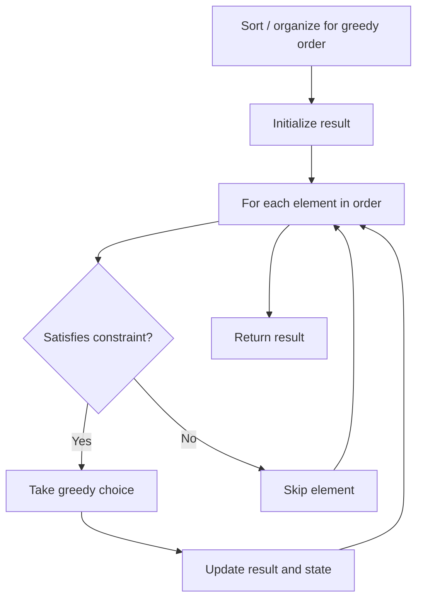

# Problem 781: Rabbits in Forest

**Difficulty:** Medium  
**Tags:** Array, Hash Table, Math, Greedy  
**Pattern:** Greedy  
**Link:** [leetcode.com/problems/rabbits-in-forest](https://leetcode.com/problems/rabbits-in-forest/)

## Description

There is a forest with an unknown number of rabbits. We asked n rabbits **"How many rabbits have the same color as you?"** and collected the answers in an integer array `answers` where `answers[i]` is the answer of the `i^th` rabbit.

Given the array `answers`, return *the minimum number of rabbits that could be in the forest*.

 

Example 1:

```

**Input:** answers = [1,1,2]
**Output:** 5
**Explanation:**
The two rabbits that answered "1" could both be the same color, say red.
The rabbit that answered "2" can't be red or the answers would be inconsistent.
Say the rabbit that answered "2" was blue.
Then there should be 2 other blue rabbits in the forest that didn't answer into the array.
The smallest possible number of rabbits in the forest is therefore 5: 3 that answered plus 2 that didn't.

```

Example 2:

```

**Input:** answers = [10,10,10]
**Output:** 11

```

 

**Constraints:**

	- `1 <= answers.length <= 1000`
	- `0 <= answers[i] < 1000`

## Approach: Greedy

Make the locally optimal choice at each step, trusting it leads to a global optimum. Greedy works when the problem has the greedy-choice property and optimal substructure.

## Pseudocode

```
1. Sort or organize data for greedy ordering
2. Initialize result
3. For each element in greedy order:
   a. If element satisfies constraint:
      - Take the greedy choice
      - Update result and state
4. Return result
```

## Algorithm Flow



## Complexity Analysis

- **Time:** O(n log n)
- **Space:** O(1)

## Solution (Python3)

```python
class Solution:
    def numRabbits(self, answers: List[int]) -> int:
        # Greedy approach - O(n) time
        result = 0
        curr_max = 0
        for i in range(len(answers)):
            if isinstance(answers[i], int):
                curr_max = max(curr_max, answers[i])
                result = max(result, curr_max)
            else:
                result += 1
        return result
```

## Solution (C++)

```cpp
#include <algorithm>
#include <string>
#include <vector>
using namespace std;

class Solution {
public:
    int numRabbits(vector<int>& answers) {
        // Greedy approach - O(n) time
        int result = 0, curr_max = 0;
        for (int i = 0; i < (int)answers.size(); i++) {
            curr_max = max(curr_max, answers[i]);
            result = max(result, curr_max);
        }
        return result;
    }
};
```
