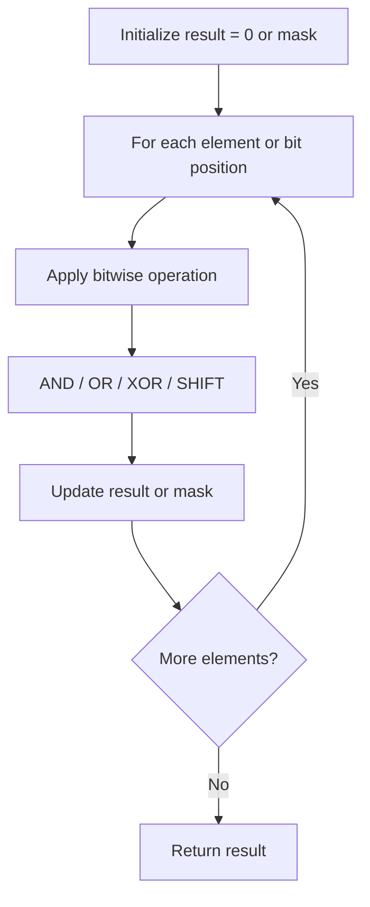

# Problem 782: Transform to Chessboard

**Difficulty:** Hard  
**Tags:** Array, Math, Bit Manipulation, Matrix  
**Pattern:** Bit Manipulation  
**Link:** [leetcode.com/problems/transform-to-chessboard](https://leetcode.com/problems/transform-to-chessboard/)

## Description

You are given an `n x n` binary grid `board`. In each move, you can swap any two rows with each other, or any two columns with each other.

Return *the minimum number of moves to transform the board into a **chessboard board***. If the task is impossible, return `-1`.

A **chessboard board** is a board where no `0`'s and no `1`'s are 4-directionally adjacent.

 

Example 1:

```

**Input:** board = [[0,1,1,0],[0,1,1,0],[1,0,0,1],[1,0,0,1]]
**Output:** 2
**Explanation:** One potential sequence of moves is shown.
The first move swaps the first and second column.
The second move swaps the second and third row.

```

Example 2:

```

**Input:** board = [[0,1],[1,0]]
**Output:** 0
**Explanation:** Also note that the board with 0 in the top left corner, is also a valid chessboard.

```

Example 3:

```

**Input:** board = [[1,0],[1,0]]
**Output:** -1
**Explanation:** No matter what sequence of moves you make, you cannot end with a valid chessboard.

```

 

**Constraints:**

	- `n == board.length`
	- `n == board[i].length`
	- `2 <= n <= 30`
	- `board[i][j]` is either `0` or `1`.

## Approach: Bit Manipulation

Operate on individual bits using bitwise operators (AND, OR, XOR, shift). Common tricks: x & (x-1) removes lowest set bit, x ^ x = 0, XOR all elements to find unique.

## Pseudocode

```
1. Apply bitwise operations:
   - XOR all elements to cancel paired bits
   - Use bitmask to track state
   - Shift and mask to extract/set individual bits
2. Return result
```

## Algorithm Flow



## Complexity Analysis

- **Time:** O(n) or O(log n)
- **Space:** O(1)

## Solution (Python3)

```python
class Solution:
    def movesToChessboard(self, board: List[List[int]]) -> int:
        # Bit manipulation - O(n) time, O(1) space
        result = 0
        for val in board:
            result ^= val
        return result
```

## Solution (C++)

```cpp
#include <string>
#include <vector>
using namespace std;

class Solution {
public:
    int movesToChessboard(vector<vector<int>>& board) {
        // Bit manipulation - O(n) time, O(1) space
        int result = 0;
        for (int val : board) {
            result ^= val;
        }
        return result;
    }
};
```
