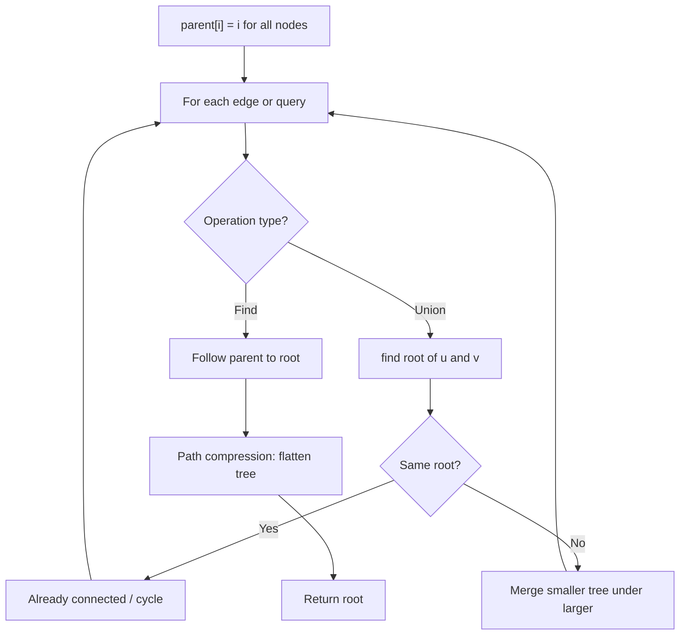
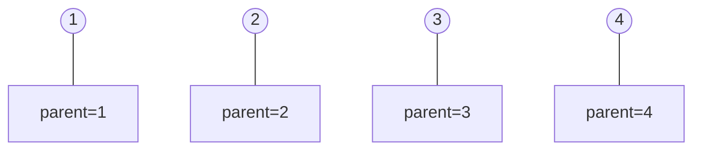
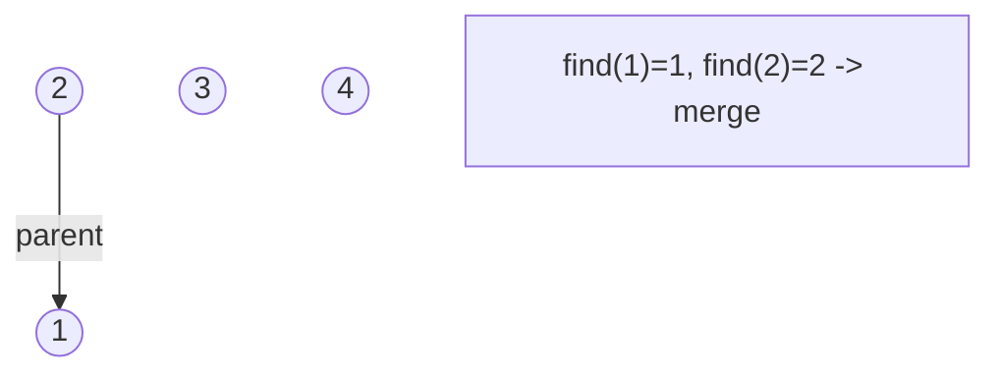
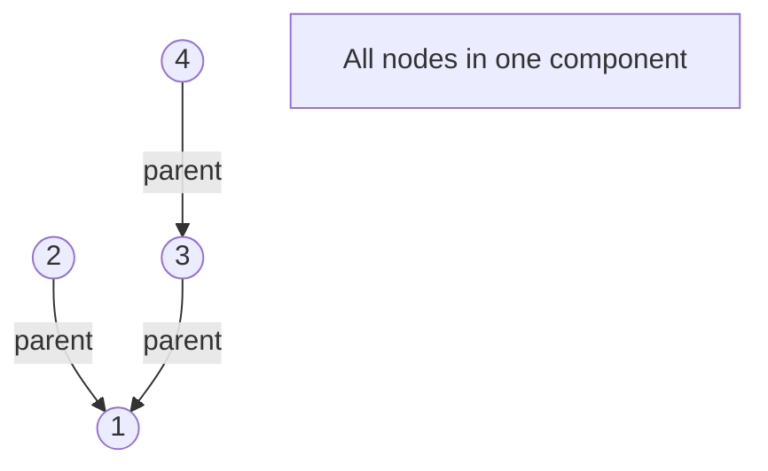
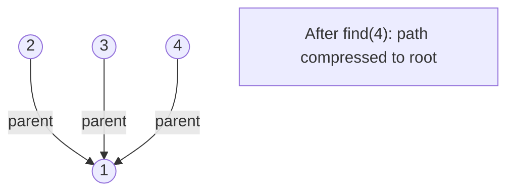

# Problem 785: Is Graph Bipartite?

**Difficulty:** Medium  
**Tags:** Depth-First Search, Breadth-First Search, Union-Find, Graph Theory  
**Pattern:** BFS / Graph Coloring  
**Link:** [leetcode.com/problems/is-graph-bipartite](https://leetcode.com/problems/is-graph-bipartite/)

## Description

There is an **undirected** graph with `n` nodes, where each node is numbered between `0` and `n - 1`. You are given a 2D array `graph`, where `graph[u]` is an array of nodes that node `u` is adjacent to. More formally, for each `v` in `graph[u]`, there is an undirected edge between node `u` and node `v`. The graph has the following properties:

	- There are no self-edges (`graph[u]` does not contain `u`).
	- There are no parallel edges (`graph[u]` does not contain duplicate values).
	- If `v` is in `graph[u]`, then `u` is in `graph[v]` (the graph is undirected).
	- The graph may not be connected, meaning there may be two nodes `u` and `v` such that there is no path between them.

A graph is **bipartite** if the nodes can be partitioned into two independent sets `A` and `B` such that **every** edge in the graph connects a node in set `A` and a node in set `B`.

Return `true`* if and only if it is **bipartite***.

 

Example 1:

```

**Input:** graph = [[1,2,3],[0,2],[0,1,3],[0,2]]
**Output:** false
**Explanation:** There is no way to partition the nodes into two independent sets such that every edge connects a node in one and a node in the other.
```

Example 2:

```

**Input:** graph = [[1,3],[0,2],[1,3],[0,2]]
**Output:** true
**Explanation:** We can partition the nodes into two sets: {0, 2} and {1, 3}.
```

 

**Constraints:**

	- `graph.length == n`
	- `1 <= n <= 100`
	- `0 <= graph[u].length < n`
	- `0 <= graph[u][i] <= n - 1`
	- `graph[u]` does not contain `u`.
	- All the values of `graph[u]` are **unique**.
	- If `graph[u]` contains `v`, then `graph[v]` contains `u`.

## Approach: BFS / Graph Coloring

BFS coloring: try to 2-color the graph. If adjacent nodes have same color, not bipartite.

## Pseudocode

```
1. parent[i] = i for all nodes (each is its own set)
2. find(x): follow parent pointers to root (with path compression)
3. union(x, y): merge sets of x and y by rank
4. Process edges/operations:
   a. For each edge (u, v): union(u, v)
5. Answer queries using find()
```

## Algorithm Flow



## Visual State Transitions

**Union-Find Step-by-Step:**

**Frame 1: Initial - each node is own parent**


**Frame 2: Union(1,2) - merge components**


**Frame 3: Union(3,4) then Union(2,3)**


**Frame 4: Path compression on find(4)**



## Complexity Analysis

- **Time:** O(V + E)
- **Space:** O(V)

## Solution (Python3)

```python
from collections import deque

class Solution:
    def isBipartite(self, graph: list[list[int]]) -> bool:
        n = len(graph)
        color = [-1] * n
        for start in range(n):
            if color[start] != -1:
                continue
            queue = deque([start])
            color[start] = 0
            while queue:
                u = queue.popleft()
                for v in graph[u]:
                    if color[v] == -1:
                        color[v] = 1 - color[u]
                        queue.append(v)
                    elif color[v] == color[u]:
                        return False
        return True
```

## Solution (C++)

```cpp
#include <functional>
#include <numeric>
#include <string>
#include <vector>
using namespace std;

class Solution {
public:
    bool isBipartite(vector<vector<int>>& graph) {
        // Union Find (DSU) - O(n * alpha(n))
        int n = graph.size();
        vector<int> parent(n + 1), rnk(n + 1, 0);
        iota(parent.begin(), parent.end(), 0);
        function<int(int)> find = [&](int x) -> int {
            return parent[x] == x ? x : parent[x] = find(parent[x]);
        };
        auto unite = [&](int x, int y) -> bool {
            int px = find(x), py = find(y);
            if (px == py) return false;
            if (rnk[px] < rnk[py]) swap(px, py);
            parent[py] = px;
            if (rnk[px] == rnk[py]) rnk[px]++;
            return true;
        };
        int components = n;
        return components;
    }
};
```
