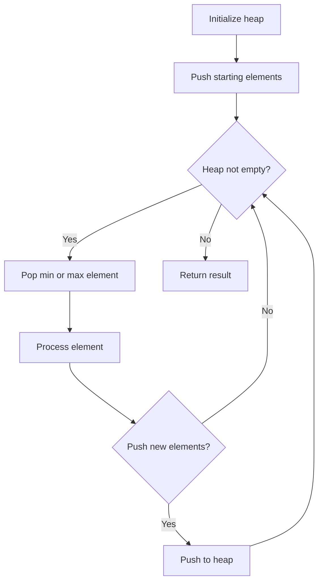
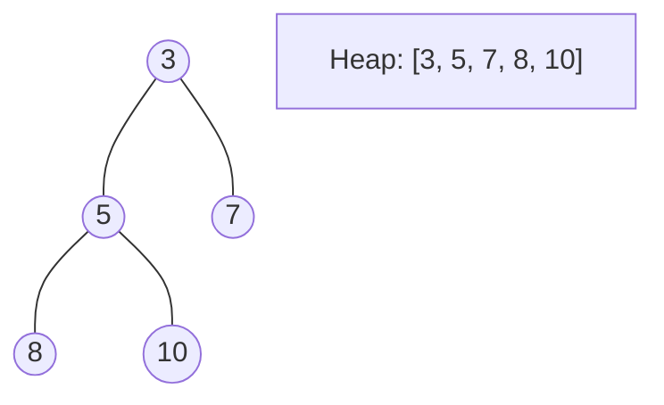
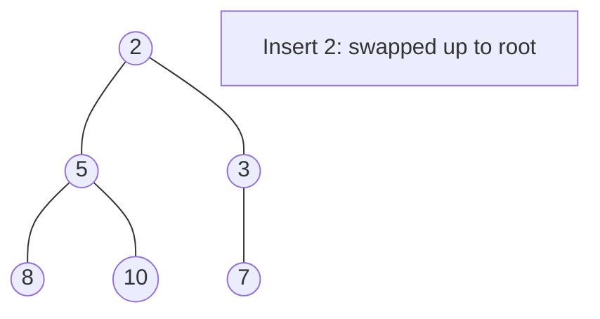
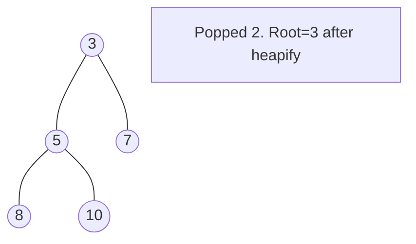

# Problem 786: K-th Smallest Prime Fraction

**Difficulty:** Medium  
**Tags:** Array, Two Pointers, Binary Search, Sorting, Heap (Priority Queue)  
**Pattern:** Heap / Priority Queue  
**Link:** [leetcode.com/problems/k-th-smallest-prime-fraction](https://leetcode.com/problems/k-th-smallest-prime-fraction/)

## Description

You are given a sorted integer array `arr` containing `1` and **prime** numbers, where all the integers of `arr` are unique. You are also given an integer `k`.

For every `i` and `j` where `0 <= i < j < arr.length`, we consider the fraction `arr[i] / arr[j]`.

Return *the* `k^th` *smallest fraction considered*. Return your answer as an array of integers of size `2`, where `answer[0] == arr[i]` and `answer[1] == arr[j]`.

 

Example 1:

```

**Input:** arr = [1,2,3,5], k = 3
**Output:** [2,5]
**Explanation:** The fractions to be considered in sorted order are:
1/5, 1/3, 2/5, 1/2, 3/5, and 2/3.
The third fraction is 2/5.

```

Example 2:

```

**Input:** arr = [1,7], k = 1
**Output:** [1,7]

```

 

**Constraints:**

	- `2 <= arr.length <= 1000`
	- `1 <= arr[i] <= 3 * 10^4`
	- `arr[0] == 1`
	- `arr[i]` is a **prime** number for `i > 0`.
	- All the numbers of `arr` are **unique** and sorted in **strictly increasing** order.
	- `1 <= k <= arr.length * (arr.length - 1) / 2`

 

**Follow up:** Can you solve the problem with better than `O(n^2)` complexity?

## Approach: Heap / Priority Queue

Use a min-heap or max-heap to efficiently access the smallest/largest element. Push elements and pop the top to process in priority order.

## Pseudocode

```
1. Initialize heap (min or max)
2. Push initial elements onto heap
3. While heap not empty and condition:
   a. Pop top element (min or max)
   b. Process element
   c. Push new elements if needed
4. Return result
```

## Algorithm Flow



## Visual State Transitions

**Heap Operations (Min-Heap):**

**Frame 1: Initial heap**


**Frame 2: Insert 2 - bubble up**


**Frame 3: Pop minimum (2) - heapify down**



## Complexity Analysis

- **Time:** O(n log n)
- **Space:** O(n)

## Solution (Python3)

```python
class Solution:
    def kthSmallestPrimeFraction(self, arr: List[int], k: int) -> List[int]:
        # Heap/Priority Queue - O(n log k) time
        import heapq
        if not arr:
            return []
        # Min heap (negate for max heap)
        heap = []
        for val in arr:
            heapq.heappush(heap, val)
            if len(heap) > (k if isinstance(k, int) else len(arr)):
                heapq.heappop(heap)
        return heap[0] if heap else []
```

## Solution (C++)

```cpp
#include <queue>
#include <string>
#include <vector>
using namespace std;

class Solution {
public:
    vector<int> kthSmallestPrimeFraction(vector<int>& arr, int k) {
        // Heap/Priority Queue - O(n log k) time
        priority_queue<int, vector<int>, greater<int>> pq;
        for (int val : arr) {
            pq.push(val);
            if ((int)pq.size() > k)
                pq.pop();
        }
        return pq.empty() ? {} : pq.top();
    }
};
```
