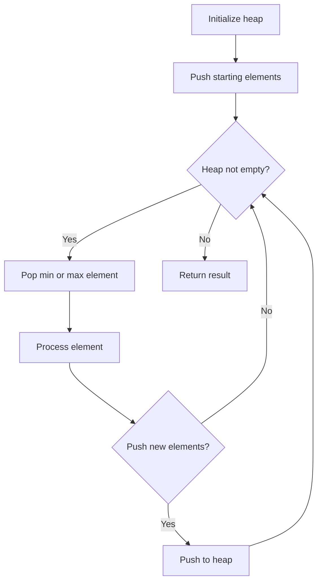
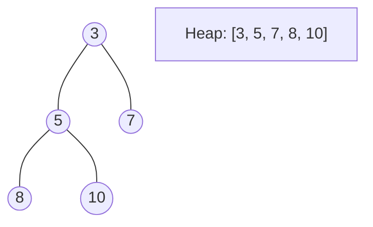
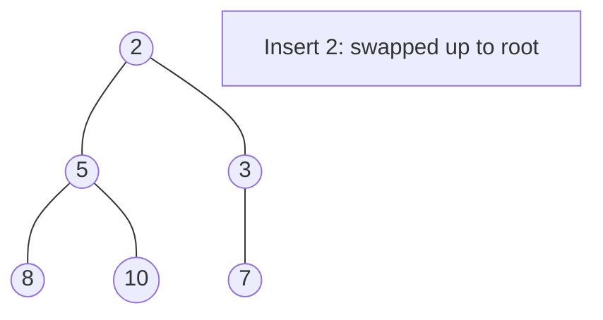
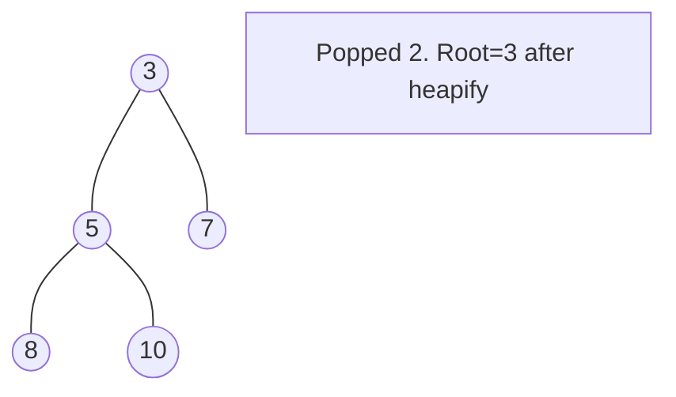

# Problem 787: Cheapest Flights Within K Stops

**Difficulty:** Medium  
**Tags:** Dynamic Programming, Depth-First Search, Breadth-First Search, Graph Theory, Heap (Priority Queue), Shortest Path  
**Pattern:** Bellman-Ford (k stops)  
**Link:** [leetcode.com/problems/cheapest-flights-within-k-stops](https://leetcode.com/problems/cheapest-flights-within-k-stops/)

## Description

There are `n` cities connected by some number of flights. You are given an array `flights` where `flights[i] = [fromi, toi, pricei]` indicates that there is a flight from city `fromi` to city `toi` with cost `pricei`.

You are also given three integers `src`, `dst`, and `k`, return ***the cheapest price** from *`src`* to *`dst`* with at most *`k`* stops. *If there is no such route, return* *`-1`.

 

Example 1:

```

**Input:** n = 4, flights = [[0,1,100],[1,2,100],[2,0,100],[1,3,600],[2,3,200]], src = 0, dst = 3, k = 1
**Output:** 700
**Explanation:**
The graph is shown above.
The optimal path with at most 1 stop from city 0 to 3 is marked in red and has cost 100 + 600 = 700.
Note that the path through cities [0,1,2,3] is cheaper but is invalid because it uses 2 stops.

```

Example 2:

```

**Input:** n = 3, flights = [[0,1,100],[1,2,100],[0,2,500]], src = 0, dst = 2, k = 1
**Output:** 200
**Explanation:**
The graph is shown above.
The optimal path with at most 1 stop from city 0 to 2 is marked in red and has cost 100 + 100 = 200.

```

Example 3:

```

**Input:** n = 3, flights = [[0,1,100],[1,2,100],[0,2,500]], src = 0, dst = 2, k = 0
**Output:** 500
**Explanation:**
The graph is shown above.
The optimal path with no stops from city 0 to 2 is marked in red and has cost 500.

```

 

**Constraints:**

	- `2 <= n <= 100`
	- `0 <= flights.length <= (n * (n - 1) / 2)`
	- `flights[i].length == 3`
	- `0 <= fromi, toi < n`
	- `fromi != toi`
	- `1 <= pricei <= 10^4`
	- There will not be any multiple flights between two cities.
	- `0 <= src, dst, k < n`
	- `src != dst`

## Approach: Bellman-Ford (k stops)

Modified Bellman-Ford: relax edges k+1 times. Use temp array to avoid using edges from current round.

## Pseudocode

```
1. Initialize heap (min or max)
2. Push initial elements onto heap
3. While heap not empty and condition:
   a. Pop top element (min or max)
   b. Process element
   c. Push new elements if needed
4. Return result
```

## Algorithm Flow



## Visual State Transitions

**Heap Operations (Min-Heap):**

**Frame 1: Initial heap**


**Frame 2: Insert 2 - bubble up**


**Frame 3: Pop minimum (2) - heapify down**



## Complexity Analysis

- **Time:** O(k * E)
- **Space:** O(V)

## Solution (Python3)

```python
class Solution:
    def findCheapestPrice(self, n, flights, src, dst, k):
        prices = [float('inf')] * n
        prices[src] = 0
        for _ in range(k + 1):
            temp = prices[:]
            for u, v, w in flights:
                if prices[u] != float('inf'):
                    temp[v] = min(temp[v], prices[u] + w)
            prices = temp
        return prices[dst] if prices[dst] != float('inf') else -1
```

## Solution (C++)

```cpp
#include <queue>
#include <string>
#include <vector>
using namespace std;

class Solution {
public:
    int findCheapestPrice(int n, vector<vector<int>>& flights, int src, int dst, int k) {
        // Heap/Priority Queue - O(n log k) time
        priority_queue<int, vector<int>, greater<int>> pq;
        for (int val : n) {
            pq.push(val);
            if ((int)pq.size() > flights)
                pq.pop();
        }
        return pq.empty() ? 0 : pq.top();
    }
};
```
