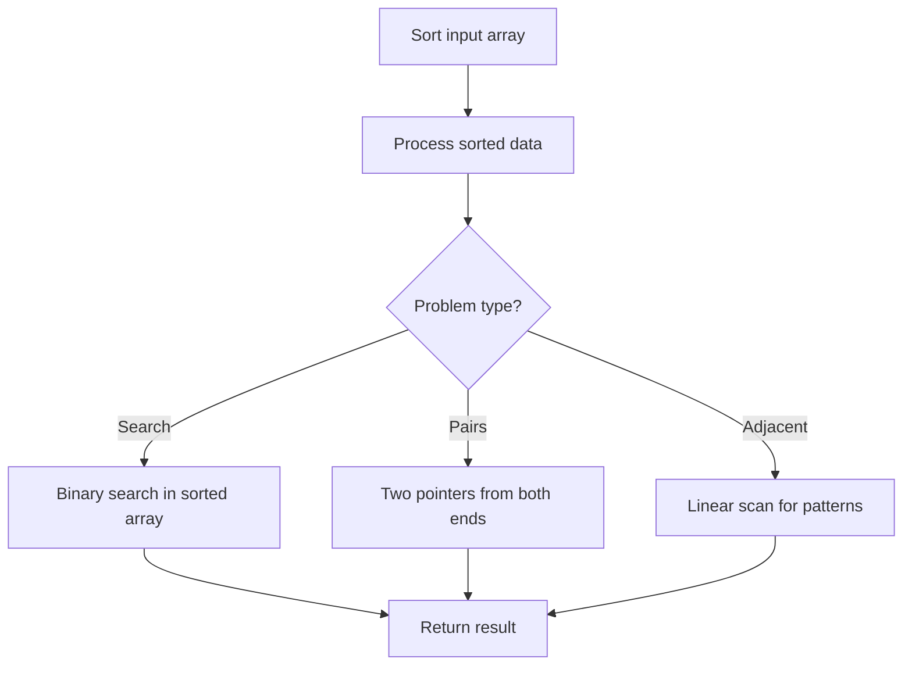

# Problem 791: Custom Sort String

**Difficulty:** Medium  
**Tags:** Hash Table, String, Sorting  
**Pattern:** Sorting  
**Link:** [leetcode.com/problems/custom-sort-string](https://leetcode.com/problems/custom-sort-string/)

## Description

You are given two strings `order` and `s`. All the characters of `order` are **unique** and were sorted in some custom order previously.

Permute the characters of `s` so that they match the order that `order` was sorted. More specifically, if a character `x` occurs before a character `y` in `order`, then `x` should occur before `y` in the permuted string.

Return *any permutation of *`s`* that satisfies this property*.

 

Example 1:

**Input: **  order = "cba", s = "abcd" 

**Output: **  "cbad" 

**Explanation: ** `"a"`, `"b"`, `"c"` appear in order, so the order of `"a"`, `"b"`, `"c"` should be `"c"`, `"b"`, and `"a"`.

Since `"d"` does not appear in `order`, it can be at any position in the returned string. `"dcba"`, `"cdba"`, `"cbda"` are also valid outputs.

Example 2:

**Input: **  order = "bcafg", s = "abcd" 

**Output: **  "bcad" 

**Explanation: ** The characters `"b"`, `"c"`, and `"a"` from `order` dictate the order for the characters in `s`. The character `"d"` in `s` does not appear in `order`, so its position is flexible.

Following the order of appearance in `order`, `"b"`, `"c"`, and `"a"` from `s` should be arranged as `"b"`, `"c"`, `"a"`. `"d"` can be placed at any position since it's not in order. The output `"bcad"` correctly follows this rule. Other arrangements like `"dbca"` or `"bcda"` would also be valid, as long as `"b"`, `"c"`, `"a"` maintain their order.

 

**Constraints:**

	- `1 <= order.length <= 26`
	- `1 <= s.length <= 200`
	- `order` and `s` consist of lowercase English letters.
	- All the characters of `order` are **unique**.

## Approach: Sorting

Sort the data to enable efficient processing. After sorting, use techniques like binary search, two pointers, or linear scan to solve the problem.

## Pseudocode

```
1. Sort the input array
2. Process sorted data:
   - Use binary search for lookups
   - Use two pointers for pair finding
   - Scan for adjacent patterns
3. Return result
```

## Algorithm Flow



## Complexity Analysis

- **Time:** O(n log n)
- **Space:** O(n)

## Solution (Python3)

```python
class Solution:
    def customSortString(self, order: str, s: str) -> str:
        # Sort-based approach - O(n log n) time
        order.sort(key=lambda x: x[0] if isinstance(x, (list, tuple)) else x)
        result = [order[0]]
        for i in range(1, len(order)):
            curr = order[i]
            if isinstance(curr, (list, tuple)) and isinstance(result[-1], (list, tuple)):
                if curr[0] <= result[-1][1]:
                    result[-1] = [result[-1][0], max(result[-1][1], curr[1])]
                else:
                    result.append(curr)
            else:
                result.append(curr)
        return result
```

## Solution (C++)

```cpp
#include <algorithm>
#include <string>
#include <vector>
using namespace std;

class Solution {
public:
    string customSortString(string& order, string& s) {
        // Sort-based approach - O(n log n) time
        sort(order.begin(), order.end());
        vector<vector<int>> result;
        result.push_back(order[0]);
        for (int i = 1; i < (int)order.size(); i++) {
            if (order[i][0] <= result.back()[1]) {
                result.back()[1] = max(result.back()[1], order[i][1]);
            } else {
                result.push_back(order[i]);
            }
        }
        return result;
    }
};
```
