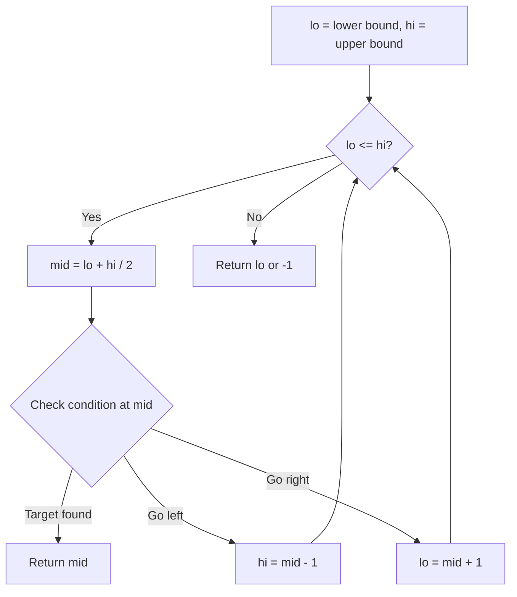
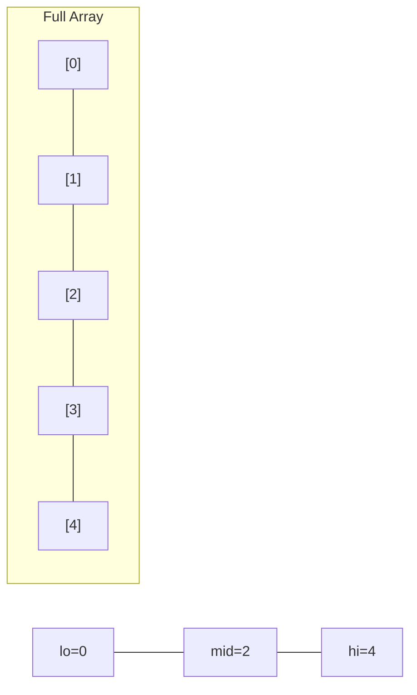
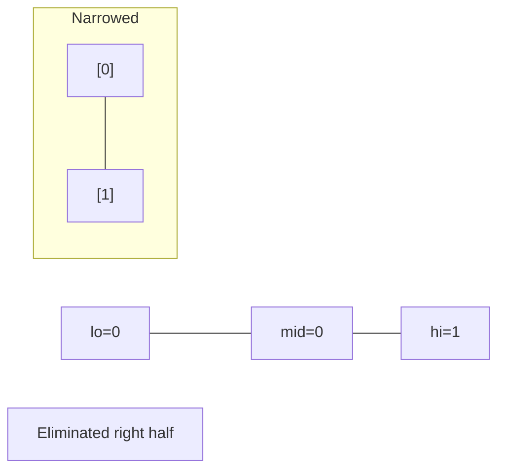
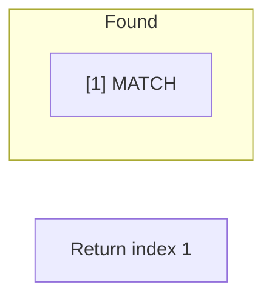

# Problem 793: Preimage Size of Factorial Zeroes Function

**Difficulty:** Hard  
**Tags:** Math, Binary Search  
**Pattern:** Binary Search  
**Link:** [leetcode.com/problems/preimage-size-of-factorial-zeroes-function](https://leetcode.com/problems/preimage-size-of-factorial-zeroes-function/)

## Description

Let `f(x)` be the number of zeroes at the end of `x!`. Recall that `x! = 1 * 2 * 3 * ... * x` and by convention, `0! = 1`.

	- For example, `f(3) = 0` because `3! = 6` has no zeroes at the end, while `f(11) = 2` because `11! = 39916800` has two zeroes at the end.

Given an integer `k`, return the number of non-negative integers `x` have the property that `f(x) = k`.

 

Example 1:

```

**Input:** k = 0
**Output:** 5
**Explanation:** 0!, 1!, 2!, 3!, and 4! end with k = 0 zeroes.

```

Example 2:

```

**Input:** k = 5
**Output:** 0
**Explanation:** There is no x such that x! ends in k = 5 zeroes.

```

Example 3:

```

**Input:** k = 3
**Output:** 5

```

 

**Constraints:**

	- `0 <= k <= 10^9`

## Approach: Binary Search

Use binary search to halve the search space each iteration. Define the search range [lo, hi], compute mid, and decide which half to keep based on the problem's monotonic condition.

## Pseudocode

```
1. lo = lower_bound, hi = upper_bound
2. While lo <= hi (or lo < hi):
   a. mid = (lo + hi) // 2
   b. If condition(mid) is satisfied: record answer, search left half
   c. Else: search right half
3. Return answer
```

## Algorithm Flow



## Visual State Transitions

**Binary Search Step-by-Step:**

**Frame 1: Initial search space**


**Frame 2: Compare mid, narrow search**


**Frame 3: Found target**



## Complexity Analysis

- **Time:** O(log n)
- **Space:** O(1)

## Solution (Python3)

```python
class Solution:
    def preimageSizeFZF(self, k: int) -> int:
        # Binary search - O(log n) time, O(1) space
        lo, hi = 0, len(k) - 1
        while lo <= hi:
            mid = lo + (hi - lo) // 2
            if k[mid] == k:
                return mid
            elif k[mid] < k:
                lo = mid + 1
            else:
                hi = mid - 1
        return 0
```

## Solution (C++)

```cpp
#include <string>
#include <vector>
using namespace std;

class Solution {
public:
    int preimageSizeFZF(int k) {
        // Binary search - O(log n) time, O(1) space
        int lo = 0, hi = k.size() - 1;
        while (lo <= hi) {
            int mid = lo + (hi - lo) / 2;
            if (k[mid] == k) {
                return mid;
            } else if (k[mid] < k) {
                lo = mid + 1;
            } else {
                hi = mid - 1;
            }
        }
        return 0;
    }
};
```
