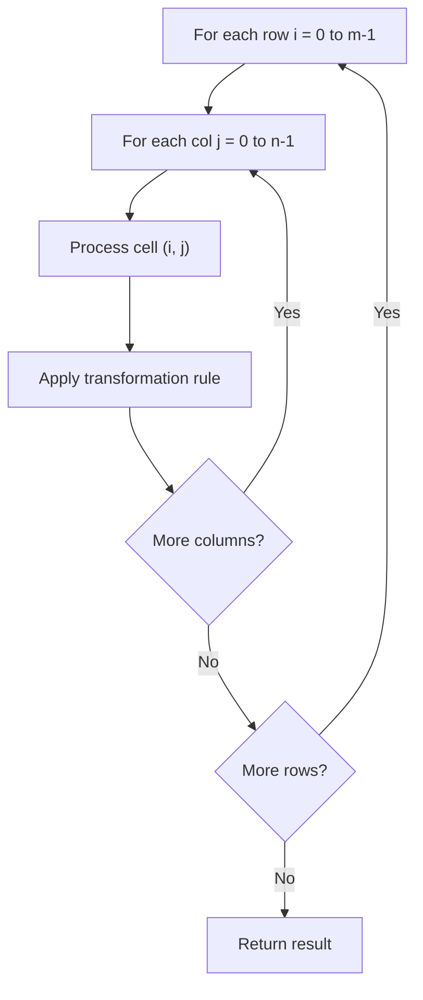

# Problem 794: Valid Tic-Tac-Toe State

**Difficulty:** Medium  
**Tags:** Array, Matrix  
**Pattern:** Matrix / 2D Array  
**Link:** [leetcode.com/problems/valid-tic-tac-toe-state](https://leetcode.com/problems/valid-tic-tac-toe-state/)

## Description

Given a Tic-Tac-Toe board as a string array `board`, return `true` if and only if it is possible to reach this board position during the course of a valid tic-tac-toe game.

The board is a `3 x 3` array that consists of characters `' '`, `'X'`, and `'O'`. The `' '` character represents an empty square.

Here are the rules of Tic-Tac-Toe:

	- Players take turns placing characters into empty squares `' '`.
	- The first player always places `'X'` characters, while the second player always places `'O'` characters.
	- `'X'` and `'O'` characters are always placed into empty squares, never filled ones.
	- The game ends when there are three of the same (non-empty) character filling any row, column, or diagonal.
	- The game also ends if all squares are non-empty.
	- No more moves can be played if the game is over.

 

Example 1:

```

**Input:** board = ["O  ","   ","   "]
**Output:** false
**Explanation:** The first player always plays "X".

```

Example 2:

```

**Input:** board = ["XOX"," X ","   "]
**Output:** false
**Explanation:** Players take turns making moves.

```

Example 3:

```

**Input:** board = ["XOX","O O","XOX"]
**Output:** true

```

 

**Constraints:**

	- `board.length == 3`
	- `board[i].length == 3`
	- `board[i][j]` is either `'X'`, `'O'`, or `' '`.

## Approach: Matrix / 2D Array

Process the matrix row by row or column by column. Common patterns: rotation, spiral traversal, in-place modification, transposition.

## Pseudocode

```
1. For each row i:
   For each column j:
     Process cell (i, j) based on neighbors or rules
2. Handle boundary conditions
3. Return modified matrix or computed result
```

## Algorithm Flow



## Complexity Analysis

- **Time:** O(m * n)
- **Space:** O(1) extra

## Solution (Python3)

```python
class Solution:
    def validTicTacToe(self, board: List[str]) -> bool:
        # Matrix manipulation - O(m*n) time
        if not board:
            return False
        m, n = len(board), len(board[0])
        # Process matrix in-place or build result
        for i in range(m):
            for j in range(n):
                pass  # Process board[i][j]
        return False
```

## Solution (C++)

```cpp
#include <string>
#include <vector>
using namespace std;

class Solution {
public:
    bool validTicTacToe(vector<string>& board) {
        // Matrix manipulation - O(m*n) time
        if (board.empty()) return false;
        int m = board.size(), n = board[0].size();
        for (int i = 0; i < m; i++) {
            for (int j = 0; j < n; j++) {
                // Process matrix[i][j]
            }
        }
        return false;
    }
};
```
