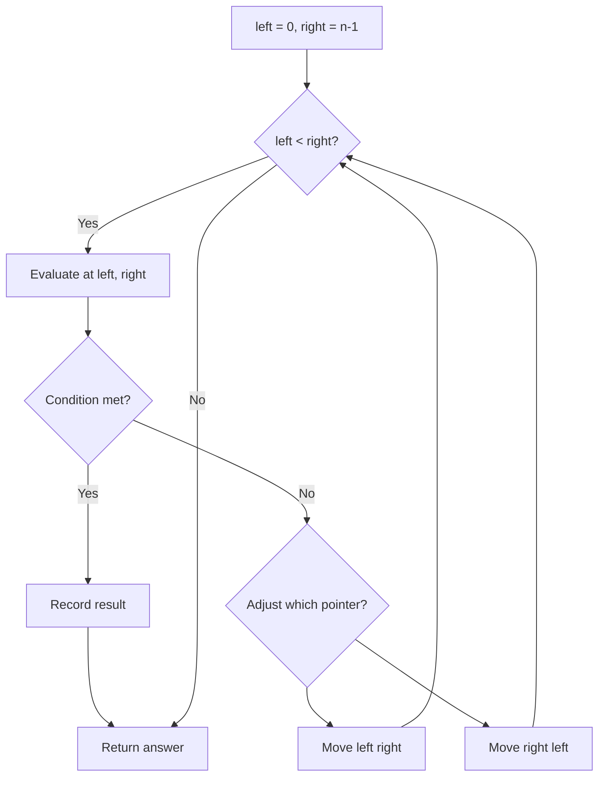
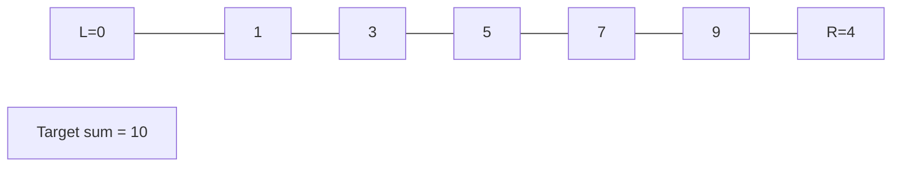
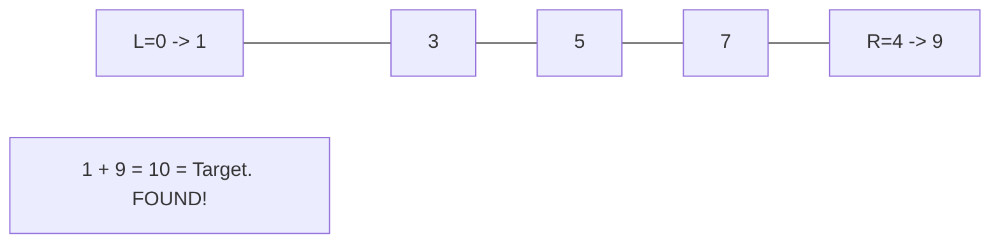

# Problem 795: Number of Subarrays with Bounded Maximum

**Difficulty:** Medium  
**Tags:** Array, Two Pointers  
**Pattern:** Two Pointers  
**Link:** [leetcode.com/problems/number-of-subarrays-with-bounded-maximum](https://leetcode.com/problems/number-of-subarrays-with-bounded-maximum/)

## Description

Given an integer array `nums` and two integers `left` and `right`, return *the number of contiguous non-empty **subarrays** such that the value of the maximum array element in that subarray is in the range *`[left, right]`.

The test cases are generated so that the answer will fit in a **32-bit** integer.

 

Example 1:

```

**Input:** nums = [2,1,4,3], left = 2, right = 3
**Output:** 3
**Explanation:** There are three subarrays that meet the requirements: [2], [2, 1], [3].

```

Example 2:

```

**Input:** nums = [2,9,2,5,6], left = 2, right = 8
**Output:** 7

```

 

**Constraints:**

	- `1 <= nums.length <= 10^5`
	- `0 <= nums[i] <= 10^9`
	- `0 <= left <= right <= 10^9`

## Approach: Two Pointers

Use two pointers moving through the data structure. Depending on the problem, pointers may move toward each other (converging), in the same direction (fast/slow), or independently.

## Pseudocode

```
1. Initialize left = 0, right = n-1 (or two independent pointers)
2. While pointers haven't crossed:
   a. Evaluate condition at pointer positions
   b. Move left pointer right or right pointer left
3. Return result
```

## Algorithm Flow



## Visual State Transitions

**Two Pointer Convergence:**

**Frame 1: Initialize pointers**


**Frame 2: Sum = 1+9 = 10, found!**



## Complexity Analysis

- **Time:** O(n)
- **Space:** O(1)

## Solution (Python3)

```python
class Solution:
    def numSubarrayBoundedMax(self, nums: List[int], left: int, right: int) -> int:
        # Two pointer approach - O(n) time, O(1) space
        left, right = 0, len(nums) - 1
        while left < right:
            curr = nums[left] + nums[right]
            if curr == left:
                return [left, right]
            elif curr < left:
                left += 1
            else:
                right -= 1
        return 0
```

## Solution (C++)

```cpp
#include <string>
#include <vector>
using namespace std;

class Solution {
public:
    int numSubarrayBoundedMax(vector<int>& nums, int left, int right) {
        // Two pointer approach - O(n) time, O(1) space
        int left = 0, right = nums.size() - 1;
        while (left < right) {
            int curr = nums[left] + nums[right];
            if (curr == left) {
                return {left, right};
            } else if (curr < left) {
                left++;
            } else {
                right--;
            }
        }
        return 0;
    }
};
```
