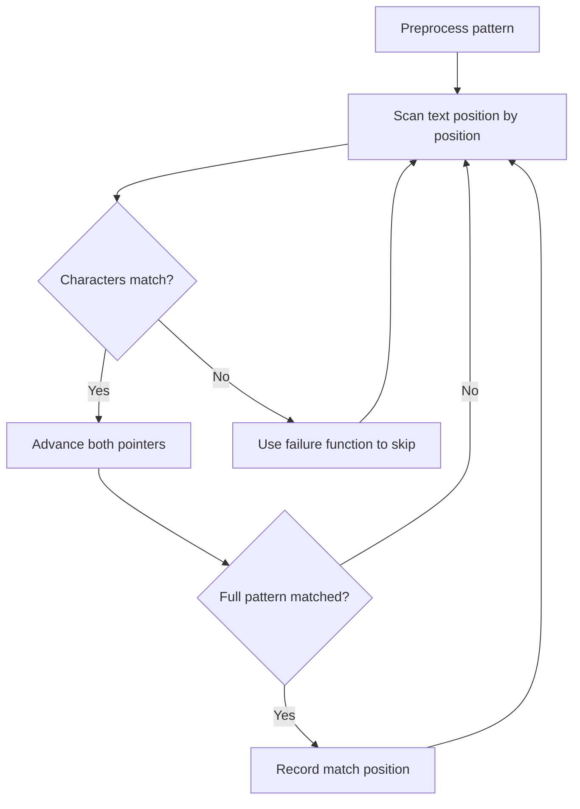

# Problem 796: Rotate String

**Difficulty:** Easy  
**Tags:** String, String Matching  
**Pattern:** String Matching  
**Link:** [leetcode.com/problems/rotate-string](https://leetcode.com/problems/rotate-string/)

## Description

Given two strings `s` and `goal`, return `true` *if and only if* `s` *can become* `goal` *after some number of **shifts** on* `s`.

A **shift** on `s` consists of moving the leftmost character of `s` to the rightmost position.

	- For example, if `s = "abcde"`, then it will be `"bcdea"` after one shift.

 

Example 1:

```
**Input:** s = "abcde", goal = "cdeab"
**Output:** true

```
Example 2:

```
**Input:** s = "abcde", goal = "abced"
**Output:** false

```

 

**Constraints:**

	- `1 <= s.length, goal.length <= 100`
	- `s` and `goal` consist of lowercase English letters.

## Approach: String Matching

Find pattern occurrences in text. Use KMP, Rabin-Karp, or Z-algorithm for efficient matching beyond brute force.

## Pseudocode

```
1. Preprocess pattern (build failure function / hash)
2. Scan text with pattern:
   a. Compare characters
   b. On mismatch: use preprocessed data to skip
   c. On full match: record position
3. Return matches
```

## Algorithm Flow



## Complexity Analysis

- **Time:** O(n + m)
- **Space:** O(m)

## Solution (Python3)

```python
class Solution:
    def rotateString(self, s: str, goal: str) -> bool:
        # String matching (KMP/Rolling Hash) - O(n+m) time
        if not goal or not s:
            return False
        n, m = len(s), len(goal)
        # Build failure function for KMP
        fail = [0] * m
        j = 0
        for i in range(1, m):
            while j > 0 and goal[i] != goal[j]:
                j = fail[j-1]
            if goal[i] == goal[j]:
                j += 1
            fail[i] = j
        # Search
        j = 0
        for i in range(n):
            while j > 0 and s[i] != goal[j]:
                j = fail[j-1]
            if s[i] == goal[j]:
                j += 1
            if j == m:
                return i - m + 1
        return -1
```

## Solution (C++)

```cpp
#include <string>
#include <vector>
using namespace std;

class Solution {
public:
    bool rotateString(string& s, string& goal) {
        // String matching (KMP) - O(n+m) time
        int n = s.size(), m = goal.size();
        if (m == 0) return 0;
        vector<int> fail(m, 0);
        for (int i = 1, j = 0; i < m; i++) {
            while (j > 0 && goal[i] != goal[j]) j = fail[j-1];
            if (goal[i] == goal[j]) j++;
            fail[i] = j;
        }
        for (int i = 0, j = 0; i < n; i++) {
            while (j > 0 && s[i] != goal[j]) j = fail[j-1];
            if (s[i] == goal[j]) j++;
            if (j == m) return i - m + 1;
        }
        return -1;
    }
};
```
