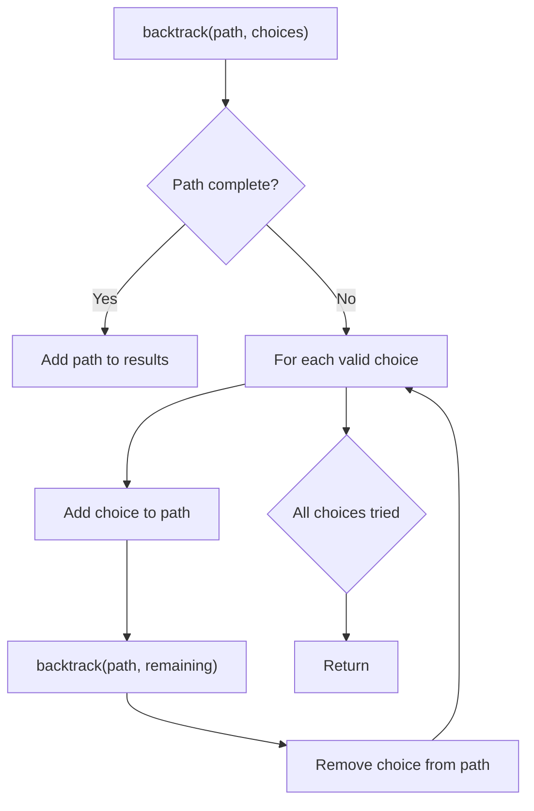
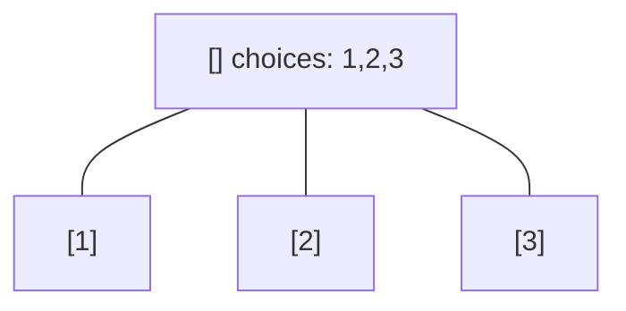
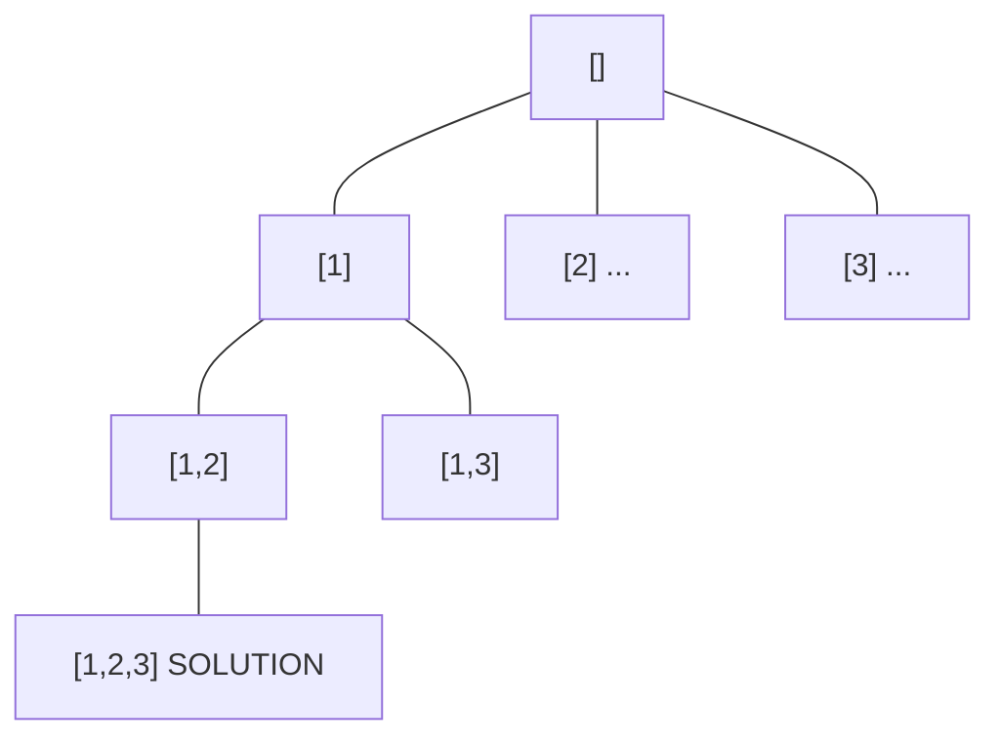
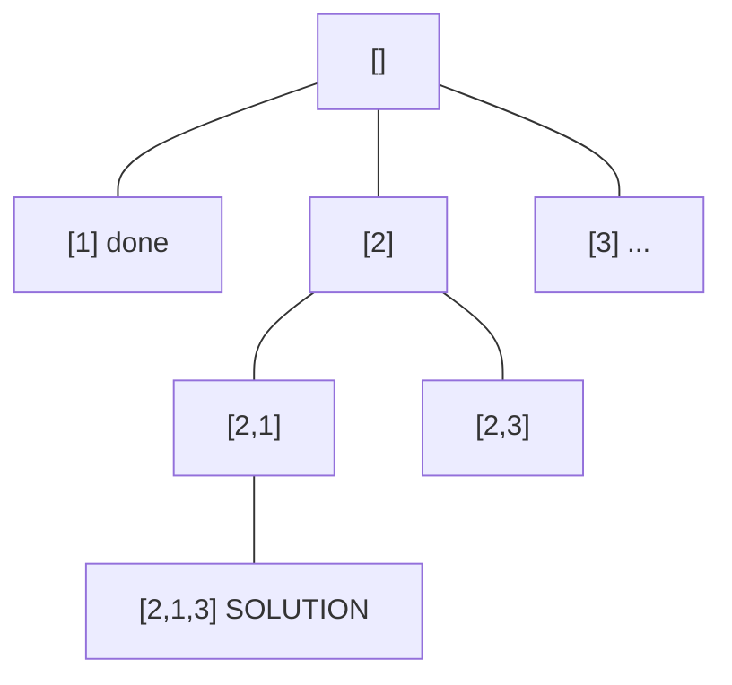
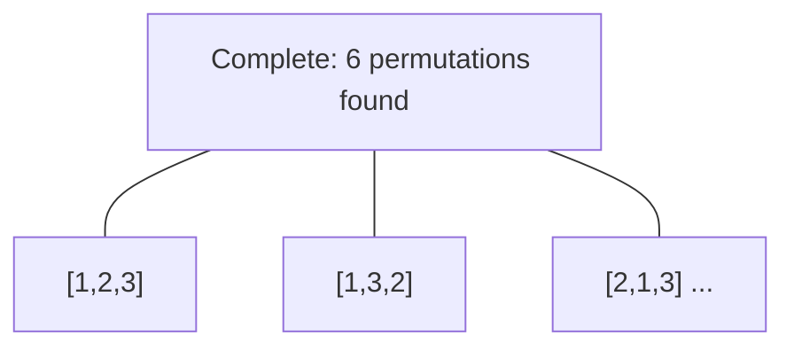

# Problem 797: All Paths From Source to Target

**Difficulty:** Medium  
**Tags:** Backtracking, Depth-First Search, Breadth-First Search, Graph Theory  
**Pattern:** Backtracking  
**Link:** [leetcode.com/problems/all-paths-from-source-to-target](https://leetcode.com/problems/all-paths-from-source-to-target/)

## Description

Given a directed acyclic graph (**DAG**) of `n` nodes labeled from `0` to `n - 1`, find all possible paths from node `0` to node `n - 1` and return them in **any order**.

The graph is given as follows: `graph[i]` is a list of all nodes you can visit from node `i` (i.e., there is a directed edge from node `i` to node `graph[i][j]`).

 

Example 1:

```

**Input:** graph = [[1,2],[3],[3],[]]
**Output:** [[0,1,3],[0,2,3]]
**Explanation:** There are two paths: 0 -> 1 -> 3 and 0 -> 2 -> 3.

```

Example 2:

```

**Input:** graph = [[4,3,1],[3,2,4],[3],[4],[]]
**Output:** [[0,4],[0,3,4],[0,1,3,4],[0,1,2,3,4],[0,1,4]]

```

 

**Constraints:**

	- `n == graph.length`
	- `2 <= n <= 15`
	- `0 <= graph[i][j] < n`
	- `graph[i][j] != i` (i.e., there will be no self-loops).
	- All the elements of `graph[i]` are **unique**.
	- The input graph is **guaranteed** to be a **DAG**.

## Approach: Backtracking

Explore all possible solutions by building candidates incrementally. At each step, make a choice and recurse. If the choice leads to a dead end, undo the choice (backtrack) and try the next option.

## Pseudocode

```
1. Define backtrack(path, choices):
   a. If path is a complete solution: add to results
   b. For each choice in choices:
      - If choice is valid:
        * Add choice to path
        * backtrack(path, remaining_choices)
        * Remove choice from path (backtrack)
2. Call backtrack([], all_choices)
```

## Algorithm Flow



## Visual State Transitions

**Backtracking Decision Tree:**

**Frame 1: Root - start with empty path**


**Frame 2: Explore branch [1]**


**Frame 3: Backtrack, explore [2]**


**Frame 4: All solutions found**



## Complexity Analysis

- **Time:** O(k^n) or O(n!)
- **Space:** O(n)

## Solution (Python3)

```python
class Solution:
    def allPathsSourceTarget(self, graph: List[List[int]]) -> List[List[int]]:
        # Backtracking - O(2^n) or O(n!) time
        result = []
        
        def backtrack(path, start):
            result.append(path[:])
            for i in range(start, len(graph)):
                path.append(graph[i])
                backtrack(path, i + 1)
                path.pop()
        
        backtrack([], 0)
        return result
```

## Solution (C++)

```cpp
#include <functional>
#include <string>
#include <vector>
using namespace std;

class Solution {
public:
    vector<vector<int>> allPathsSourceTarget(vector<vector<int>>& graph) {
        // Backtracking - O(2^n) or O(n!) time
        vector<vector<int>> result;
        vector<int> path;
        function<void(int)> backtrack = [&](int start) {
            result.push_back(path);
            for (int i = start; i < (int)graph.size(); i++) {
                path.push_back(graph[i]);
                backtrack(i + 1);
                path.pop_back();
            }
        };
        backtrack(0);
        return result;
    }
};
```
