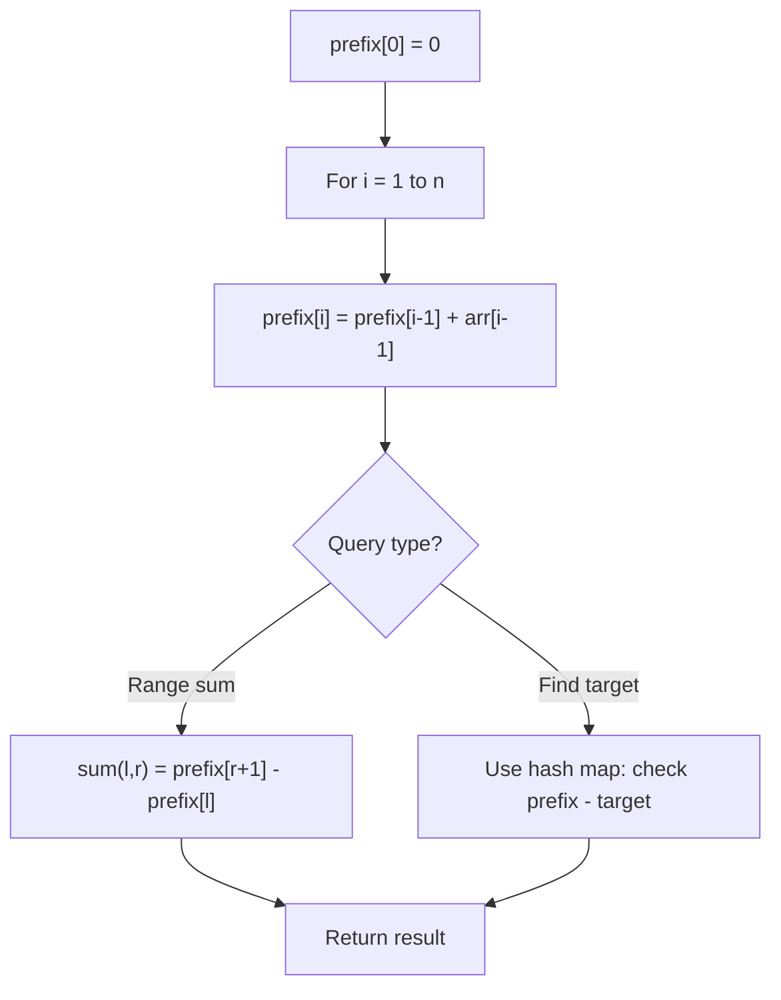

# Problem 798: Smallest Rotation with Highest Score

**Difficulty:** Hard  
**Tags:** Array, Prefix Sum  
**Pattern:** Prefix Sum  
**Link:** [leetcode.com/problems/smallest-rotation-with-highest-score](https://leetcode.com/problems/smallest-rotation-with-highest-score/)

## Description

You are given an array `nums`. You can rotate it by a non-negative integer `k` so that the array becomes `[nums[k], nums[k + 1], ... nums[nums.length - 1], nums[0], nums[1], ..., nums[k-1]]`. Afterward, any entries that are less than or equal to their index are worth one point.

	- For example, if we have `nums = [2,4,1,3,0]`, and we rotate by `k = 2`, it becomes `[1,3,0,2,4]`. This is worth `3` points because `1 > 0` [no points], `3 > 1` [no points], `0 <= 2` [one point], `2 <= 3` [one point], `4 <= 4` [one point].

Return *the rotation index *`k`* that corresponds to the highest score we can achieve if we rotated *`nums`* by it*. If there are multiple answers, return the smallest such index `k`.

 

Example 1:

```

**Input:** nums = [2,3,1,4,0]
**Output:** 3
**Explanation:** Scores for each k are listed below: 
k = 0,  nums = [2,3,1,4,0],    score 2
k = 1,  nums = [3,1,4,0,2],    score 3
k = 2,  nums = [1,4,0,2,3],    score 3
k = 3,  nums = [4,0,2,3,1],    score 4
k = 4,  nums = [0,2,3,1,4],    score 3
So we should choose k = 3, which has the highest score.

```

Example 2:

```

**Input:** nums = [1,3,0,2,4]
**Output:** 0
**Explanation:** nums will always have 3 points no matter how it shifts.
So we will choose the smallest k, which is 0.

```

 

**Constraints:**

	- `1 <= nums.length <= 10^5`
	- `0 <= nums[i] < nums.length`

## Approach: Prefix Sum

Build a prefix sum array where prefix[i] = sum of elements 0..i-1. Any subarray sum [l..r] = prefix[r+1] - prefix[l]. Combine with hash map for O(n) subarray sum queries.

## Pseudocode

```
1. Build prefix sum array: prefix[0]=0, prefix[i]=prefix[i-1]+arr[i-1]
2. Use prefix sums to answer queries:
   - Subarray sum [l..r] = prefix[r+1] - prefix[l]
   - Or use hash map to find prefix[j]-prefix[i] == target
3. Return result
```

## Algorithm Flow



## Complexity Analysis

- **Time:** O(n)
- **Space:** O(n)

## Solution (Python3)

```python
class Solution:
    def bestRotation(self, nums: List[int]) -> int:
        # Prefix sum approach - O(n) time, O(n) space
        prefix = {0: -1}
        curr_sum = 0
        result = 0
        target = nums if isinstance(nums, int) else 0
        for i, val in enumerate(nums):
            curr_sum += val
            if curr_sum - target in prefix:
                result = max(result, i - prefix[curr_sum - target])
            if curr_sum not in prefix:
                prefix[curr_sum] = i
        return result
```

## Solution (C++)

```cpp
#include <algorithm>
#include <string>
#include <unordered_map>
#include <vector>
using namespace std;

class Solution {
public:
    int bestRotation(vector<int>& nums) {
        // Prefix sum approach - O(n) time, O(n) space
        unordered_map<int, int> prefix;
        prefix[0] = -1;
        int curr_sum = 0, result = 0;
        int target = nums;
        for (int i = 0; i < (int)nums.size(); i++) {
            curr_sum += nums[i];
            if (prefix.count(curr_sum - target)) {
                result = max(result, i - prefix[curr_sum - target]);
            }
            if (!prefix.count(curr_sum)) {
                prefix[curr_sum] = i;
            }
        }
        return result;
    }
};
```
