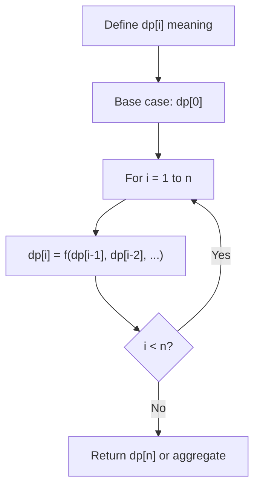
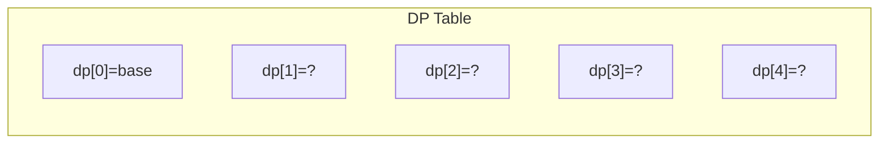
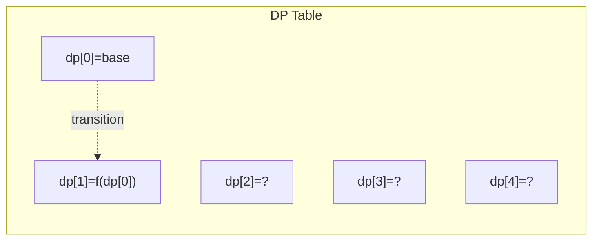
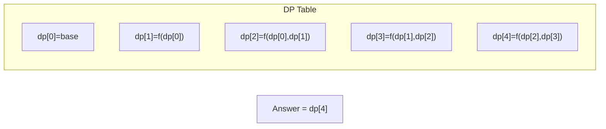

# Problem 801: Minimum Swaps To Make Sequences Increasing

**Difficulty:** Hard  
**Tags:** Array, Dynamic Programming  
**Pattern:** Dynamic Programming (1D)  
**Link:** [leetcode.com/problems/minimum-swaps-to-make-sequences-increasing](https://leetcode.com/problems/minimum-swaps-to-make-sequences-increasing/)

## Description

You are given two integer arrays of the same length `nums1` and `nums2`. In one operation, you are allowed to swap `nums1[i]` with `nums2[i]`.

	- For example, if `nums1 = [1,2,3,8]`, and `nums2 = [5,6,7,4]`, you can swap the element at `i = 3` to obtain `nums1 = [1,2,3,4]` and `nums2 = [5,6,7,8]`.

Return *the minimum number of needed operations to make *`nums1`* and *`nums2`* **strictly increasing***. The test cases are generated so that the given input always makes it possible.

An array `arr` is **strictly increasing** if and only if `arr[0] < arr[1] < arr[2] < ... < arr[arr.length - 1]`.

 

Example 1:

```

**Input:** nums1 = [1,3,5,4], nums2 = [1,2,3,7]
**Output:** 1
**Explanation:** 
Swap nums1[3] and nums2[3]. Then the sequences are:
nums1 = [1, 3, 5, 7] and nums2 = [1, 2, 3, 4]
which are both strictly increasing.

```

Example 2:

```

**Input:** nums1 = [0,3,5,8,9], nums2 = [2,1,4,6,9]
**Output:** 1

```

 

**Constraints:**

	- `2 <= nums1.length <= 10^5`
	- `nums2.length == nums1.length`
	- `0 <= nums1[i], nums2[i] <= 2 * 10^5`

## Approach: Dynamic Programming (1D)

Break the problem into overlapping subproblems. Define dp[i] as the optimal value for the subproblem ending at or considering index i. Build the solution bottom-up, using previously computed dp values.

## Pseudocode

```
1. Define dp[i] = optimal value for subproblem i
2. Base case: dp[0] = initial value
3. For i from 1 to n:
   a. dp[i] = recurrence(dp[i-1], dp[i-2], ...)
4. Return dp[n] or max/min of dp
```

## Algorithm Flow



## Visual State Transitions

**1D Dynamic Programming Table Build:**

**Frame 1: Initialize base cases**


**Frame 2: Fill dp[1] from dp[0]**


**Frame 3: Fill remaining cells**



## Complexity Analysis

- **Time:** O(n)
- **Space:** O(n)

## Solution (Python3)

```python
class Solution:
    def minSwap(self, nums1: List[int], nums2: List[int]) -> int:
        # Dynamic programming (1D) - O(n) time, O(n) space
        if not nums1:
            return 0
        n = len(nums1) if isinstance(nums1, list) else nums1
        dp = [0] * (n + 1)
        dp[0] = 1  # base case
        for i in range(1, n + 1):
            dp[i] = dp[i-1]  # transition (customize per problem)
            if i >= 2:
                dp[i] += dp[i-2]
        return dp[n]
```

## Solution (C++)

```cpp
#include <string>
#include <vector>
using namespace std;

class Solution {
public:
    int minSwap(vector<int>& nums1, vector<int>& nums2) {
        // Dynamic programming (1D) - O(n) time, O(n) space
        int n = nums1;
        if (n <= 0) return 0;
        vector<int> dp(n + 1, 0);
        dp[0] = 1;
        for (int i = 1; i <= n; i++) {
            dp[i] = dp[i-1];
            if (i >= 2) dp[i] += dp[i-2];
        }
        return dp[n];
    }
};
```
