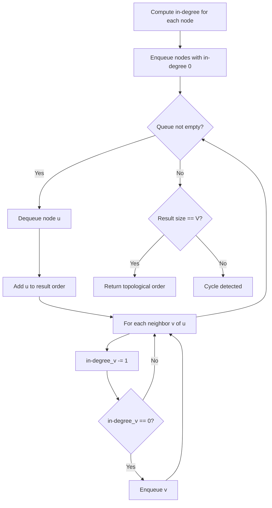
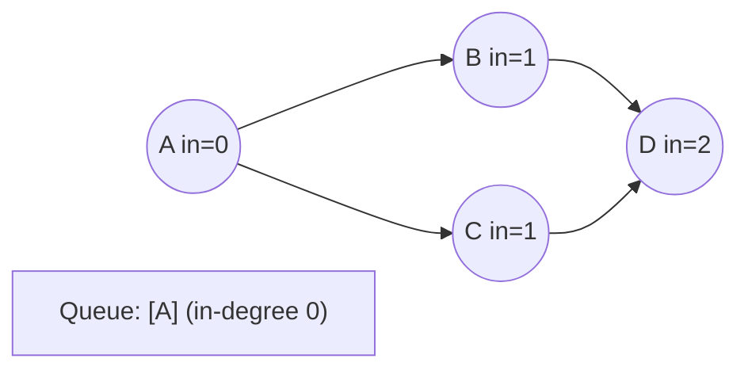
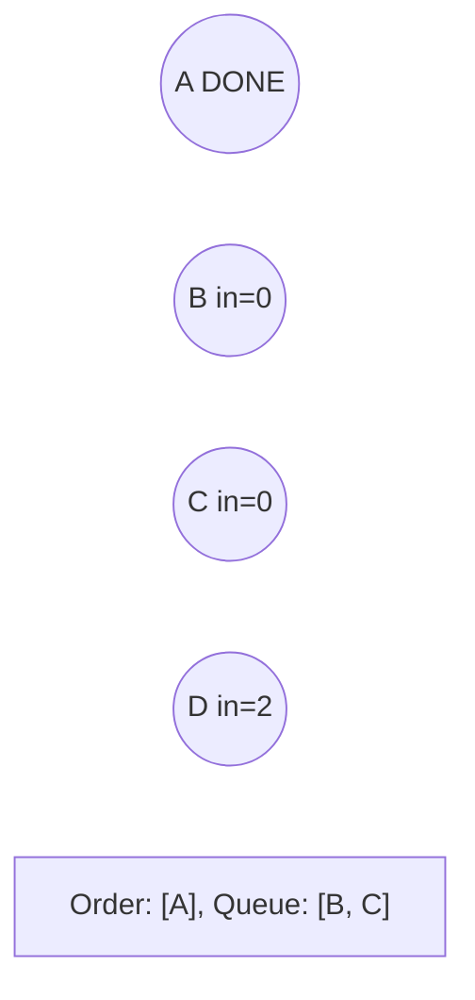
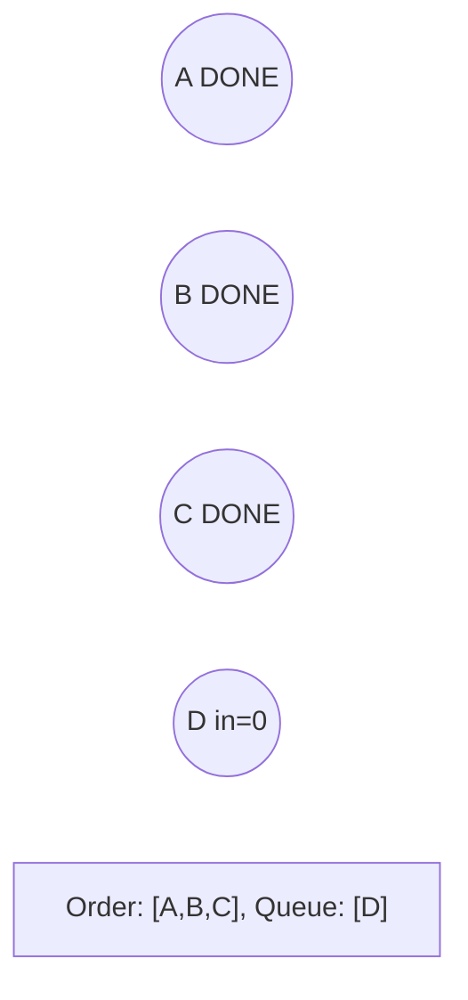
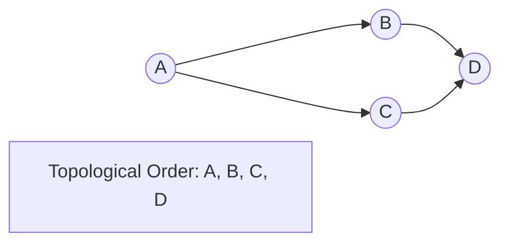

# Problem 802: Find Eventual Safe States

**Difficulty:** Medium  
**Tags:** Depth-First Search, Breadth-First Search, Graph Theory, Topological Sort  
**Pattern:** Topological Sort  
**Link:** [leetcode.com/problems/find-eventual-safe-states](https://leetcode.com/problems/find-eventual-safe-states/)

## Description

There is a directed graph of `n` nodes with each node labeled from `0` to `n - 1`. The graph is represented by a **0-indexed** 2D integer array `graph` where `graph[i]` is an integer array of nodes adjacent to node `i`, meaning there is an edge from node `i` to each node in `graph[i]`.

A node is a **terminal node** if there are no outgoing edges. A node is a **safe node** if every possible path starting from that node leads to a **terminal node** (or another safe node).

Return *an array containing all the **safe nodes** of the graph*. The answer should be sorted in **ascending** order.

 

Example 1:

```

**Input:** graph = [[1,2],[2,3],[5],[0],[5],[],[]]
**Output:** [2,4,5,6]
**Explanation:** The given graph is shown above.
Nodes 5 and 6 are terminal nodes as there are no outgoing edges from either of them.
Every path starting at nodes 2, 4, 5, and 6 all lead to either node 5 or 6.
```

Example 2:

```

**Input:** graph = [[1,2,3,4],[1,2],[3,4],[0,4],[]]
**Output:** [4]
**Explanation:**
Only node 4 is a terminal node, and every path starting at node 4 leads to node 4.

```

 

**Constraints:**

	- `n == graph.length`
	- `1 <= n <= 10^4`
	- `0 <= graph[i].length <= n`
	- `0 <= graph[i][j] <= n - 1`
	- `graph[i]` is sorted in a strictly increasing order.
	- The graph may contain self-loops.
	- The number of edges in the graph will be in the range `[1, 4 * 10^4]`.

## Approach: Topological Sort

Order nodes in a DAG so every edge u->v has u before v. Use Kahn's algorithm (BFS with in-degree tracking) or DFS-based ordering.

## Pseudocode

```
1. Compute in-degree for every node
2. Enqueue all nodes with in-degree 0
3. While queue not empty:
   a. Dequeue node u, add to result order
   b. For each neighbor v of u:
      - Decrease in-degree of v
      - If in-degree becomes 0: enqueue v
4. If result size != V: cycle exists
5. Return topological order
```

## Algorithm Flow



## Visual State Transitions

**Topological Sort (Kahn's Algorithm):**

**Frame 1: Compute in-degrees**


**Frame 2: Process A, reduce neighbors**


**Frame 3: Process B and C**


**Frame 4: Complete**



## Complexity Analysis

- **Time:** O(V + E)
- **Space:** O(V + E)

## Solution (Python3)

```python
class Solution:
    def eventualSafeNodes(self, graph: List[List[int]]) -> List[int]:
        # Topological sort (Kahn's algorithm) - O(V+E)
        from collections import deque, defaultdict
        graph = defaultdict(list)
        n = graph if isinstance(graph, int) else len(graph)
        indegree = [0] * n
        # Build graph from prerequisites
        prereqs = graph if isinstance(graph, list) else graph
        for edge in prereqs:
            if isinstance(edge, (list, tuple)) and len(edge) >= 2:
                graph[edge[1]].append(edge[0])
                indegree[edge[0]] += 1
        queue = deque([i for i in range(n) if indegree[i] == 0])
        order = []
        while queue:
            node = queue.popleft()
            order.append(node)
            for neighbor in graph[node]:
                indegree[neighbor] -= 1
                if indegree[neighbor] == 0:
                    queue.append(neighbor)
        return len(order) == n if isinstance([], bool) else order
```

## Solution (C++)

```cpp
#include <queue>
#include <string>
#include <vector>
using namespace std;

class Solution {
public:
    vector<int> eventualSafeNodes(vector<vector<int>>& graph) {
        // Topological sort (Kahn's) - O(V+E)
        int n = graph;
        vector<vector<int>> graph(n);
        vector<int> indegree(n, 0);
        for (auto& edge : graph) {
            graph[edge[1]].push_back(edge[0]);
            indegree[edge[0]]++;
        }
        queue<int> q;
        for (int i = 0; i < n; i++)
            if (indegree[i] == 0) q.push(i);
        vector<int> order;
        while (!q.empty()) {
            int node = q.front(); q.pop();
            order.push_back(node);
            for (int neighbor : graph[node]) {
                if (--indegree[neighbor] == 0) q.push(neighbor);
            }
        }
        return order.size() == n;
    }
};
```
