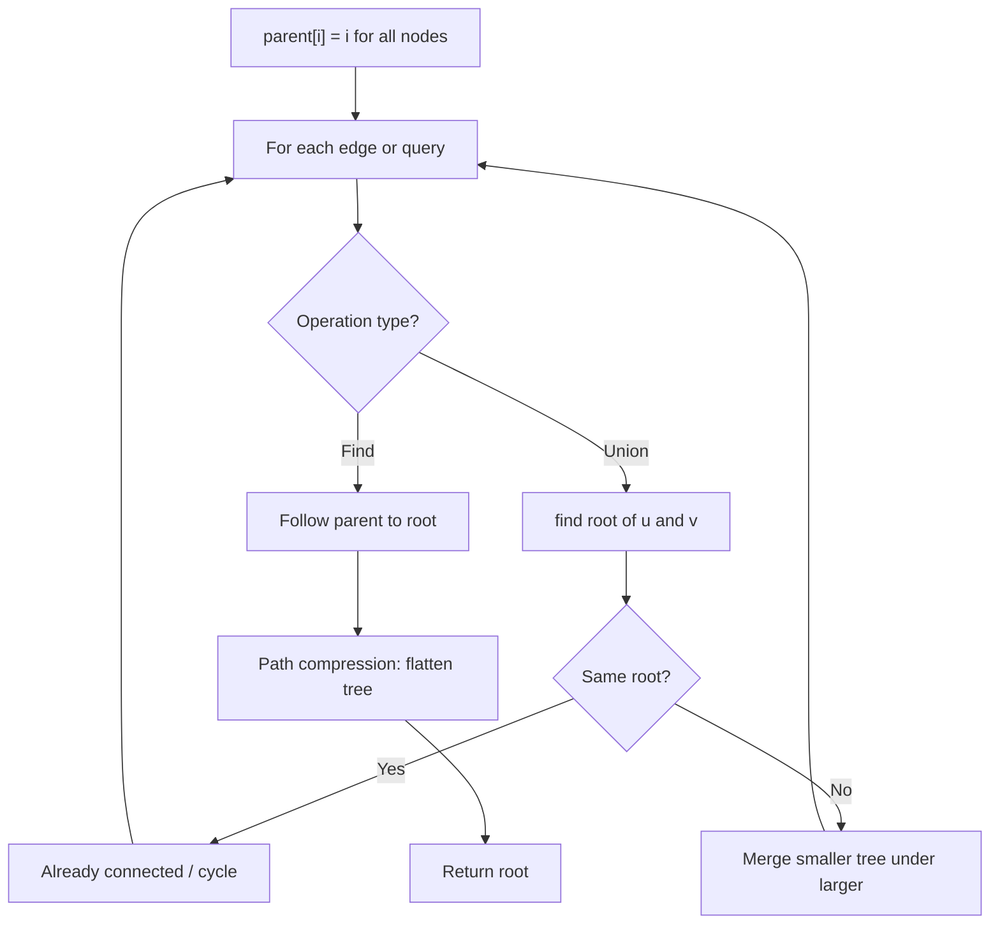
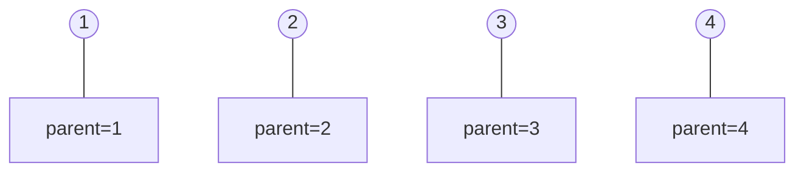
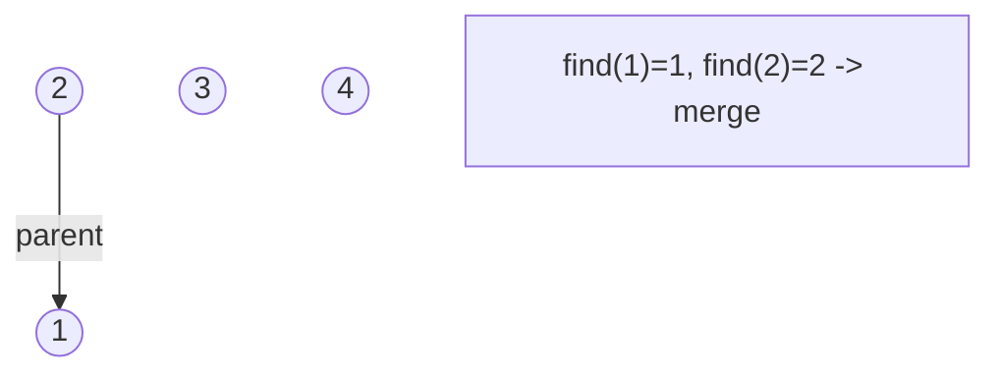
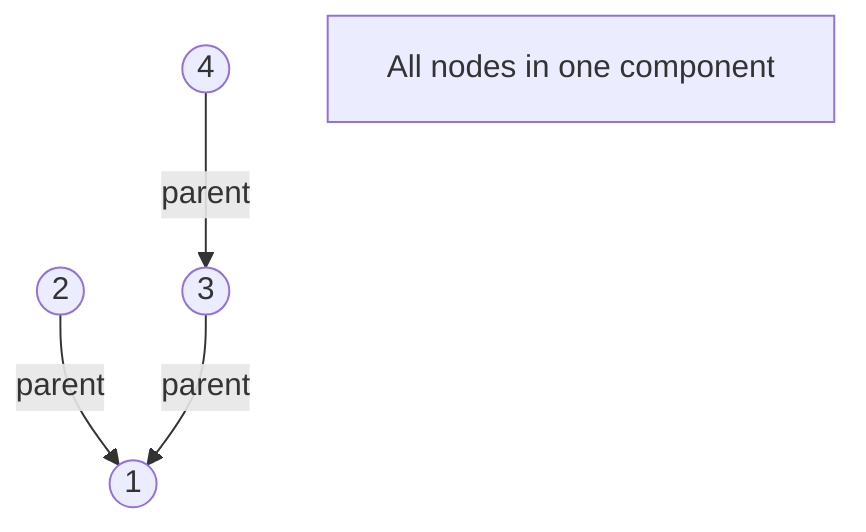
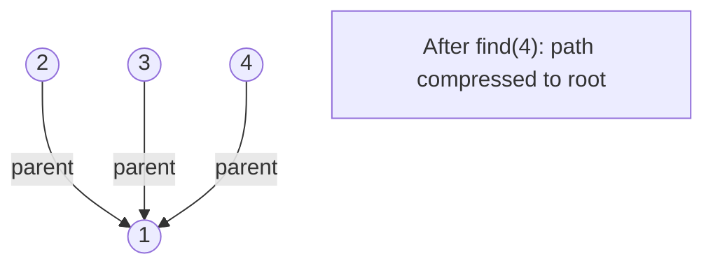

# Problem 803: Bricks Falling When Hit

**Difficulty:** Hard  
**Tags:** Array, Union-Find, Matrix  
**Pattern:** Union-Find / Disjoint Set  
**Link:** [leetcode.com/problems/bricks-falling-when-hit](https://leetcode.com/problems/bricks-falling-when-hit/)

## Description

You are given an `m x n` binary `grid`, where each `1` represents a brick and `0` represents an empty space. A brick is **stable** if:

	- It is directly connected to the top of the grid, or
	- At least one other brick in its four adjacent cells is **stable**.

You are also given an array `hits`, which is a sequence of erasures we want to apply. Each time we want to erase the brick at the location `hits[i] = (rowi, coli)`. The brick on that location (if it exists) will disappear. Some other bricks may no longer be stable because of that erasure and will **fall**. Once a brick falls, it is **immediately** erased from the `grid` (i.e., it does not land on other stable bricks).

Return *an array *`result`*, where each *`result[i]`* is the number of bricks that will **fall** after the *`i^th`* erasure is applied.*

**Note** that an erasure may refer to a location with no brick, and if it does, no bricks drop.

 

Example 1:

```

**Input:** grid = [[1,0,0,0],[1,1,1,0]], hits = [[1,0]]
**Output:** [2]
**Explanation: **Starting with the grid:
[[1,0,0,0],
 [1,1,1,0]]
We erase the underlined brick at (1,0), resulting in the grid:
[[1,0,0,0],
 [0,1,1,0]]
The two underlined bricks are no longer stable as they are no longer connected to the top nor adjacent to another stable brick, so they will fall. The resulting grid is:
[[1,0,0,0],
 [0,0,0,0]]
Hence the result is [2].

```

Example 2:

```

**Input:** grid = [[1,0,0,0],[1,1,0,0]], hits = [[1,1],[1,0]]
**Output:** [0,0]
**Explanation: **Starting with the grid:
[[1,0,0,0],
 [1,1,0,0]]
We erase the underlined brick at (1,1), resulting in the grid:
[[1,0,0,0],
 [1,0,0,0]]
All remaining bricks are still stable, so no bricks fall. The grid remains the same:
[[1,0,0,0],
 [1,0,0,0]]
Next, we erase the underlined brick at (1,0), resulting in the grid:
[[1,0,0,0],
 [0,0,0,0]]
Once again, all remaining bricks are still stable, so no bricks fall.
Hence the result is [0,0].

```

 

**Constraints:**

	- `m == grid.length`
	- `n == grid[i].length`
	- `1 <= m, n <= 200`
	- `grid[i][j]` is `0` or `1`.
	- `1 <= hits.length <= 4 * 10^4`
	- `hits[i].length == 2`
	- `0 <= xi <= m - 1`
	- `0 <= yi <= n - 1`
	- All `(xi, yi)` are unique.

## Approach: Union-Find / Disjoint Set

Use Union-Find with path compression and union by rank to efficiently manage connected components. Find(x) returns the root of x's component; Union(x,y) merges two components.

## Pseudocode

```
1. parent[i] = i for all nodes (each is its own set)
2. find(x): follow parent pointers to root (with path compression)
3. union(x, y): merge sets of x and y by rank
4. Process edges/operations:
   a. For each edge (u, v): union(u, v)
5. Answer queries using find()
```

## Algorithm Flow



## Visual State Transitions

**Union-Find Step-by-Step:**

**Frame 1: Initial - each node is own parent**


**Frame 2: Union(1,2) - merge components**


**Frame 3: Union(3,4) then Union(2,3)**


**Frame 4: Path compression on find(4)**



## Complexity Analysis

- **Time:** O(n * alpha(n))
- **Space:** O(n)

## Solution (Python3)

```python
class Solution:
    def hitBricks(self, grid: List[List[int]], hits: List[List[int]]) -> List[int]:
        # Union Find (Disjoint Set Union) - O(n * alpha(n))
        parent = list(range(len(grid) + 1 if isinstance(grid, list) else grid + 1))
        rank = [0] * len(parent)
        
        def find(x):
            if parent[x] != x:
                parent[x] = find(parent[x])
            return parent[x]
        
        def union(x, y):
            px, py = find(x), find(y)
            if px == py:
                return False
            if rank[px] < rank[py]:
                px, py = py, px
            parent[py] = px
            if rank[px] == rank[py]:
                rank[px] += 1
            return True
        
        components = len(parent)
        # Process edges/connections
        return components
```

## Solution (C++)

```cpp
#include <functional>
#include <numeric>
#include <string>
#include <vector>
using namespace std;

class Solution {
public:
    vector<int> hitBricks(vector<vector<int>>& grid, vector<vector<int>>& hits) {
        // Union Find (DSU) - O(n * alpha(n))
        int n = grid.size();
        vector<int> parent(n + 1), rnk(n + 1, 0);
        iota(parent.begin(), parent.end(), 0);
        function<int(int)> find = [&](int x) -> int {
            return parent[x] == x ? x : parent[x] = find(parent[x]);
        };
        auto unite = [&](int x, int y) -> bool {
            int px = find(x), py = find(y);
            if (px == py) return false;
            if (rnk[px] < rnk[py]) swap(px, py);
            parent[py] = px;
            if (rnk[px] == rnk[py]) rnk[px]++;
            return true;
        };
        int components = n;
        return components;
    }
};
```
