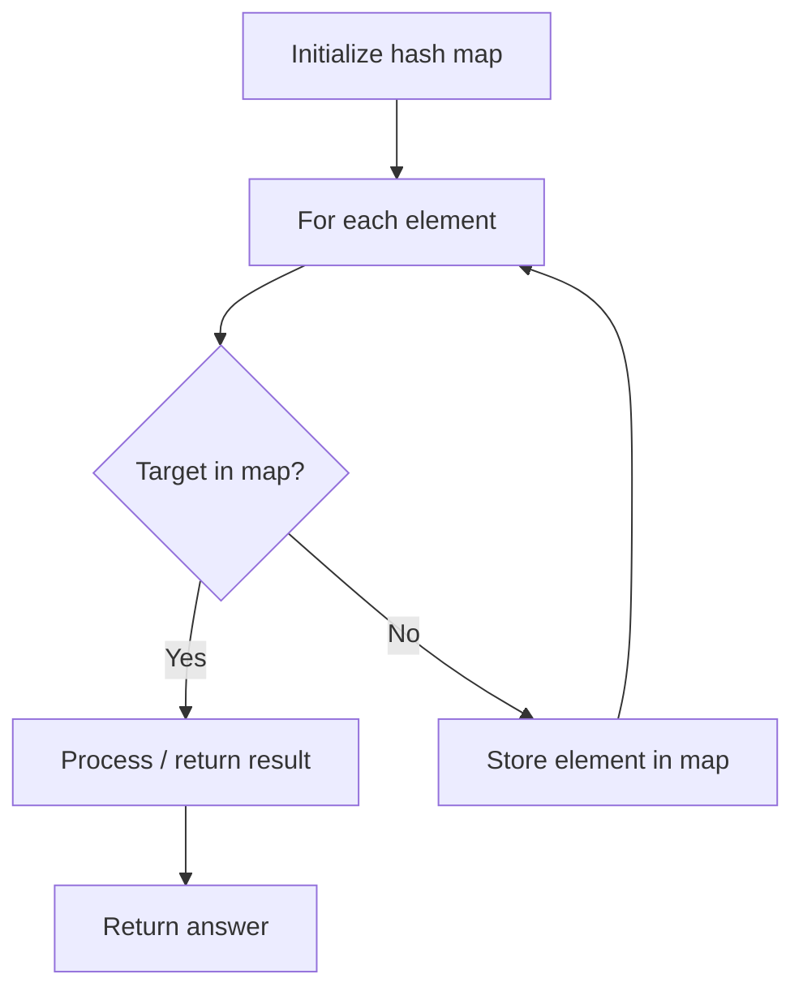

# Problem 804: Unique Morse Code Words

**Difficulty:** Easy  
**Tags:** Array, Hash Table, String  
**Pattern:** Hash Map Lookup  
**Link:** [leetcode.com/problems/unique-morse-code-words](https://leetcode.com/problems/unique-morse-code-words/)

## Description

International Morse Code defines a standard encoding where each letter is mapped to a series of dots and dashes, as follows:

	- `'a'` maps to `".-"`,
	- `'b'` maps to `"-..."`,
	- `'c'` maps to `"-.-."`, and so on.

For convenience, the full table for the `26` letters of the English alphabet is given below:

```

[".-","-...","-.-.","-..",".","..-.","--.","....","..",".---","-.-",".-..","--","-.","---",".--.","--.-",".-.","...","-","..-","...-",".--","-..-","-.--","--.."]
```

Given an array of strings `words` where each word can be written as a concatenation of the Morse code of each letter.

	- For example, `"cab"` can be written as `"-.-..--..."`, which is the concatenation of `"-.-."`, `".-"`, and `"-..."`. We will call such a concatenation the **transformation** of a word.

Return *the number of different **transformations** among all words we have*.

 

Example 1:

```

**Input:** words = ["gin","zen","gig","msg"]
**Output:** 2
**Explanation:** The transformation of each word is:
"gin" -> "--...-."
"zen" -> "--...-."
"gig" -> "--...--."
"msg" -> "--...--."
There are 2 different transformations: "--...-." and "--...--.".

```

Example 2:

```

**Input:** words = ["a"]
**Output:** 1

```

 

**Constraints:**

	- `1 <= words.length <= 100`
	- `1 <= words[i].length <= 12`
	- `words[i]` consists of lowercase English letters.

## Approach: Hash Map Lookup

Use a hash map (dictionary) to store elements for O(1) lookup. Iterate through the input, checking membership or counting frequencies in the map.

## Pseudocode

```
1. Initialize hash map
2. Iterate through elements:
   a. Check if target/complement exists in map
   b. If found: process result
   c. Otherwise: store element in map
3. Return result
```

## Algorithm Flow



## Complexity Analysis

- **Time:** O(n)
- **Space:** O(n)

## Solution (Python3)

```python
class Solution:
    def uniqueMorseRepresentations(self, words: List[str]) -> int:
        # Hash map approach - O(n) time, O(n) space
        seen = {}
        for i, val in enumerate(words):
            complement = words - val
            if complement in seen:
                return [seen[complement], i]
            seen[val] = i
        return 0
```

## Solution (C++)

```cpp
#include <string>
#include <unordered_map>
#include <vector>
using namespace std;

class Solution {
public:
    int uniqueMorseRepresentations(vector<string>& words) {
        // Hash map approach - O(n) time, O(n) space
        unordered_map<int, int> seen;
        for (int i = 0; i < words.size(); i++) {
            int complement = words - words[i];
            if (seen.count(complement)) {
                return {seen[complement], i};
            }
            seen[words[i]] = i;
        }
        return 0;
    }
};
```
