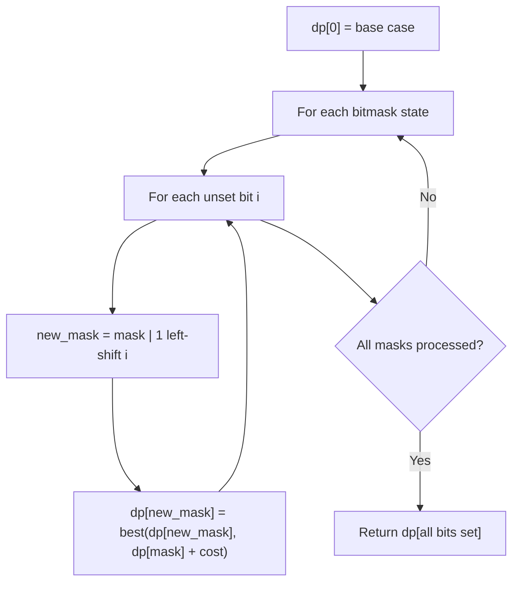

# Problem 805: Split Array With Same Average

**Difficulty:** Hard  
**Tags:** Array, Hash Table, Math, Dynamic Programming, Bit Manipulation, Bitmask  
**Pattern:** Dynamic Programming (Bitmask)  
**Link:** [leetcode.com/problems/split-array-with-same-average](https://leetcode.com/problems/split-array-with-same-average/)

## Description

You are given an integer array `nums`.

You should move each element of `nums` into one of the two arrays `A` and `B` such that `A` and `B` are non-empty, and `average(A) == average(B)`.

Return `true` if it is possible to achieve that and `false` otherwise.

**Note** that for an array `arr`, `average(arr)` is the sum of all the elements of `arr` over the length of `arr`.

 

Example 1:

```

**Input:** nums = [1,2,3,4,5,6,7,8]
**Output:** true
**Explanation:** We can split the array into [1,4,5,8] and [2,3,6,7], and both of them have an average of 4.5.

```

Example 2:

```

**Input:** nums = [3,1]
**Output:** false

```

 

**Constraints:**

	- `1 <= nums.length <= 30`
	- `0 <= nums[i] <= 10^4`

## Approach: Dynamic Programming (Bitmask)

Use bitmask to represent subsets of n elements. dp[mask] = optimal value when the selected subset is represented by mask. Iterate over all masks and transitions.

## Pseudocode

```
1. dp[0] = base case
2. For mask from 0 to 2^n - 1:
   a. For each bit i not set in mask:
      - new_mask = mask | (1 << i)
      - dp[new_mask] = best of dp[new_mask], dp[mask] + cost(i)
3. Return dp[(1 << n) - 1]
```

## Algorithm Flow



## Complexity Analysis

- **Time:** O(2^n * n)
- **Space:** O(2^n)

## Solution (Python3)

```python
class Solution:
    def splitArraySameAverage(self, nums: List[int]) -> bool:
        # Bitmask DP - O(2^n * n) time
        n = len(nums)
        dp = [float('inf')] * (1 << n)
        dp[0] = 0
        for mask in range(1 << n):
            bits = bin(mask).count('1')
            for i in range(n):
                if mask & (1 << i):
                    continue
                new_mask = mask | (1 << i)
                dp[new_mask] = min(dp[new_mask], dp[mask] + 1)
        return dp[(1 << n) - 1]
```

## Solution (C++)

```cpp
#include <algorithm>
#include <climits>
#include <string>
#include <vector>
using namespace std;

class Solution {
public:
    bool splitArraySameAverage(vector<int>& nums) {
        // Bitmask DP - O(2^n * n) time
        int n = nums.size();
        vector<int> dp(1 << n, INT_MAX);
        dp[0] = 0;
        for (int mask = 0; mask < (1 << n); mask++) {
            for (int i = 0; i < n; i++) {
                if (mask & (1 << i)) continue;
                int new_mask = mask | (1 << i);
                dp[new_mask] = min(dp[new_mask], dp[mask] + 1);
            }
        }
        return dp[(1 << n) - 1];
    }
};
```
