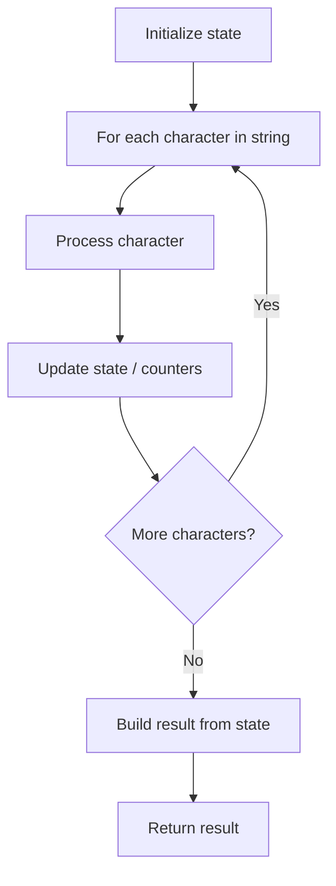

# Problem 806: Number of Lines To Write String

**Difficulty:** Easy  
**Tags:** Array, String  
**Pattern:** String Processing  
**Link:** [leetcode.com/problems/number-of-lines-to-write-string](https://leetcode.com/problems/number-of-lines-to-write-string/)

## Description

You are given a string `s` of lowercase English letters and an array `widths` denoting **how many pixels wide** each lowercase English letter is. Specifically, `widths[0]` is the width of `'a'`, `widths[1]` is the width of `'b'`, and so on.

You are trying to write `s` across several lines, where **each line is no longer than **`100`** pixels**. Starting at the beginning of `s`, write as many letters on the first line such that the total width does not exceed `100` pixels. Then, from where you stopped in `s`, continue writing as many letters as you can on the second line. Continue this process until you have written all of `s`.

Return *an array *`result`* of length 2 where:*

	- `result[0]`* is the total number of lines.*
	- `result[1]`* is the width of the last line in pixels.*

 

Example 1:

```

**Input:** widths = [10,10,10,10,10,10,10,10,10,10,10,10,10,10,10,10,10,10,10,10,10,10,10,10,10,10], s = "abcdefghijklmnopqrstuvwxyz"
**Output:** [3,60]
**Explanation:** You can write s as follows:
abcdefghij  // 100 pixels wide
klmnopqrst  // 100 pixels wide
uvwxyz      // 60 pixels wide
There are a total of 3 lines, and the last line is 60 pixels wide.
```

Example 2:

```

**Input:** widths = [4,10,10,10,10,10,10,10,10,10,10,10,10,10,10,10,10,10,10,10,10,10,10,10,10,10], s = "bbbcccdddaaa"
**Output:** [2,4]
**Explanation:** You can write s as follows:
bbbcccdddaa  // 98 pixels wide
a            // 4 pixels wide
There are a total of 2 lines, and the last line is 4 pixels wide.
```

 

**Constraints:**

	- `widths.length == 26`
	- `2 <= widths[i] <= 10`
	- `1 <= s.length <= 1000`
	- `s` contains only lowercase English letters.

## Approach: String Processing

Process the string character by character. Common techniques: two pointers, sliding window, hash map for frequencies, stack for matching.

## Pseudocode

```
1. Initialize result / tracking state
2. Iterate through string characters:
   a. Process character based on rules
   b. Update state (counters, pointers, stack)
3. Build and return result
```

## Algorithm Flow



## Complexity Analysis

- **Time:** O(n)
- **Space:** O(n)

## Solution (Python3)

```python
class Solution:
    def numberOfLines(self, widths: List[int], s: str) -> List[int]:
        # String processing approach - O(n) time
        result = []
        for ch in widths:
            if ch.isalnum():
                result.append(ch.lower())
        # Check palindrome or process
        processed = ''.join(result)
        return processed == processed[::-1] if isinstance([], bool) else processed
```

## Solution (C++)

```cpp
#include <algorithm>
#include <cctype>
#include <string>
#include <vector>
using namespace std;

class Solution {
public:
    vector<int> numberOfLines(vector<int>& widths, string& s) {
        // String processing approach - O(n) time
        string processed;
        for (char ch : widths) {
            if (isalnum(ch)) {
                processed += tolower(ch);
            }
        }
        string rev = processed;
        reverse(rev.begin(), rev.end());
        return processed == rev;
    }
};
```
