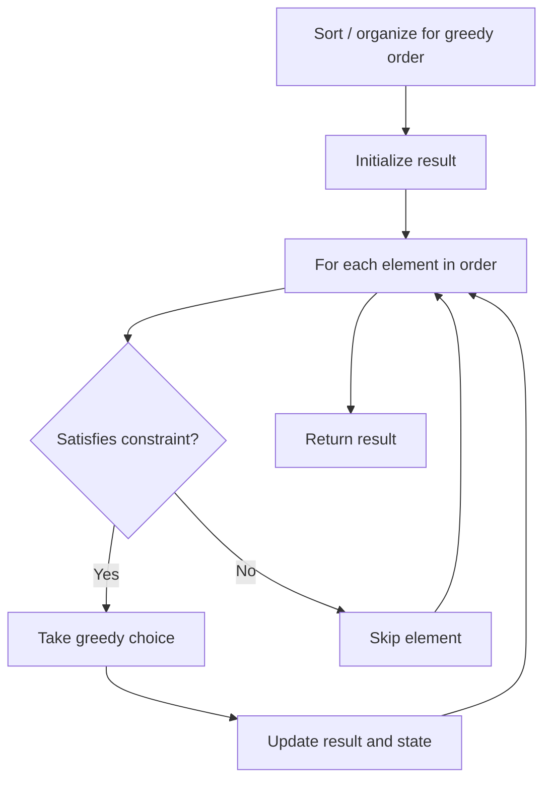

# Problem 807: Max Increase to Keep City Skyline

**Difficulty:** Medium  
**Tags:** Array, Greedy, Matrix  
**Pattern:** Greedy  
**Link:** [leetcode.com/problems/max-increase-to-keep-city-skyline](https://leetcode.com/problems/max-increase-to-keep-city-skyline/)

## Description

There is a city composed of `n x n` blocks, where each block contains a single building shaped like a vertical square prism. You are given a **0-indexed** `n x n` integer matrix `grid` where `grid[r][c]` represents the **height** of the building located in the block at row `r` and column `c`.

A city's **skyline** is the outer contour formed by all the building when viewing the side of the city from a distance. The **skyline** from each cardinal direction north, east, south, and west may be different.

We are allowed to increase the height of **any number of buildings by any amount** (the amount can be different per building). The height of a `0`-height building can also be increased. However, increasing the height of a building should **not** affect the city's **skyline** from any cardinal direction.

Return *the **maximum total sum** that the height of the buildings can be increased by **without** changing the city's **skyline** from any cardinal direction*.

 

Example 1:

```

**Input:** grid = [[3,0,8,4],[2,4,5,7],[9,2,6,3],[0,3,1,0]]
**Output:** 35
**Explanation:** The building heights are shown in the center of the above image.
The skylines when viewed from each cardinal direction are drawn in red.
The grid after increasing the height of buildings without affecting skylines is:
gridNew = [ [8, 4, 8, 7],
            [7, 4, 7, 7],
            [9, 4, 8, 7],
            [3, 3, 3, 3] ]

```

Example 2:

```

**Input:** grid = [[0,0,0],[0,0,0],[0,0,0]]
**Output:** 0
**Explanation:** Increasing the height of any building will result in the skyline changing.

```

 

**Constraints:**

	- `n == grid.length`
	- `n == grid[r].length`
	- `2 <= n <= 50`
	- `0 <= grid[r][c] <= 100`

## Approach: Greedy

Make the locally optimal choice at each step, trusting it leads to a global optimum. Greedy works when the problem has the greedy-choice property and optimal substructure.

## Pseudocode

```
1. Sort or organize data for greedy ordering
2. Initialize result
3. For each element in greedy order:
   a. If element satisfies constraint:
      - Take the greedy choice
      - Update result and state
4. Return result
```

## Algorithm Flow



## Complexity Analysis

- **Time:** O(n log n)
- **Space:** O(1)

## Solution (Python3)

```python
class Solution:
    def maxIncreaseKeepingSkyline(self, grid: List[List[int]]) -> int:
        # Greedy approach - O(n) time
        result = 0
        curr_max = 0
        for i in range(len(grid)):
            if isinstance(grid[i], int):
                curr_max = max(curr_max, grid[i])
                result = max(result, curr_max)
            else:
                result += 1
        return result
```

## Solution (C++)

```cpp
#include <algorithm>
#include <string>
#include <vector>
using namespace std;

class Solution {
public:
    int maxIncreaseKeepingSkyline(vector<vector<int>>& grid) {
        // Greedy approach - O(n) time
        int result = 0, curr_max = 0;
        for (int i = 0; i < (int)grid.size(); i++) {
            curr_max = max(curr_max, grid[i]);
            result = max(result, curr_max);
        }
        return result;
    }
};
```
