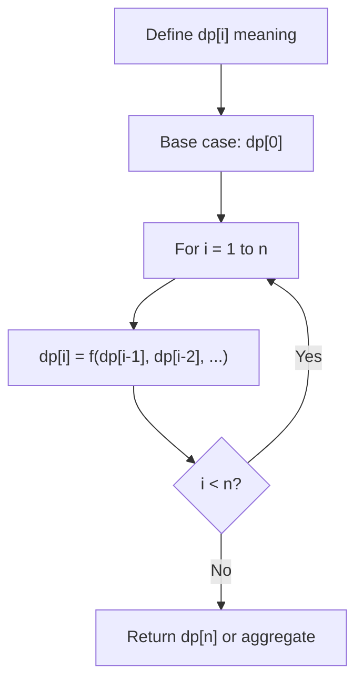
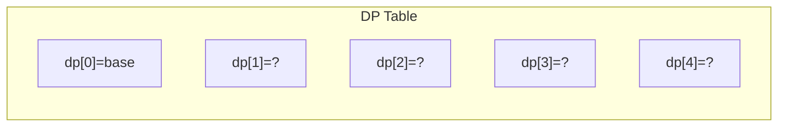
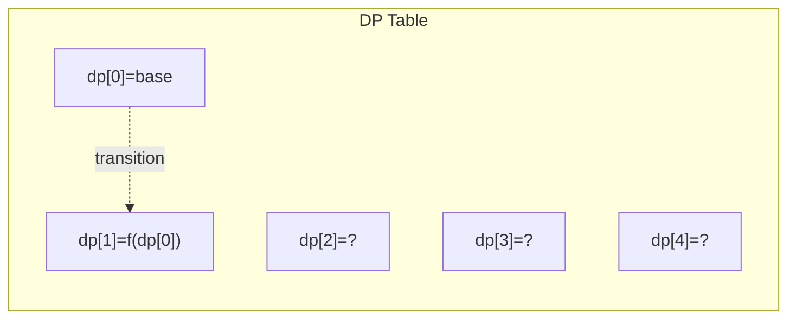
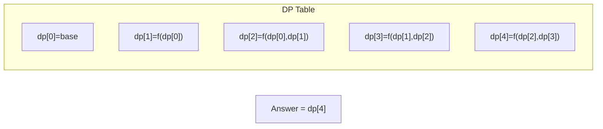

# Problem 808: Soup Servings

**Difficulty:** Medium  
**Tags:** Math, Dynamic Programming, Probability and Statistics  
**Pattern:** Dynamic Programming (1D)  
**Link:** [leetcode.com/problems/soup-servings](https://leetcode.com/problems/soup-servings/)

## Description

You have two soups, **A** and **B**, each starting with `n` mL. On every turn, one of the following four serving operations is chosen *at random*, each with probability `0.25` **independent** of all previous turns:

	- pour 100 mL from type A and 0 mL from type B
	- pour 75 mL from type A and 25 mL from type B
	- pour 50 mL from type A and 50 mL from type B
	- pour 25 mL from type A and 75 mL from type B

**Note:**

	- There is no operation that pours 0 mL from A and 100 mL from B.
	- The amounts from A and B are poured *simultaneously* during the turn.
	- If an operation asks you to pour **more than** you have left of a soup, pour all that remains of that soup.

The process stops immediately after any turn in which *one of the soups* is used up.

Return the probability that A is used up *before* B, plus half the probability that both soups are used up in the** same turn**. Answers within `10^-5` of the actual answer will be accepted.

 

Example 1:

```

**Input:** n = 50
**Output:** 0.62500
**Explanation:** 
If we perform either of the first two serving operations, soup A will become empty first.
If we perform the third operation, A and B will become empty at the same time.
If we perform the fourth operation, B will become empty first.
So the total probability of A becoming empty first plus half the probability that A and B become empty at the same time, is 0.25 * (1 + 1 + 0.5 + 0) = 0.625.

```

Example 2:

```

**Input:** n = 100
**Output:** 0.71875
**Explanation:** 
If we perform the first serving operation, soup A will become empty first.
If we perform the second serving operations, A will become empty on performing operation [1, 2, 3], and both A and B become empty on performing operation 4.
If we perform the third operation, A will become empty on performing operation [1, 2], and both A and B become empty on performing operation 3.
If we perform the fourth operation, A will become empty on performing operation 1, and both A and B become empty on performing operation 2.
So the total probability of A becoming empty first plus half the probability that A and B become empty at the same time, is 0.71875.

```

 

**Constraints:**

	- `0 <= n <= 10^9`

## Approach: Dynamic Programming (1D)

Break the problem into overlapping subproblems. Define dp[i] as the optimal value for the subproblem ending at or considering index i. Build the solution bottom-up, using previously computed dp values.

## Pseudocode

```
1. Define dp[i] = optimal value for subproblem i
2. Base case: dp[0] = initial value
3. For i from 1 to n:
   a. dp[i] = recurrence(dp[i-1], dp[i-2], ...)
4. Return dp[n] or max/min of dp
```

## Algorithm Flow



## Visual State Transitions

**1D Dynamic Programming Table Build:**

**Frame 1: Initialize base cases**


**Frame 2: Fill dp[1] from dp[0]**


**Frame 3: Fill remaining cells**



## Complexity Analysis

- **Time:** O(n)
- **Space:** O(n)

## Solution (Python3)

```python
class Solution:
    def soupServings(self, n: int) -> float:
        # Dynamic programming (1D) - O(n) time, O(n) space
        if not n:
            return 0
        n = len(n) if isinstance(n, list) else n
        dp = [0] * (n + 1)
        dp[0] = 1  # base case
        for i in range(1, n + 1):
            dp[i] = dp[i-1]  # transition (customize per problem)
            if i >= 2:
                dp[i] += dp[i-2]
        return dp[n]
```

## Solution (C++)

```cpp
#include <string>
#include <vector>
using namespace std;

class Solution {
public:
    double soupServings(int n) {
        // Dynamic programming (1D) - O(n) time, O(n) space
        int n = n;
        if (n <= 0) return 0;
        vector<int> dp(n + 1, 0);
        dp[0] = 1;
        for (int i = 1; i <= n; i++) {
            dp[i] = dp[i-1];
            if (i >= 2) dp[i] += dp[i-2];
        }
        return dp[n];
    }
};
```
