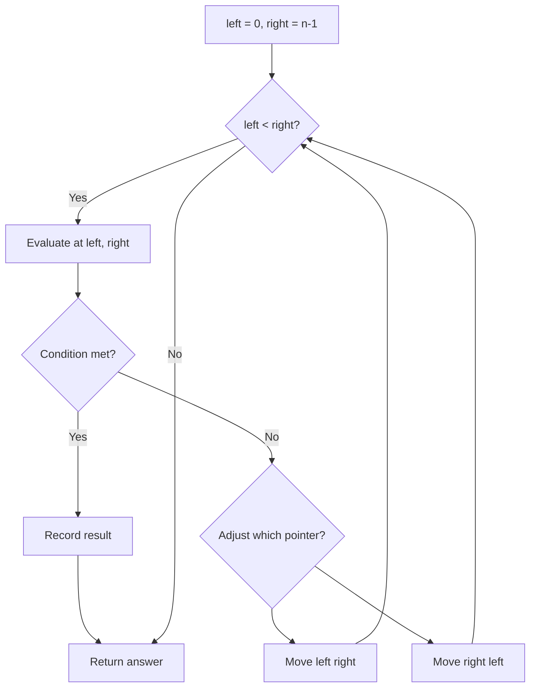
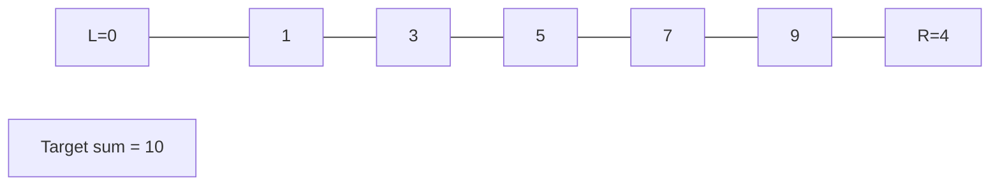
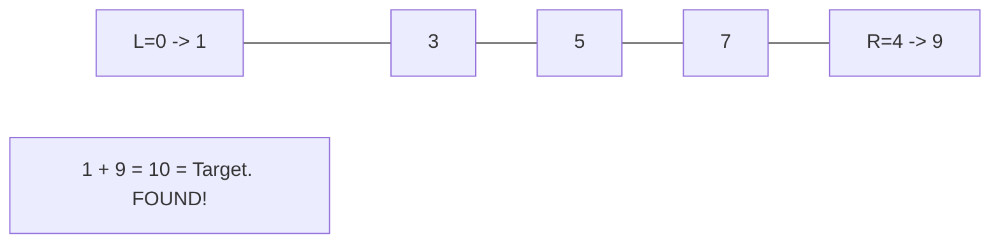

# Problem 809: Expressive Words

**Difficulty:** Medium  
**Tags:** Array, Two Pointers, String  
**Pattern:** Two Pointers  
**Link:** [leetcode.com/problems/expressive-words](https://leetcode.com/problems/expressive-words/)

## Description

Sometimes people repeat letters to represent extra feeling. For example:

	- `"hello" -> "heeellooo"`
	- `"hi" -> "hiiii"`

In these strings like `"heeellooo"`, we have groups of adjacent letters that are all the same: `"h"`, `"eee"`, `"ll"`, `"ooo"`.

You are given a string `s` and an array of query strings `words`. A query word is **stretchy** if it can be made to be equal to `s` by any number of applications of the following extension operation: choose a group consisting of characters `c`, and add some number of characters `c` to the group so that the size of the group is **three or more**.

	- For example, starting with `"hello"`, we could do an extension on the group `"o"` to get `"hellooo"`, but we cannot get `"helloo"` since the group `"oo"` has a size less than three. Also, we could do another extension like `"ll" -> "lllll"` to get `"helllllooo"`. If `s = "helllllooo"`, then the query word `"hello"` would be **stretchy** because of these two extension operations: `query = "hello" -> "hellooo" -> "helllllooo" = s`.

Return *the number of query strings that are **stretchy***.

 

Example 1:

```

**Input:** s = "heeellooo", words = ["hello", "hi", "helo"]
**Output:** 1
**Explanation:** 
We can extend "e" and "o" in the word "hello" to get "heeellooo".
We can't extend "helo" to get "heeellooo" because the group "ll" is not size 3 or more.

```

Example 2:

```

**Input:** s = "zzzzzyyyyy", words = ["zzyy","zy","zyy"]
**Output:** 3

```

 

**Constraints:**

	- `1 <= s.length, words.length <= 100`
	- `1 <= words[i].length <= 100`
	- `s` and `words[i]` consist of lowercase letters.

## Approach: Two Pointers

Use two pointers moving through the data structure. Depending on the problem, pointers may move toward each other (converging), in the same direction (fast/slow), or independently.

## Pseudocode

```
1. Initialize left = 0, right = n-1 (or two independent pointers)
2. While pointers haven't crossed:
   a. Evaluate condition at pointer positions
   b. Move left pointer right or right pointer left
3. Return result
```

## Algorithm Flow



## Visual State Transitions

**Two Pointer Convergence:**

**Frame 1: Initialize pointers**


**Frame 2: Sum = 1+9 = 10, found!**



## Complexity Analysis

- **Time:** O(n)
- **Space:** O(1)

## Solution (Python3)

```python
class Solution:
    def expressiveWords(self, s: str, words: List[str]) -> int:
        # Two pointer approach - O(n) time, O(1) space
        left, right = 0, len(s) - 1
        while left < right:
            curr = s[left] + s[right]
            if curr == words:
                return [left, right]
            elif curr < words:
                left += 1
            else:
                right -= 1
        return 0
```

## Solution (C++)

```cpp
#include <string>
#include <vector>
using namespace std;

class Solution {
public:
    int expressiveWords(string& s, vector<string>& words) {
        // Two pointer approach - O(n) time, O(1) space
        int left = 0, right = s.size() - 1;
        while (left < right) {
            int curr = s[left] + s[right];
            if (curr == words) {
                return {left, right};
            } else if (curr < words) {
                left++;
            } else {
                right--;
            }
        }
        return 0;
    }
};
```
