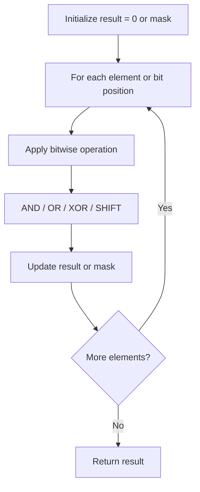

# Problem 810: Chalkboard XOR Game

**Difficulty:** Hard  
**Tags:** Array, Math, Bit Manipulation, Brainteaser, Game Theory  
**Pattern:** Bit Manipulation  
**Link:** [leetcode.com/problems/chalkboard-xor-game](https://leetcode.com/problems/chalkboard-xor-game/)

## Description

You are given an array of integers `nums` represents the numbers written on a chalkboard.

Alice and Bob take turns erasing exactly one number from the chalkboard, with Alice starting first. If erasing a number causes the bitwise XOR of all the elements of the chalkboard to become `0`, then that player loses. The bitwise XOR of one element is that element itself, and the bitwise XOR of no elements is `0`.

Also, if any player starts their turn with the bitwise XOR of all the elements of the chalkboard equal to `0`, then that player wins.

Return `true` *if and only if Alice wins the game, assuming both players play optimally*.

 

Example 1:

```

**Input:** nums = [1,1,2]
**Output:** false
**Explanation:** 
Alice has two choices: erase 1 or erase 2. 
If she erases 1, the nums array becomes [1, 2]. The bitwise XOR of all the elements of the chalkboard is 1 XOR 2 = 3. Now Bob can remove any element he wants, because Alice will be the one to erase the last element and she will lose. 
If Alice erases 2 first, now nums become [1, 1]. The bitwise XOR of all the elements of the chalkboard is 1 XOR 1 = 0. Alice will lose.

```

Example 2:

```

**Input:** nums = [0,1]
**Output:** true

```

Example 3:

```

**Input:** nums = [1,2,3]
**Output:** true

```

 

**Constraints:**

	- `1 <= nums.length <= 1000`
	- `0 <= nums[i] < 2^16`

## Approach: Bit Manipulation

Operate on individual bits using bitwise operators (AND, OR, XOR, shift). Common tricks: x & (x-1) removes lowest set bit, x ^ x = 0, XOR all elements to find unique.

## Pseudocode

```
1. Apply bitwise operations:
   - XOR all elements to cancel paired bits
   - Use bitmask to track state
   - Shift and mask to extract/set individual bits
2. Return result
```

## Algorithm Flow



## Complexity Analysis

- **Time:** O(n) or O(log n)
- **Space:** O(1)

## Solution (Python3)

```python
class Solution:
    def xorGame(self, nums: List[int]) -> bool:
        # Bit manipulation - O(n) time, O(1) space
        result = 0
        for val in nums:
            result ^= val
        return result
```

## Solution (C++)

```cpp
#include <string>
#include <vector>
using namespace std;

class Solution {
public:
    bool xorGame(vector<int>& nums) {
        // Bit manipulation - O(n) time, O(1) space
        int result = 0;
        for (int val : nums) {
            result ^= val;
        }
        return result;
    }
};
```
