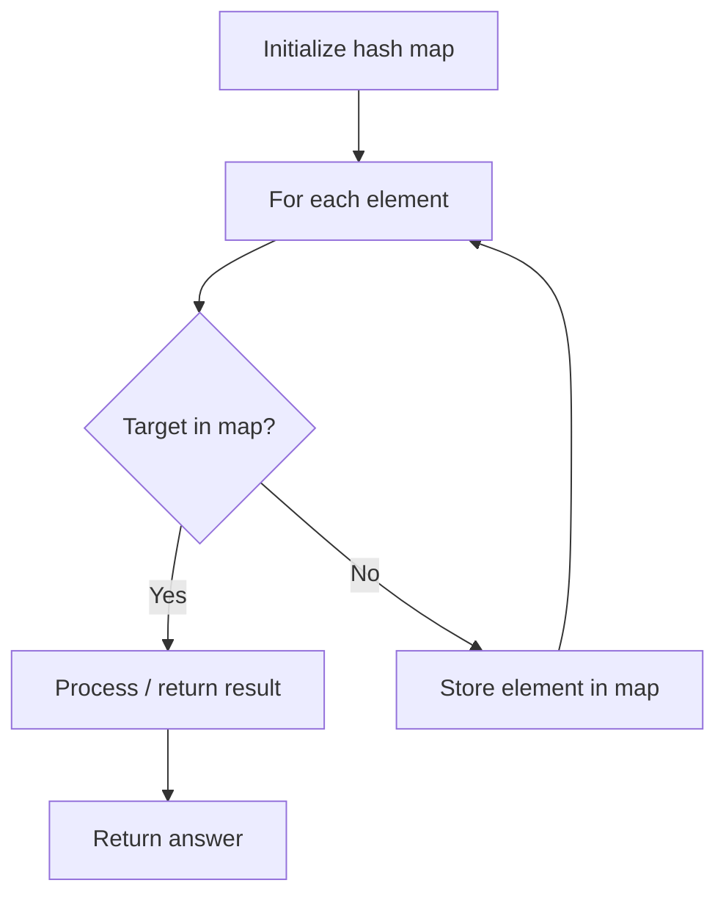

# Problem 811: Subdomain Visit Count

**Difficulty:** Medium  
**Tags:** Array, Hash Table, String, Counting  
**Pattern:** Hash Map Lookup  
**Link:** [leetcode.com/problems/subdomain-visit-count](https://leetcode.com/problems/subdomain-visit-count/)

## Description

A website domain `"discuss.leetcode.com"` consists of various subdomains. At the top level, we have `"com"`, at the next level, we have `"leetcode.com"` and at the lowest level, `"discuss.leetcode.com"`. When we visit a domain like `"discuss.leetcode.com"`, we will also visit the parent domains `"leetcode.com"` and `"com"` implicitly.

A **count-paired domain** is a domain that has one of the two formats `"rep d1.d2.d3"` or `"rep d1.d2"` where `rep` is the number of visits to the domain and `d1.d2.d3` is the domain itself.

	- For example, `"9001 discuss.leetcode.com"` is a **count-paired domain** that indicates that `discuss.leetcode.com` was visited `9001` times.

Given an array of **count-paired domains** `cpdomains`, return *an array of the **count-paired domains** of each subdomain in the input*. You may return the answer in **any order**.

 

Example 1:

```

**Input:** cpdomains = ["9001 discuss.leetcode.com"]
**Output:** ["9001 leetcode.com","9001 discuss.leetcode.com","9001 com"]
**Explanation:** We only have one website domain: "discuss.leetcode.com".
As discussed above, the subdomain "leetcode.com" and "com" will also be visited. So they will all be visited 9001 times.

```

Example 2:

```

**Input:** cpdomains = ["900 google.mail.com", "50 yahoo.com", "1 intel.mail.com", "5 wiki.org"]
**Output:** ["901 mail.com","50 yahoo.com","900 google.mail.com","5 wiki.org","5 org","1 intel.mail.com","951 com"]
**Explanation:** We will visit "google.mail.com" 900 times, "yahoo.com" 50 times, "intel.mail.com" once and "wiki.org" 5 times.
For the subdomains, we will visit "mail.com" 900 + 1 = 901 times, "com" 900 + 50 + 1 = 951 times, and "org" 5 times.

```

 

**Constraints:**

	- `1 <= cpdomain.length <= 100`
	- `1 <= cpdomain[i].length <= 100`
	- `cpdomain[i]` follows either the `"repi d1i.d2i.d3i"` format or the `"repi d1i.d2i"` format.
	- `repi` is an integer in the range `[1, 10^4]`.
	- `d1i`, `d2i`, and `d3i` consist of lowercase English letters.

## Approach: Hash Map Lookup

Use a hash map (dictionary) to store elements for O(1) lookup. Iterate through the input, checking membership or counting frequencies in the map.

## Pseudocode

```
1. Initialize hash map
2. Iterate through elements:
   a. Check if target/complement exists in map
   b. If found: process result
   c. Otherwise: store element in map
3. Return result
```

## Algorithm Flow



## Complexity Analysis

- **Time:** O(n)
- **Space:** O(n)

## Solution (Python3)

```python
class Solution:
    def subdomainVisits(self, cpdomains: List[str]) -> List[str]:
        # Hash map approach - O(n) time, O(n) space
        seen = {}
        for i, val in enumerate(cpdomains):
            complement = cpdomains - val
            if complement in seen:
                return [seen[complement], i]
            seen[val] = i
        return []
```

## Solution (C++)

```cpp
#include <string>
#include <unordered_map>
#include <vector>
using namespace std;

class Solution {
public:
    vector<string> subdomainVisits(vector<string>& cpdomains) {
        // Hash map approach - O(n) time, O(n) space
        unordered_map<int, int> seen;
        for (int i = 0; i < cpdomains.size(); i++) {
            int complement = cpdomains - cpdomains[i];
            if (seen.count(complement)) {
                return {seen[complement], i};
            }
            seen[cpdomains[i]] = i;
        }
        return {};
    }
};
```
