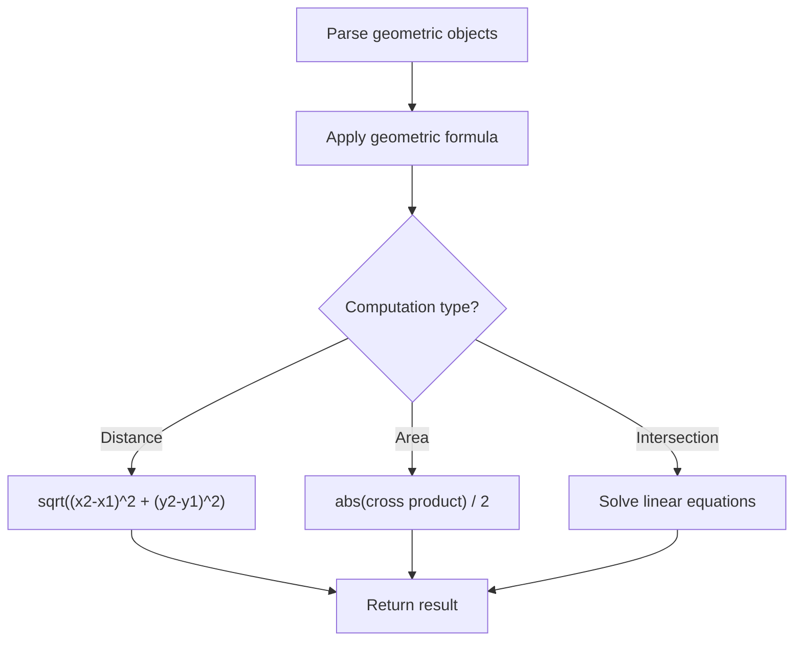

# Problem 812: Largest Triangle Area

**Difficulty:** Easy  
**Tags:** Array, Math, Geometry  
**Pattern:** Geometry  
**Link:** [leetcode.com/problems/largest-triangle-area](https://leetcode.com/problems/largest-triangle-area/)

## Description

Given an array of points on the **X-Y** plane `points` where `points[i] = [xi, yi]`, return *the area of the largest triangle that can be formed by any three different points*. Answers within `10^-5` of the actual answer will be accepted.

 

Example 1:

```

**Input:** points = [[0,0],[0,1],[1,0],[0,2],[2,0]]
**Output:** 2.00000
**Explanation:** The five points are shown in the above figure. The red triangle is the largest.

```

Example 2:

```

**Input:** points = [[1,0],[0,0],[0,1]]
**Output:** 0.50000

```

 

**Constraints:**

	- `3 <= points.length <= 50`
	- `-50 <= xi, yi <= 50`
	- All the given points are **unique**.

## Approach: Geometry

Apply geometric formulas: distance, area, cross product, convex hull, line intersection. Handle floating-point precision carefully.

## Pseudocode

```
1. Parse geometric objects (points, lines, shapes)
2. Apply geometric operations:
   - Distance formula
   - Cross/dot product
   - Area computation
3. Handle precision and edge cases
4. Return result
```

## Algorithm Flow



## Complexity Analysis

- **Time:** O(n^2) or O(n log n)
- **Space:** O(n)

## Solution (Python3)

```python
class Solution:
    def largestTriangleArea(self, points: List[List[int]]) -> float:
        # Geometry approach
        import math
        result = 0
        for i in range(len(points)):
            for j in range(i + 1, len(points)):
                dx = points[i][0] - points[j][0]
                dy = points[i][1] - points[j][1]
                dist = math.sqrt(dx*dx + dy*dy)
                result = max(result, dist)
        return result
```

## Solution (C++)

```cpp
#include <algorithm>
#include <cmath>
#include <string>
#include <vector>
using namespace std;

class Solution {
public:
    double largestTriangleArea(vector<vector<int>>& points) {
        // Geometry approach
        double result = 0;
        for (int i = 0; i < (int)points.size(); i++) {
            for (int j = i + 1; j < (int)points.size(); j++) {
                double dx = points[i][0] - points[j][0];
                double dy = points[i][1] - points[j][1];
                result = max(result, sqrt(dx*dx + dy*dy));
            }
        }
        return result;
    }
};
```
