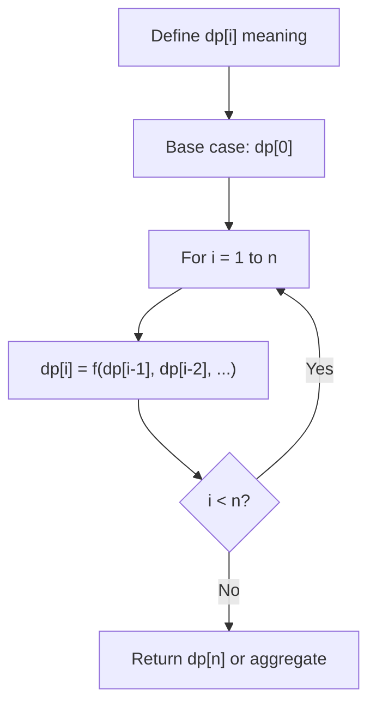
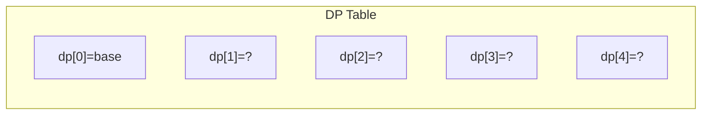
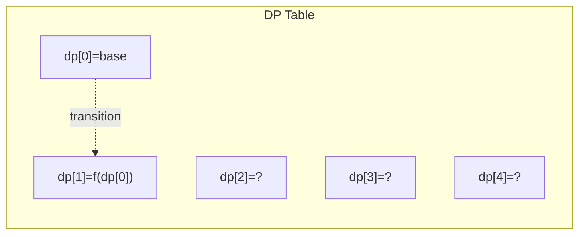
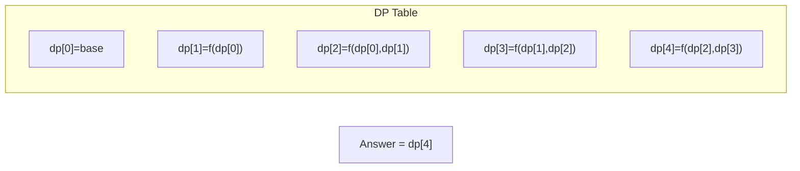

# Problem 813: Largest Sum of Averages

**Difficulty:** Medium  
**Tags:** Array, Dynamic Programming, Prefix Sum  
**Pattern:** Dynamic Programming (1D)  
**Link:** [leetcode.com/problems/largest-sum-of-averages](https://leetcode.com/problems/largest-sum-of-averages/)

## Description

You are given an integer array `nums` and an integer `k`. You can partition the array into **at most** `k` non-empty adjacent subarrays. The **score** of a partition is the sum of the averages of each subarray.

Note that the partition must use every integer in `nums`, and that the score is not necessarily an integer.

Return *the maximum **score** you can achieve of all the possible partitions*. Answers within `10^-6` of the actual answer will be accepted.

 

Example 1:

```

**Input:** nums = [9,1,2,3,9], k = 3
**Output:** 20.00000
**Explanation:** 
The best choice is to partition nums into [9], [1, 2, 3], [9]. The answer is 9 + (1 + 2 + 3) / 3 + 9 = 20.
We could have also partitioned nums into [9, 1], [2], [3, 9], for example.
That partition would lead to a score of 5 + 2 + 6 = 13, which is worse.

```

Example 2:

```

**Input:** nums = [1,2,3,4,5,6,7], k = 4
**Output:** 20.50000

```

 

**Constraints:**

	- `1 <= nums.length <= 100`
	- `1 <= nums[i] <= 10^4`
	- `1 <= k <= nums.length`

## Approach: Dynamic Programming (1D)

Break the problem into overlapping subproblems. Define dp[i] as the optimal value for the subproblem ending at or considering index i. Build the solution bottom-up, using previously computed dp values.

## Pseudocode

```
1. Define dp[i] = optimal value for subproblem i
2. Base case: dp[0] = initial value
3. For i from 1 to n:
   a. dp[i] = recurrence(dp[i-1], dp[i-2], ...)
4. Return dp[n] or max/min of dp
```

## Algorithm Flow



## Visual State Transitions

**1D Dynamic Programming Table Build:**

**Frame 1: Initialize base cases**


**Frame 2: Fill dp[1] from dp[0]**


**Frame 3: Fill remaining cells**



## Complexity Analysis

- **Time:** O(n)
- **Space:** O(n)

## Solution (Python3)

```python
class Solution:
    def largestSumOfAverages(self, nums: List[int], k: int) -> float:
        # Dynamic programming (1D) - O(n) time, O(n) space
        if not nums:
            return 0
        n = len(nums) if isinstance(nums, list) else nums
        dp = [0] * (n + 1)
        dp[0] = 1  # base case
        for i in range(1, n + 1):
            dp[i] = dp[i-1]  # transition (customize per problem)
            if i >= 2:
                dp[i] += dp[i-2]
        return dp[n]
```

## Solution (C++)

```cpp
#include <string>
#include <vector>
using namespace std;

class Solution {
public:
    double largestSumOfAverages(vector<int>& nums, int k) {
        // Dynamic programming (1D) - O(n) time, O(n) space
        int n = nums;
        if (n <= 0) return 0;
        vector<int> dp(n + 1, 0);
        dp[0] = 1;
        for (int i = 1; i <= n; i++) {
            dp[i] = dp[i-1];
            if (i >= 2) dp[i] += dp[i-2];
        }
        return dp[n];
    }
};
```
