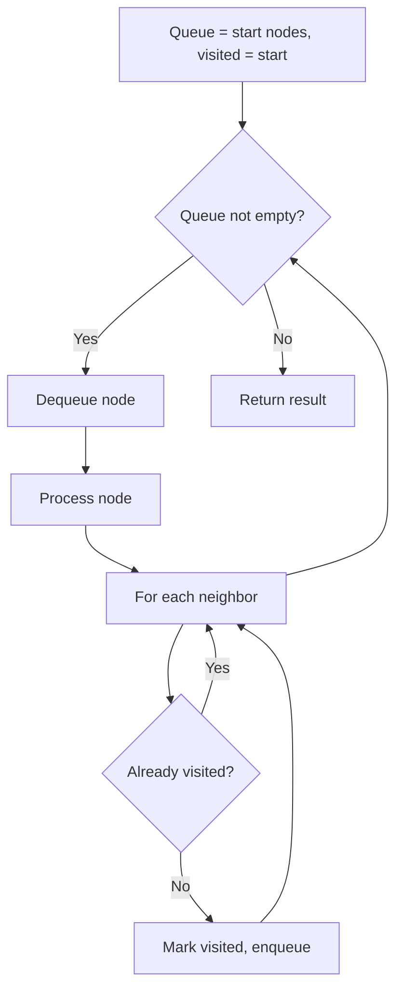
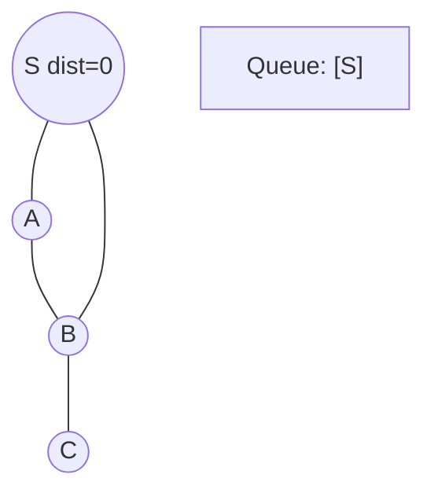
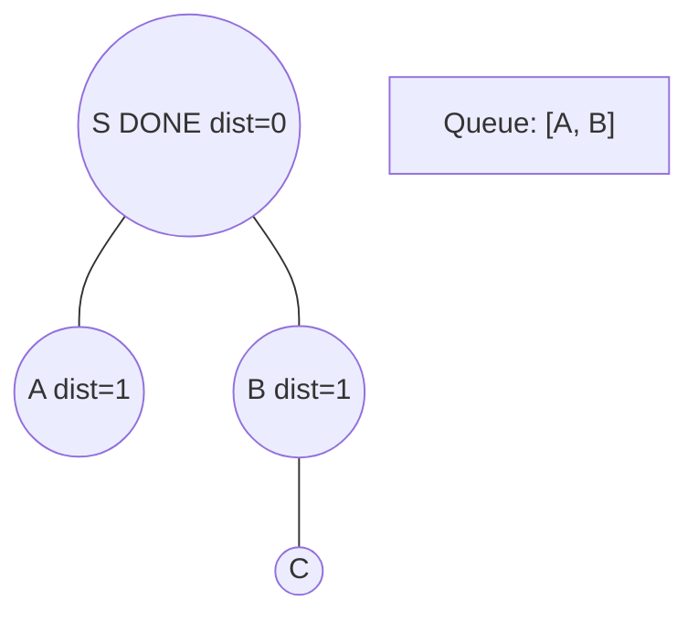
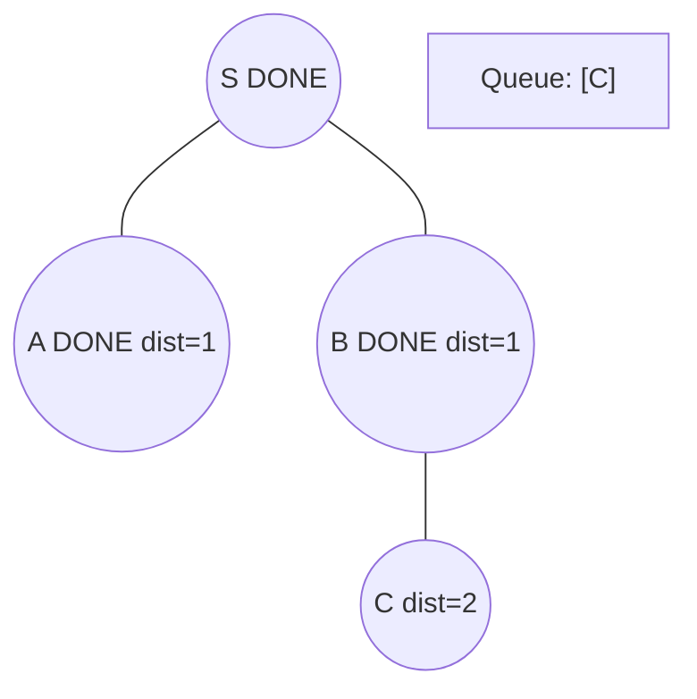
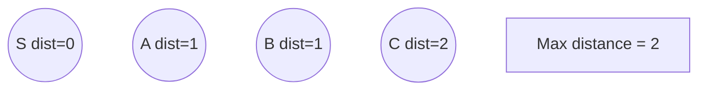

# Problem 815: Bus Routes

**Difficulty:** Hard  
**Tags:** Array, Hash Table, Breadth-First Search  
**Pattern:** BFS Graph Traversal  
**Link:** [leetcode.com/problems/bus-routes](https://leetcode.com/problems/bus-routes/)

## Description

You are given an array `routes` representing bus routes where `routes[i]` is a bus route that the `i^th` bus repeats forever.

	- For example, if `routes[0] = [1, 5, 7]`, this means that the `0^th` bus travels in the sequence `1 -> 5 -> 7 -> 1 -> 5 -> 7 -> 1 -> ...` forever.

You will start at the bus stop `source` (You are not on any bus initially), and you want to go to the bus stop `target`. You can travel between bus stops by buses only.

Return *the least number of buses you must take to travel from *`source`* to *`target`. Return `-1` if it is not possible.

 

Example 1:

```

**Input:** routes = [[1,2,7],[3,6,7]], source = 1, target = 6
**Output:** 2
**Explanation:** The best strategy is take the first bus to the bus stop 7, then take the second bus to the bus stop 6.

```

Example 2:

```

**Input:** routes = [[7,12],[4,5,15],[6],[15,19],[9,12,13]], source = 15, target = 12
**Output:** -1

```

 

 

**Constraints:**

	- `1 <= routes.length <= 500`.
	- `1 <= routes[i].length <= 10^5`
	- All the values of `routes[i]` are **unique**.
	- `sum(routes[i].length) <= 10^5`
	- `0 <= routes[i][j] < 10^6`
	- `0 <= source, target < 10^6`

## Approach: BFS Graph Traversal

Explore the graph breadth-first using a queue. Process nodes level by level; BFS finds shortest paths in unweighted graphs.

## Pseudocode

```
1. Initialize queue with start node(s), visited set
2. While queue not empty:
   a. Dequeue node
   b. Process node
   c. For each unvisited neighbor:
      - Mark visited, enqueue
3. Return result
```

## Algorithm Flow



## Visual State Transitions

**BFS Level-by-Level Traversal:**

**Frame 1: Start BFS from source**


**Frame 2: Process level 0, enqueue neighbors**


**Frame 3: Process level 1**


**Frame 4: All nodes reached**



## Complexity Analysis

- **Time:** O(V + E)
- **Space:** O(V)

## Solution (Python3)

```python
class Solution:
    def numBusesToDestination(self, routes: List[List[int]], source: int, target: int) -> int:
        # BFS on graph - O(V+E) time
        from collections import deque
        if not routes:
            return 0
        visited = set()
        queue = deque([0])
        visited.add(0)
        dist = 0
        while queue:
            for _ in range(len(queue)):
                node = queue.popleft()
                # Process node
            dist += 1
        return dist
```

## Solution (C++)

```cpp
#include <queue>
#include <string>
#include <unordered_set>
#include <vector>
using namespace std;

class Solution {
public:
    int numBusesToDestination(vector<vector<int>>& routes, int source, int target) {
        // BFS on graph - O(V+E) time
        if (routes.empty()) return 0;
        queue<int> q;
        unordered_set<int> visited;
        q.push(0);
        visited.insert(0);
        int dist = 0;
        while (!q.empty()) {
            int sz = q.size();
            for (int i = 0; i < sz; i++) {
                int node = q.front(); q.pop();
                // Process node
            }
            dist++;
        }
        return dist;
    }
};
```
