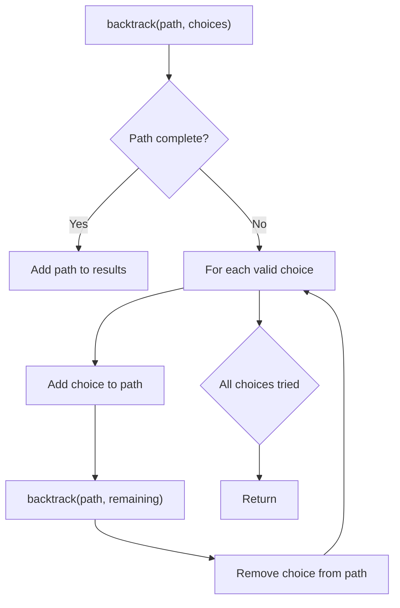
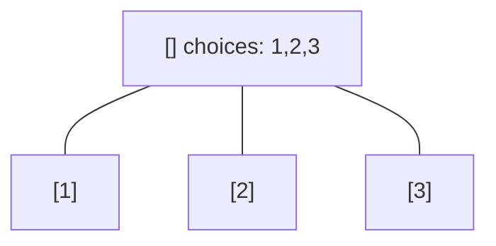
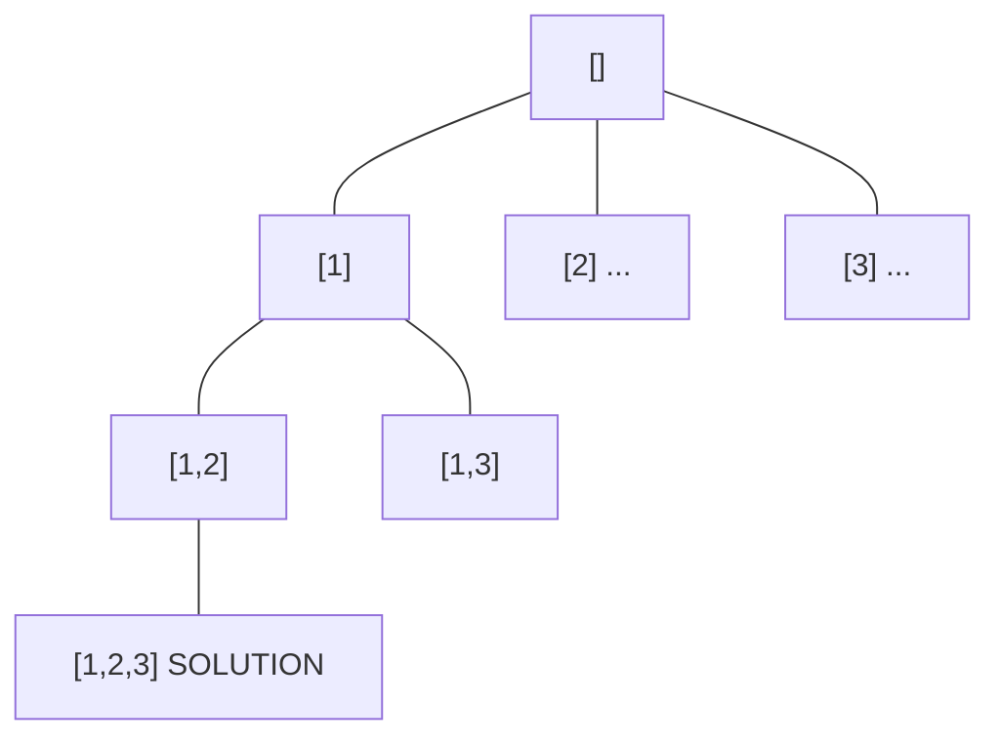
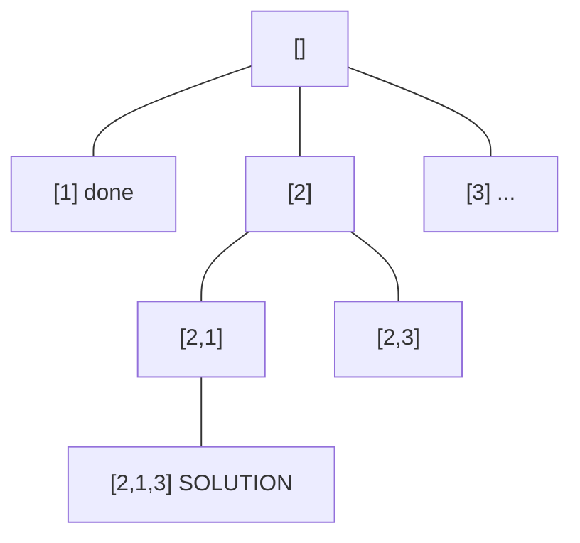
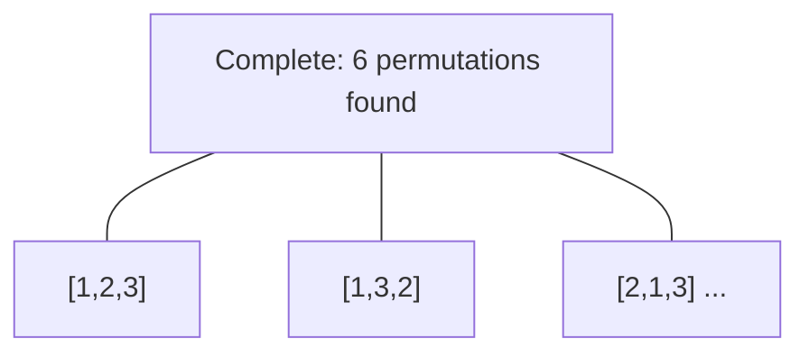

# Problem 816: Ambiguous Coordinates

**Difficulty:** Medium  
**Tags:** String, Backtracking, Enumeration  
**Pattern:** Backtracking  
**Link:** [leetcode.com/problems/ambiguous-coordinates](https://leetcode.com/problems/ambiguous-coordinates/)

## Description

We had some 2-dimensional coordinates, like `"(1, 3)"` or `"(2, 0.5)"`. Then, we removed all commas, decimal points, and spaces and ended up with the string s.

	- For example, `"(1, 3)"` becomes `s = "(13)"` and `"(2, 0.5)"` becomes `s = "(205)"`.

Return *a list of strings representing all possibilities for what our original coordinates could have been*.

Our original representation never had extraneous zeroes, so we never started with numbers like `"00"`, `"0.0"`, `"0.00"`, `"1.0"`, `"001"`, `"00.01"`, or any other number that can be represented with fewer digits. Also, a decimal point within a number never occurs without at least one digit occurring before it, so we never started with numbers like `".1"`.

The final answer list can be returned in any order. All coordinates in the final answer have exactly one space between them (occurring after the comma.)

 

Example 1:

```

**Input:** s = "(123)"
**Output:** ["(1, 2.3)","(1, 23)","(1.2, 3)","(12, 3)"]

```

Example 2:

```

**Input:** s = "(0123)"
**Output:** ["(0, 1.23)","(0, 12.3)","(0, 123)","(0.1, 2.3)","(0.1, 23)","(0.12, 3)"]
**Explanation:** 0.0, 00, 0001 or 00.01 are not allowed.

```

Example 3:

```

**Input:** s = "(00011)"
**Output:** ["(0, 0.011)","(0.001, 1)"]

```

 

**Constraints:**

	- `4 <= s.length <= 12`
	- `s[0] == '('` and `s[s.length - 1] == ')'`.
	- The rest of `s` are digits.

## Approach: Backtracking

Explore all possible solutions by building candidates incrementally. At each step, make a choice and recurse. If the choice leads to a dead end, undo the choice (backtrack) and try the next option.

## Pseudocode

```
1. Define backtrack(path, choices):
   a. If path is a complete solution: add to results
   b. For each choice in choices:
      - If choice is valid:
        * Add choice to path
        * backtrack(path, remaining_choices)
        * Remove choice from path (backtrack)
2. Call backtrack([], all_choices)
```

## Algorithm Flow



## Visual State Transitions

**Backtracking Decision Tree:**

**Frame 1: Root - start with empty path**


**Frame 2: Explore branch [1]**


**Frame 3: Backtrack, explore [2]**


**Frame 4: All solutions found**



## Complexity Analysis

- **Time:** O(k^n) or O(n!)
- **Space:** O(n)

## Solution (Python3)

```python
class Solution:
    def ambiguousCoordinates(self, s: str) -> List[str]:
        # Backtracking - O(2^n) or O(n!) time
        result = []
        
        def backtrack(path, start):
            result.append(path[:])
            for i in range(start, len(s)):
                path.append(s[i])
                backtrack(path, i + 1)
                path.pop()
        
        backtrack([], 0)
        return result
```

## Solution (C++)

```cpp
#include <functional>
#include <string>
#include <vector>
using namespace std;

class Solution {
public:
    vector<string> ambiguousCoordinates(string& s) {
        // Backtracking - O(2^n) or O(n!) time
        vector<vector<int>> result;
        vector<int> path;
        function<void(int)> backtrack = [&](int start) {
            result.push_back(path);
            for (int i = start; i < (int)s.size(); i++) {
                path.push_back(s[i]);
                backtrack(i + 1);
                path.pop_back();
            }
        };
        backtrack(0);
        return result;
    }
};
```
